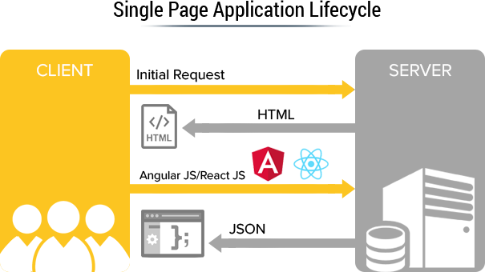
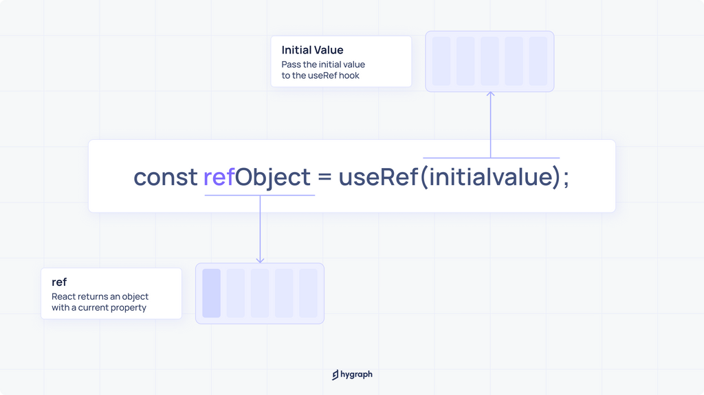

# **SPAs, Routing**

## [Notes/Slides Link](https://petal-estimate-4e9.notion.site/React-Part-1-1177dfd1073580069172fc54e33929c0)

## Articles/Blogs Link:

- [**React Lezy loading**](https://medium.com/@ignatovich.dm/optimizing-react-apps-with-code-splitting-and-lazy-loading-e8c8791006e3)
- [**A Complete Beginner's Guide to React Router**](https://www.freecodecamp.org/news/a-complete-beginners-guide-to-react-router-include-router-hooks/)
- [**How to Use React Router to Build Single Page Applications**](https://www.freecodecamp.org/news/use-react-router-to-build-single-page-applications/) - must read
- [**A complete guide to routing in React**](https://hygraph.com/blog/routing-in-react)

---

- [**How to Use Nested Routes in React Router**](https://dev.to/tywenk/how-to-use-nested-routes-in-react-router-6-4jhd)
- [**React Router outlets: Nested Routes**](https://www.robinwieruch.de/react-router-nested-routes/)
- [**Mastering React routing : Types**](https://www.contentful.com/blog/react-routing/)

---

- [**How to create a multilevel dropdown menu in React**](https://blog.logrocket.com/how-create-multilevel-dropdown-menu-react/)
- [**Why is React Js called as Single Page Application**](https://stackoverflow.com/questions/62529631/why-is-react-js-called-as-single-page-application)
- [**React Design Patterns: Layout Components Pattern**](https://medium.com/@vitorbritto/react-design-patterns-layout-components-pattern-455c98e0bf92)

---

- [**A Better Way to Structure React Projects**](https://www.freecodecamp.org/news/a-better-way-to-structure-react-projects/)
- [**React Best Practices – Tips for Writing Better React Code**](https://www.freecodecamp.org/news/best-practices-for-react/)
- [**The Best File Structure for Your React Components**](https://www.freecodecamp.org/news/best-file-structure-for-react-components/)
- [**How to Use React Hooks**](https://www.freecodecamp.org/news/full-guide-to-react-hooks/)

---

- [**Understanding the React useRef Hook**](https://refine.dev/blog/react-useref-hook-and-ref/#using-refs-to-access-dom-elements-in-react)
- [**React useRef Hook**](https://medium.com/trabe/react-useref-hook-b6c9d39e2022)
- [**useRef**](https://hygraph.com/blog/react-useref-a-complete-guide)
- [**React State vs Refs – Differences and Use Cases**](https://www.freecodecamp.org/news/react-state-vs-ref-differences-and-use-cases/)
- [**React State vs Refs – Video**](https://www.youtube.com/watch?v=42BkpGe8oxg) - Must watch
- [**React Hooks Cheat Sheet: The 7 Hooks You Need To Know**](https://www.freecodecamp.org/news/react-hooks-cheatsheet/)

## SPAs

A **Single Page Application (SPA)** is a web app that loads a single HTML page and dynamically updates content without refreshing the entire page. This creates a faster and smoother user experience, similar to using a native app.

### Popular tools for building SPAs:

- React (with React Router)
- Vue.js (with Vue Router)
- Angular
- Svelte



## Routing in React

Routing in React allows you to create multiple "pages" or "views" in a Single Page Application (SPA) — so users can navigate to different URLs without a full page reload.

React itself doesn’t include routing, but you use the `react-router-dom` library to handle this.

### 📦 Installation

```bash
npm install react-router-dom
```

### 🔄 Basic Setup

```jsx
import { BrowserRouter, Routes, Route, Link } from "react-router-dom";

function App() {
  return (
    <BrowserRouter>
      <nav>
        <Link to="/">Home</Link>
        <Link to="/about">About</Link>
      </nav>
      <Routes>
        <Route path="/" element={<Home />} />
        <Route path="/about" element={<About />} />
      </Routes>
    </BrowserRouter>
  );
}
```

## 🧱 COMPONENTS

### 1. `<BrowserRouter>`

- **Purpose:** Enables routing using the browser’s address bar.
- **Usage:** Wrap your entire app with it.

```jsx
<BrowserRouter>
  <App />
</BrowserRouter>
```

- The `BrowserRouter` has a `basename` attribute used to set base URL for all routes in an application.

```jsx
<BrowserRouter basename="/shop"></BrowserRouter>
```

Adding `/shop` as a `basename` will make sure that all route paths are relative to `/shop`.

---

### 2. `<Routes>`

- **Purpose:** Holds your routing definitions.
- **Analogy:** Like a switchboard that decides what to show based on the URL.

```jsx
<Routes>
  <Route path="/" element={<Home />} />
</Routes>
```

---

### 3. `<Route>`

- **Purpose:** Defines a path and the component to render.
- **Usage:** Inside `<Routes>`.

```jsx
<Route path="/about" element={<About />} />
```

---

### 4. `<Link>`

- **Purpose:** Navigate without page reload.
- **Analogy:** Like a regular `<a>` tag but for SPAs.

```jsx
<Link to="/about">About</Link>
```

### 4.1. `<NavLink>`

`<NavLink>` is just like `<Link>`, but with styling for the active route. It’s great for navigation menus where you want to highlight the current page.

```js
<NavLink
  to="/about"
  style={({ isActive }) => ({
    color: isActive ? "red" : "black",
    fontWeight: isActive ? "bold" : "normal",
  })}
>
  About
</NavLink>
```

The function you pass to `className`(for tailwind) or `style` receives a props-like object from React Router. The full object looks like:

```js
{
  isActive: true/false,
  isPending: true/false
}
```

---

### 5. `<Navigate>`

- **Purpose:** Programmatic redirection.
- **Use Case:** Redirect after login, or if user is not authenticated.

```jsx
{
  !isLoggedIn && <Navigate to="/login" />;
}
```

---

## 🧠 HOOKS

### 6. `useNavigate()`

- **Purpose:** Navigate using Hook, returns a navigation method.
- **Use Case:** After form submission or button click.

```jsx
const navigate = useNavigate();
navigate("/dashboard");
```

---

### 7. `useParams()`

- **Purpose:** Access dynamic parts of the URL.
- **Use Case:** For routes like `/user/:id`.

```jsx
<Route path="/user/:id" element={<User />} />;
function User() {
  const { id } = useParams();
  return <h2>User ID: {id}</h2>;
}
```

---

### 8. `useLocation()`

- **Purpose:** Access current URL info (path, query, state).

```jsx
const location = useLocation();
console.log(location.pathname);
```

---

## ✅ Summary Table

| Tool            | Purpose                       | Example Use Case                         |
| --------------- | ----------------------------- | ---------------------------------------- |
| `BrowserRouter` | Sets up routing               | Wrap entire app                          |
| `Routes`        | Groups route definitions      | Nest Route components                    |
| `Route`         | Defines a path + component    | Show `<About />` when path is `/about`   |
| `Link`          | Navigates between routes      | Navigation menu or buttons               |
| `Navigate`      | Redirects programmatically    | After login or permission check          |
| `useNavigate()` | Code-based navigation         | After form submit or custom button click |
| `useParams()`   | Read `:param` values from URL | `/product/:id` pages                     |
| `useLocation()` | Access current path or state  | Logging, tracking, or custom behavior    |

---

## 🧱 What is a "Layout" in React Router?

A layout is a shared component structure — like a common header, sidebar, or footer — that appears across multiple pages. Instead of repeating the same UI on every route, you define it once in a layout route.

### 🧩 What is `<Outlet />`?

`<Outlet />` is a placeholder where child route components will be rendered.

It's used inside a layout to specify where nested routes should appear.

### Basic Layout with Outlet :

The Structure in which the child `<Route path = '/path' element = {<Component/>} />` will get render in place of `<Outlet />`

```js
import { Outlet, Link } from "react-router-dom";

function Layout() {
  return (
    <div>
      <nav>
        <Link to="/">Home</Link> | <Link to="/about">About</Link>
      </nav>

      <hr />

      {/* Render child route components here */}
      <Outlet />
    </div>
  );
}
```

### 🔗 Nested Routes components will be replaced in `<outlet/>`

```js
import { BrowserRouter, Routes, Route } from "react-router-dom";
import Layout from "./Layout";
import Home from "./Home";
import About from "./About";

function App() {
  return (
    <BrowserRouter>
      <Routes>
        {/* Layout Route */}
        <Route path="/" element={<Layout />}>
          {/* Nested Routes */}
          <Route index element={<Home />} />
          <Route path="about" element={<About />} />
        </Route>
      </Routes>
    </BrowserRouter>
  );
}
```

### 🧠 What Happens Here:

- The `Layout` component is rendered for both `/` and `/about`.

- Inside `Layout`, the `<Outlet />` is replaced with:

  - `<Home />` for `/`
  - `<About />` for `/about`

---

## Data Router :

**React Router v6.4+** using the newer `createBrowserRouter` and `RouterProvider` method — also known as the Data Router API

### 🧭 Why `createBrowserRouter + RouterProvider`?

This is the modern React Router approach and supports:

- Centralized route config (like a route map)
- Data fetching (loader)
- Form handling (action)
- Route-level error handling (errorElement)
- Code splitting (with lazy)

```css
src/
├── App.jsx
├── pages/
│   ├── Home.jsx
│   └── About.jsx
```

### 1. ✨ Define Routes with `createBrowserRouter`

```jsx
// main.jsx or App.jsx
import { createBrowserRouter, RouterProvider } from "react-router-dom";
import Home from "./pages/Home";
import About from "./pages/About";

const router = createBrowserRouter([
  {
    path: "/",
    element: <Home />,
  },
  {
    path: "/about",
    element: <About />,
  },
]);

function App() {
  return <RouterProvider router={router} />;
}

export default App;
```

✅ App only does one thing — plug the router into the React tree using <RouterProvider>.

🔑 You don’t manually render `<Home />` or `<About />` in App. Instead, the router handles that automatically based on the current URL.

| URL Path | Component Rendered |
| -------- | ------------------ |
| `/`      | `<Home />`         |
| `/about` | `<About />`        |

### 2. 🔗 Navigation with `<Link>`

```js
import { Link } from "react-router-dom";

function Home() {
  return (
    <div>
      <h1>Home Page</h1>
      <Link to="/about">Go to About</Link>
    </div>
  );
}
```

### 🔁 With Layout + `<Outlet />`

```js
import { createBrowserRouter, RouterProvider, Outlet } from "react-router-dom";

function Layout() {
  return (
    <div>
      <h1>🧭 My Site Layout</h1>
      <Outlet />
    </div>
  );
}

const router = createBrowserRouter([
  {
    path: "/",
    element: <Layout />,
    children: [
      {
        index: true, // matches "/"
        element: <Home />,
      },
      {
        path: "about", // matches "/about"
        element: <About />,
      },
    ],
  },
]);
```

### 🚀 Bonus: Add loader and errorElement

```jsx
const router = createBrowserRouter([
  {
    path: "/",
    element: <Layout />,
    errorElement: <div>⚠️ Error loading this page.</div>,
    children: [
      {
        index: true,
        element: <Home />,
        loader: () => {
          console.log("Data loaded before Home renders");
          return null;
        },
      },
      {
        path: "about",
        element: <About />,
      },
    ],
  },
]);
```

- `loader`: runs before the component renders
- `errorElement`: catches loader or route errors

---

## `useFref()`

The `useRef()` Hook is a built-in React feature that persists values between component re-renders. Unlike state variables managed by `useState`, values stored in a ref object remain unchanged across renders, making it ideal for scenarios where data doesn't directly affect the UI but is essential for the component's behavior.

The `useRef` Hook is a function that returns a mutable `ref` object whose `.current` property is initialized with the passed argument (`initialValue`). The returned object will persist for the full lifetime of the component.

```js
import { useRef } from "react";

const myRef = useRef(initialValue);
```

- It returns a mutable object: `{ current: initialValue }`
- This object does not change between renders



the returned reference object is mutable. You can update the `current` value directly..

```js
import { useRef } from "react";
function MyComponent() {
    const reference = useRef(true);
    const handleUpdate = () => {
      reference.current = !reference.current;
    };
    console.log(reference.current); // true
    return <button onClick={handleUpdate}>Update</button>;
};
```
### 📌 Use Case 1: Accessing DOM Elements

```js
import { useRef, useEffect } from "react";

function MyInput() {
  const inputRef = useRef(null);

  useEffect(() => {
    inputRef.current.focus(); // Auto focus on mount
  }, []);

  return <input ref={inputRef} />;
}
```

- `ref={inputRef}` links the DOM node to `inputRef`
- `inputRef.current` gives you access to the DOM element (here the input in which `ref` is used)

- The `ref` attribute connects the DOM element (`<input>`) to a reference variable (`inputRef`) created using `useRef()`.

After React renders this `input` element, it stores the actual DOM node in `inputRef.current`


### 📌 Use Case 2: Storing Mutable Values

```js
function Timer() {
  const count = useRef(0);

  function handleClick() {
    count.current += 1;
    console.log(count.current);
  }

  return <button onClick={handleClick}>Click Me</button>;
}
```
- `count.current` holds a value that persists, doest change in re render
- Changing it **doesn't cause a re-render**