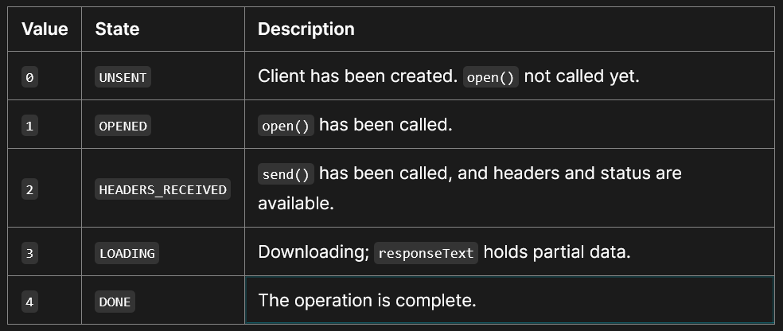

### Common APIs

    https://api.github.com/users/ranaa-24
    https://randomuser.me/api/
    jsonplaceholder apis: https://jsonplaceholder.typicode.com/posts

# Ajax

AJAX = Asynchronous JavaScript And XML.

AJAX is not a programming language.

AJAX just uses a combination of:

- A browser built-in `XMLHttpRequest` object (to request data from a web server or a API written by backend)
- JavaScript and HTML DOM (to display or use the data)

**We have 3 ways to create and send req to a server**

1. `XMLHttpRequest`
2. `fetch`
3. `axois`

<br>

# XMLHttpRequest (XHR)

`XMLHttpRequest` is a built-in browser object that allows to make HTTP requests asynchronously in JavaScript.

    NOTE: XMLHttpRequest is a built-in object in web browsers.
    It is not distributed with Node.

**Note: every funtion is async, open(), send(), .on\***

**To do the request, we need 3 steps:**

> 1.  Create `XMLHttpRequest`:

```js
let xhr = new XMLHttpRequest();
```

The constructor has no arguments.

> 2.  Initialize it, usually right after `new XMLHttpRequest`:

```js
xhr.open(method, URL, [async, user, password]);
```

`method` – HTTP-method. Usually `"GET"` or `"POST"`

`URL` – the URL to request, a string

`async` – if explicitly set to `false`, then the request is synchronous

`user, password` – login and password for basic HTTP auth (if required).

    .open() does not open the connection. It only configures the request, but the network activity only starts with the call of .send()

> 3.  Send the request over the network

```js
xhr.send();
```

## To Access the response

```js
xhr.readyState;
```

returns the state an XMLHttpRequest client is in, when .readyState is 4 The operation is complete, and we receive the response



```js
let url = "https://jsonplaceholder.typicode.com/posts";
let xhr = new XMLHttpRequest();

console.log(xhr.readyState); // 0
xhr.open("GET", url);
console.log(xhr.readyState); // 1

xhr.send();

xhr.onreadystatechange = function () {
  // every time readyState changes
  console.log(xhr.readyState); //2 3 4
};

console.log("End");
```

<pre>
0
1
End
2
3
4
</pre>

and when `.readyState == 4` we get our response as a JSON string.

```js
xhr.onreadystatechange = function () {
  if (xhr.readyState == 4) {
    let response = xhr.response;
    let json = JSON.parse(response);
    console.log(json);
  }
};
```

if url not found it gives 404 status code

```js
xhr.onreadystatechange = function () {
  if (xhr.readyState == 4) {
    console.log(xhr.status); //404
  }
};
```

**we can use .onload**
here is a full example:

```js
// 1. Create a new XMLHttpRequest object
let xhr = new XMLHttpRequest();

// 2. Configure it: GET-request for the URL /article/.../load
xhr.open("GET", url);

// 3. Send the request over the network
xhr.send();

// 4. This will be called after the response is received
xhr.onload = function () {
  if (xhr.status != 200) {
    // analyze HTTP status of the response
    alert(`Error ${xhr.status}: ${xhr.statusText}`); // e.g. 404: Not Found
  } else {
    // show the result
    alert(`Done, got ${xhr.response.length} bytes`); // response is the server response
  }
};

xhr.onerror = function () {
  alert("Request failed");
};
```

`xhr.onerror` doesnt triggered when 404 : not found (a client error) ocurrs but
when Cross-Origin(CORS) requests, What if the server is offline, client offline, DNS lookup fails, a router between you and the server that is critical point of failure goes down?, It heandles server error.

```js
let xmlhttp = new XMLHttpRequest(),
  method = "GET",
  url = "https://developer.mozilla.org/";

xmlhttp.open(method, url, true);
xmlhttp.send();
//its a CORS Error, occurs when a web application tries to access resources from a different domain than the one that served the page, and the server doesn't allow it
xmlhttp.onerror = function () {
  console.log("** An error occurred during the transaction");
};
```

we can wrap a xhr response on a promise to cunstruct a promise chain and handle multiple request as chain, for example, send a request to `URL2` when we receive `URL1` respons

```js
function sendReq(method, url) {
  return new Promise(function (resolve, reject) {
    if (xhr.status != 200) {
      reject("Error");
    } else {
      resolve(xhr.response);
    }
  });
}
```

<br>
<br>

# Fetch

Node.js includes the Fetch API as a built-in feature starting with version 18.0.0,

**First, the `promise`, returned by `fetch`, resolves with an object of the built-in `Response` class as soon as the server responds with headers.**

At this stage we can check HTTP status, to see whether it is successful or not, check headers, but don’t have the body yet.

The promise rejects if the fetch was unable to make HTTP-request, e.g. network problems, or there’s no such site. Abnormal HTTP-statuses, such as **404 or 500 do not cause an error** these are resolved promise

```js
let promise = fetch(url, [options]);
```

Without `options`, this is a simple GET request, downloading the contents of the url.

We can see HTTP-status in response properties:

`status` – HTTP status code, e.g. 200.

`ok` – boolean, true if the HTTP status code is 200-299.

```js
let response = await fetch(url);

if (response.ok) {
  // if HTTP-status is 200-299
  // get the response body (the method explained below)
  let json = await response.json();
} else {
  alert("HTTP-Error: " + response.status);
}
```

**Second, to get the response body, we need to use an additional method call.**

`Response` provides multiple `promise-based` methods (these methods also returns a promise) to access the body in various formats:

`response.text()` – read the response and return as text,
`response.json()` – parse the response as JSON,

additionally, `response.body` is a ReadableStream object, it allows you to read the body chunk-by-chunk, we’ll see an example later.

> fetch() -resolves-> response -> response.json() -resolves-> JSON

```js
(async () => {
  let response = await fetch(url);
  console.log(response);
  let data = await response.json();
  console.log(data);
})();
```

```js
fetch(url)
  .then(function (response) {
    if (response.ok) {
      return response.json();
    } else {
      return new Error("Network issue");
    }
  })
  .then((val) => {
    console.log(val);
  })
  .catch((err) => {
    console.log(err);
  });
```

> Further options &nbsp;
> [read](https://javascript.info/fetch#response-headers)

```js
//creating a resource to a end point
fetch("https://jsonplaceholder.typicode.com/posts", {
  method: "POST",
  body: JSON.stringify({
    // create this body
    title: "foo",
    body: "bar",
    userId: 1,
  }),
  headers: {
    "Content-type": "application/json; charset=UTF-8",
  },
})
  .then((response) => response.json())
  .then((json) => console.log(json));
```

> A Good read on CORs

### [Fetch: Cross-Origin Requests](https://javascript.info/fetch-crossorigin)
