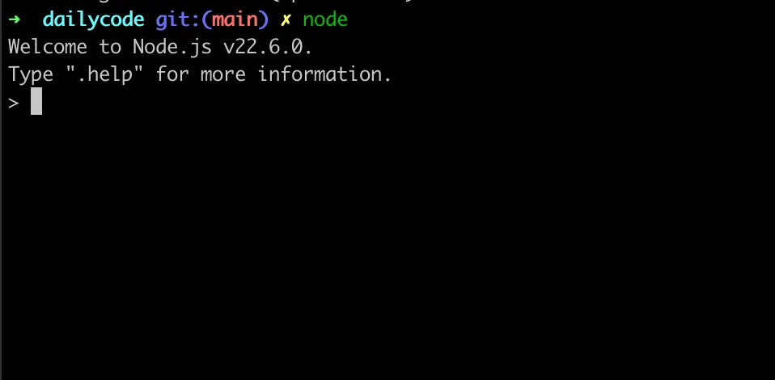

## NodeJS Installation using nvm (Node Virsion Manager)

Reference - https://www.digitalocean.com/community/tutorials/how-to-install-node-js-on-ubuntu-22-04

There are a few ways you can install Node.js

1. Build it from Source (difficult, not recommended)
2. Use a package manager like `brew` , `snap` etc
3. Use `nvm` (Node Version Manager)

## Node version manager

NVM is a `cli` (Command line interface) that lets you install/upgrade the version of Node.js you have locally. 

- Step 1 - Install `Node version manager`
    - Linux/Mac
    
    ```jsx
    curl -o- https://raw.githubusercontent.com/nvm-sh/nvm/v0.39.1/install.sh | bash
    ```
    
    - Windows - First install WSL, then use the same steps as above
- Step 2 - Install Node

```jsx
nvm install v22
```

- Try running `node`
