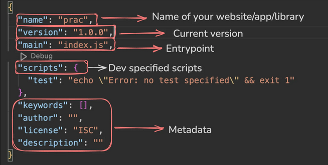

# **Week 04 - 4.1 | Node.js, Bun and JS Runtimes**

### [Notes / Slides Link](https://petal-estimate-4e9.notion.site/Node-js-Bun-and-JS-runtimes-a09a41ccd61c4f498e55750c9a1c9b34)

## Some Good Articles Link

- [**What Exactly is Node.js? Explained for Beginners**](https://www.freecodecamp.org/news/what-is-node-js/)
- [**What is Node.js and How it Work?**](https://www.youtube.com/watch?v=_eJ6KAb56Gw) - Must watch
- [**The V8 JavaScript Engine**](https://medium.com/@manikmudholkar831995/the-v8-javascript-engine-d1434ca77c96)
- [**How JavaScript Works: Under the Hood of the V8 Engine**](https://www.freecodecamp.org/news/javascript-under-the-hood-v8/)
- [**What is Bun: A High-Performance JavaScript Runtime?**](https://medium.com/code-crafters/what-is-bun-a-high-performance-javascript-runtime-3aaff50aeef7)
- [**What is NPM? A Beginner's Guide**](https://careerfoundry.com/en/blog/web-development/what-is-npm/)
- [**What is npm? A Node Package Manager Tutorial for Beginners**](https://www.freecodecamp.org/news/what-is-npm-a-node-package-manager-tutorial-for-beginners/)
- [**All You Need to Know About NPM and Node Packages as a Beginner**](https://medium.com/@oroz.askarov/all-you-need-to-know-about-npm-and-packages-as-a-beginner-b6fcea8b3519) - Best
- [**30 Most Popular NPM Packages for Node JS Developers**](https://www.turing.com/blog/top-npm-packages-for-node-js-developers)
- [**Everything about package.json**](https://dev.to/himanshudevgupta/everything-about-packagejson-597l)
- [**package-lock.json: The Complete Guide**](https://medium.com/pavesoft/package-lock-json-the-complete-guide-2ae40175ebdd)
- [**Difference between package.json and package-lock.json**](https://umarfarooquekhan.medium.com/difference-between-package-json-and-package-lock-json-6225f83f247c)

## GitHub Link

- [**Node.js**](https://github.com/nodejs/node)
- [**Bun**](https://github.com/oven-sh/bun)
- [**NPM**](https://github.com/npm)
- [**Chalk**](https://github.com/chalk/chalk)

<br>
<br>

## To initialize a Node.js project locally,

# `npm init -y`

The command `npm init -y` initializes a new Node.js project with a default `package.json` file.

## Breakdown:

- **`npm init`** → Creates a `package.json` file for managing dependencies and project metadata.
- **`-y`** → Skips interactive prompts and uses default values.

## `package.json` Fields Explained:

| Field             | Description                                                                 |
| ----------------- | --------------------------------------------------------------------------- |
| **`name`**        | The name of your project/package.                                           |
| **`version`**     | The current version of the project, following semantic versioning.          |
| **`description`** | A short description of the project (optional).                              |
| **`main`**        | The entry point file for the project (default is `index.js`).               |
| **`scripts`**     | Defines command-line scripts that can be run using `npm run <script-name>`. |
| **`test`**        | A default test script that prints an error message when run.                |
| **`keywords`**    | An array of keywords to help others find your package (optional).           |
| **`author`**      | The name of the project author (optional).                                  |
| **`license`**     | Specifies the license type (default is ISC, an open-source license).        |

## Example `package.json` File:



## NPM

### What is NPM?

NPM (Node Package Manager) is a tool used to install, manage, and update packages (libraries) in a Node.js project.

> package manager of rust is **cargo**

### Terms

Basically a `package` is a pack with some features which fullfills some functionality of your app.

Once you install any `package` using npm then the package is installed as a `dependency` in your app inside your `package.json` file along with its `modules`(aka libraries consist of classes) stored inside `node_modules` folder.

**Initializing a Project**

```
npm init
```

**Managing Packages (Dependencies)**

```
npm install <package-name>
```

Ex

```
npm install express mongoose dotenv
```

**Uninstalling a Package**

```
npm uninstall <package-name>
```

**Viewing Installed Packages**

```
npm list
```

**Updating Dependencies**

```
npm update
```

**Running Scripts**

```
npm run <script-name>
```

## Importing Libraries

- **Using CommonJS (`require`)**
  This method works in Node.js by default.

```js
const express = require("express");
```

- **Using ES Modules (`import`)**
  If your project uses ES Modules **("type": "module" in `package.json` or `.mjs` extension)**, use import:

```js
import chalk from "chalk";

console.log(chalk.green("Success!"));
```

An `.mjs` file is a JavaScript module file that uses ECMAScript Modules (ESM), enabling the `import/export` syntax in Node.js.

> Chalk is a Node.js library used to style and colorize text in the terminal output. 🚀

<br>

## NOTE: if we delete node_module folder `npm install` automaticlly bring all imported libs as these are mentioned in `package.json > dependencies`

<br>

## Internal packages

Node.js provides you some `packages` out of the box. Some common ones include..

- fs - Filesystem
- path - path related fnc
- http - HTTP Servers

### <u>fs module</u>

**Read File Synchronised `readFileSync`**

- locks execution until the file is completely read.
- Best for small files or when you need sequential execution.

```js
const fs = require("fs");
const data = fs.readFileSync("example.txt", "utf8"); // Blocking
console.log(data); // Executes only after file is read
```

**Read File asynchronised `readFile`**

- Does not block execution; it reads the file in the background.
- Uses a callback function to handle the file once it’s read.
- Best for large files or when performance matters.

```js
fs.readFile("example.txt", "utf8", (err, data) => {
  if (err) throw err;
  console.log(data); // Executes after file is read
});
console.log("Reading file..."); // This runs immediately
```

**Write to a file:**

`fs.writeFileSync` (Synchronous)

Block execution

```js
const fs = require("fs");
fs.writeFileSync("example.txt", "Hello, world!"); // Blocking
console.log("File written successfully!");
```

`fs.writeFile` (Asynchronous)
Does not block execution; writes the file in the background.
Uses a callback function to handle success or errors.

```js
fs.writeFile("example.txt", "Hello, world!", (err) => {
  if (err) throw err;
  console.log("File written successfully!");
});
console.log("Writing file..."); // This runs immediately
```

### <u> path module</u>

node has global variable `__dirname` that gives a string of the current directory

The `path` module in Node.js provides utilities for working with file and directory paths. It helps with resolving, formatting, and normalizing file paths across different operating systems.

`path.join()` Normalizes the path

```js
const filePath = path.join(__dirname, "folder", "file.txt");
console.log(filePath);
```

## Semantic Versioning Format

# External packages

Every external package is updated incrementally. A specific version looks something like follows -

```json
"chalk": "^5.3.0"
```

The format is as follows - **MAJOR.MINOR.PATCH**

- **MAJOR** - Major version changes indicate significant updates or breaking changes.

- **MINOR** - Minor version changes signify the addition of new features or improvements in a backward-compatible manner.

- **PATCH** - Patch version changes include backward-compatible bug fixes or minor improvements that address issues without adding new features or causing breaking changes.

### Usage in `package.json`

`“chalk”: “^5.3.0”` - ^ npm will install any version that is compatible with `5.3.0` but less than `6.0.0`. This includes versions like `5.3.1, 5.4.0, 5.5.0`, etc.

`“chalk”: “5.3.0”` - Will install the exact version

`"chalk": "latest"` - Will install the latest version

## package-lock.json

The `package-lock.json` records the exact versions of all dependencies and their dependencies (sub-dependencies) that are installed at the time when `npm install` was run.

**Consistency**: By locking down these versions, `package-lock.json` ensures that every time someone installs dependencies (e.g., by running `npm install`), they get the exact same versions of packages. This prevents discrepancies that can arise from different versions being installed in different environments.

## Extra

### Alias in bash

```
alias <anyname>="<any command>"
```

Example-

```
> alias mycli="node CLIusingCommander.js"

> mycli countWords ./a.txt
```

`mycli` became alias of node `CLIusigCommander.js`
