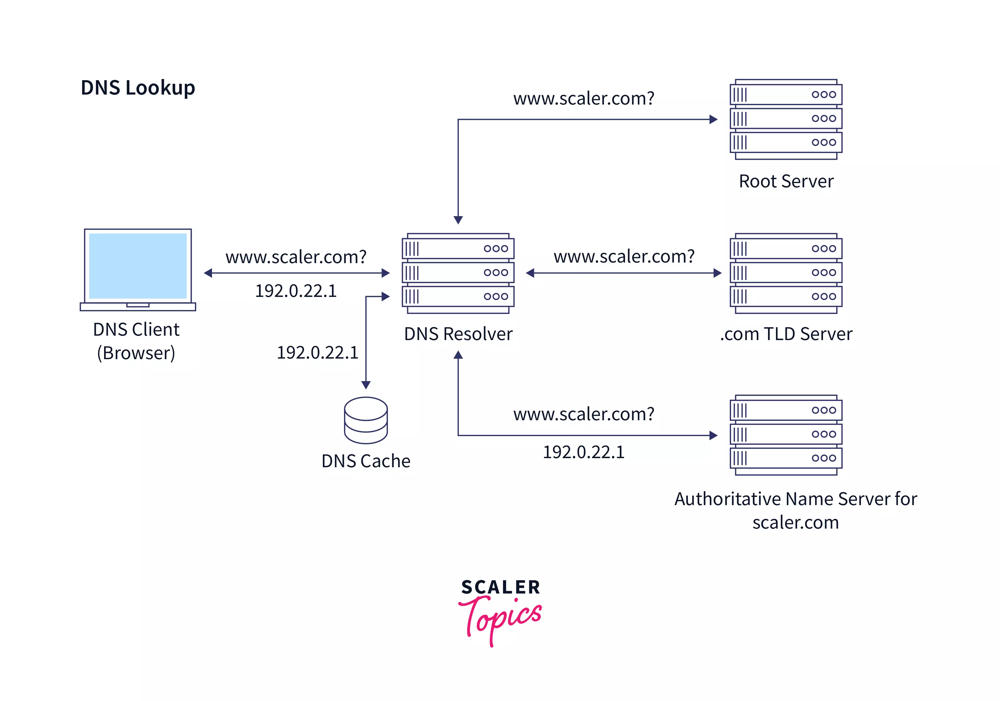

# **HTTP Servers**

## Article/Blogs Link:

- [**Express/Node introduction**](https://developer.mozilla.org/en-US/docs/Learn/Server-side/Express_Nodejs/Introduction)
- [**What is HTTP? Protocol Overview for Beginners**](https://www.freecodecamp.org/news/what-is-http/) - **Must Read**
- [**Understanding Request And Response Model**](https://medium.com/@imakashsharma135/understanding-request-and-response-model-a-general-overview-831c24d2288)
- [**What Is a Domain Name and Why Are They Important?**](https://iloveseo.com/seo/what-is-a-domain-name-and-why-are-they-important/)
- [**What Is An IP Address? How Does It Work?**](<https://www.fortinet.com/resources/cyberglossary/what-is-ip-address#:~:text=An%20Internet%20Protocol%20(IP)%20address,use%20the%20internet%20to%20communicate.>)
- [**What is a computer port? | Ports in networking**](https://www.cloudflare.com/learning/network-layer/what-is-a-computer-port/)
- [**How to setup a Node.js server port**](https://dev.to/aneeqakhan/how-to-setup-a-nodejs-server-port-25l6)

- [**How Web Works?**](https://github.com/vasanthk/how-web-works)
- [**What happens when you type “https://www.google.com” in your browser and press Enter**](https://forum.freecodecamp.org/t/what-happens-when-you-type-https-www-google-com-in-your-browser-and-press-enter/561581/1)

- [**Find IP Address of a Domain, Server or Website**](https://www.site24x7.com/tools/find-ip-address-of-web-site.html)

## Videos Link

- [**Postman Beginner's Course - API Testing**](https://www.youtube.com/watch?v=VywxIQ2ZXw4&t=3358s)

<hr>
<br>
<br>

# HTTP Overview

HTTP (Hypertext Transfer Protocol) is a protocol used for exchanging information over the internet.

 - Req Res Model

## How to Create HTTP Requests

To create a valid HTTP request, you need the following:

- A URL.
- The HTTP method.
- A list of headers (request headers).
- The request body.

## HTTP Request URL

When you type a URL into your web browser, your computer sends a request to a server that hosts the website. The server then sends back the HTML code for the webpage, which your browser renders into the visual content you see on your screen. The process of requesting and receiving web pages is known as the Hypertext Transfer Protocol (HTTP)..

### URL vs URI vs URN

- **URI (Uniform Resource Identifier)** – A general identifier for a resource, which can be a URL, URN, or both.

  - **Example:** `https://example.com/page.html` (URL) and `urn:isbn:0451450523` (URN) are both URIs.

- **URL (Uniform Resource Locator)** – A type of URI that specifies the location of a resource and how to access it.

  - **Example:** `https://example.com/page.html` (specifies protocol, domain, and path).

- **URN (Uniform Resource Name)** – A type of URI that uniquely names a resource but doesn’t specify its location.
  - **Example:** `urn:isbn:0451450523` (an ISBN for a book, but doesn’t tell where to find it).

The string `urn:isbn:0451450523` is a URN (Uniform Resource Name) that uniquely identifies a book using its ISBN (International Standard Book Number).

Breaking It Down:

`urn`: → Indicates that this is a Uniform Resource Name (URN).
`isbn`: → Specifies that the identifier follows the ISBN naming scheme.
`0451450523` → The unique ISBN of a specific book (e.g., a published novel).

### Analogy

- **URI (ID card)** – A broad concept; can include a location or just an identifier.
- **URL (Home Address)** – Tells where someone lives and how to reach them.
- **URN (Social Security Number)** – A unique identifier, but doesn’t tell where the person is.


## HTTP Req Methods

The request method tells the server what kind of action the client wants the server to take

- `HEAD` Asks the server for status (size, availability) of a resource.
- `GET` Asks the server to retrieve a resource.
- `POST` Asks the server to create a new resource.
- `PUT` Asks the server to edit/update an existing resource.
- `DELETE` Asks the server to delete a resource.

## HTTP Headers

TP headers are key-value pairs sent with HTTP requests and responses. They provide additional information about the request or response, such as content type, caching policies, authentication, and more.

- **Request Headers** – Sent by the client (browser, API client, etc.) to the server.

- **Response Headers** – Sent by the server to provide metadata about the response.


## HTTP Header, Request, and Body

- **HTTP Header** – Metadata in an HTTP request/response (e.g., `Content-Type: application/json`).

- **HTTP Request/Response** – A message sent by a client to a server containing method, URL, headers, and optionally a body.  
  An HTTP **response** is the message that a server sends back to a client in response to an HTTP request. It usually consists of a status line, headers, and a message body
- **HTTP Body** – The data sent in a request (for `POST`, `PUT`, `PATCH`) or response (e.g., JSON, HTML, XML).

```js
//HTTP Response

//header
HTTP/1.1 200 OK  // status line
Date: Sun, 28 Mar 2023 10:15:00 GMT
Content-Type: application/json
Server: Apache/2.4.39 (Unix) OpenSSL/1.1.1c PHP/7.3.6
Content-Length: 1024

//body
{
    "name": "John Doe",
    "email": "johndoe@example.com",
    "age": 30,
    "address": {
        "street": "123 Main St",
        "city": "Anytown",
        "state": "CA",
        "zip": "12345"
    }
}
```


### DNS (Domain Name System)

DNS translates domain names (e.g., google.com) into IP addresses (e.g., 142.250.180.14).

**DNS Lookup**



1. **User Request** – A user enters a domain (e.g., `example.com`) in the browser.
2. **Browser Cache Check** – The browser checks its local cache for the DNS record.
3. **OS Cache Check** – If not found, the OS resolver cache is checked.
4. **Recursive Resolver Query** – If still unresolved, the request goes to a DNS resolver (ISP or public resolver like Google DNS).
5. **Root Server Query** – The resolver contacts a root DNS server to find the Top-Level Domain (TLD) server (.com, .net, etc.).
6. **TLD Server Query** – The TLD server directs the resolver to the authoritative nameserver.
7. **Authoritative Nameserver Query** – The authoritative nameserver returns the IP address of the requested domain.
8. **Response to User** – The IP address is returned to the browser, which establishes a connection to the server.
9. **Cache Storage** – The IP address is cached for future requests.

**What Are DNS Records and Why Are They Used?**

- **DNS Records** are configurations that store domain-related data and tell DNS servers how to handle domain requests.
- **Why Used?** They help in domain resolution, email routing, security verification, load balancing, and service discovery.

**When DNS Records Are Used (Single Line)**

- **A Record** – Maps a domain to an IPv4 address (used when accessing a website).
- **AAAA Record** – Maps a domain to an IPv6 address (used when IPv6 is preferred).
- **CNAME Record** – Creates an alias for another domain (used for subdomains or load balancing).
- **MX Record** – Specifies mail servers for a domain (used for email routing).
- **TXT Record** – Stores arbitrary text data (used for SPF, DKIM, and verification).
- **NS Record** – Defines the authoritative nameservers for a domain (used for DNS delegation).
- **PTR Record** – Resolves an IP address to a domain name (used for reverse DNS lookups).
- **SOA Record** – Contains admin details and DNS zone settings (used for zone transfers and updates).
- **SRV Record** – Defines service-specific DNS records (used for services like VoIP and LDAP).
- **CAA Record** – Specifies which certificate authorities can issue SSL certificates (used for SSL security).

### Port

HTTP typically uses port 80 for communication. When a user enters a URL in a web browser, the browser uses this port to connect to the web server.

They help direct network traffic to the correct application or service on a system.

- HTTP: Runs on port 80 on server
- HTTPS: Uses port 443.
- 3000 – Common for Node.js/Express development
- 3306 – MySQL


### Status codes

HTTP status codes are three-digit numbers returned by a server to indicate the outcome of a client’s request. They provide information about the status of the request and the server's response.

HTTP Status Codes in the Status Line of http response

### 200 series (Success)

- **200 OK**: The request was successful, and the server returned the requested resource.
- **204 No Content**: The request was successful, but there is no content to send in the response

### 300 series (Redirection)

- **301 Moved Permanently**: The requested resource has been moved to a new URL permanently. The client should use the new URL provided in the response.
- **304 Not Modified**: The resource has not been modified since the last request. The client can use the cached version.

### 400 series (Client Error)

- **400 Bad Request**: The server could not understand the request due to invalid syntax.
- **401 Unauthorized**: The request requires user authentication. The client must provide credentials.
- **403 Forbidden**: The server understood the request but refuses to authorize it.
- **404 Not Found**: The requested resource could not be found on the server.

### 500 series (Server Error)

- **500 Internal Server Error**: The server encountered an unexpected condition that prevented it from fulfilling the request.
- **502 Bad Gateway**: The server received an invalid response from an upstream server while acting as a gateway or proxy.

## Meme


- Sometimes, due to misconfigured backend logic, a server might send a successful HTTP status (200 OK) but still return an error message in the response body.

- This can confuse clients because they expect a proper response when they see 200 OK, but instead, they receive an error in the payload.

## HTTP server using Node.js with the built-in `http` module:

```js
const http = require("http");

let server = http.createServer((req, res) => {
  // console.log("Got Request");
  res.writeHead(200, { "content-length": "200", "content-type": "text/plain" }); // will parse on 200 chars

  res.end("<h1> Helo From server </h1>");
});

server.listen(3000, () => {
  console.log("Server Running on port 3000");
});
```

```js
const server = http.createServer((req, res) => {
```

- The `http.createServer()` method creates an HTTP server.

- It takes a callback function that gets executed every time a request is received.

- The callback function has two parameters:

  - `req` (request object) → contains details about the incoming request.

  - `res` (response object) → used to send a response back to the client.

```js
res.writeHead(200, { "Content-Type": "text/plain" });
```

`res.writeHead(200, { 'Content-Type': 'text/plain' })` sets the HTTP status code (200 means "OK") and the response headers.

The `Content-Type: text/plain` header tells the browser that we are sending plain text.

```js
res.end("Hello, World!\n");
```

`res.end("<h1> Helo From server </h1>")` sends the response body ("Hello, World!\n") to the client and closes the connection.

```js
const PORT = 3000;
server.listen(PORT, () => {
  console.log(`Server running at http://localhost:${PORT}/`);
});
```

The server listens on port `3000`.

```js
console.log(req.socket.remoteAddress);
```

gets the client ip, there are other methods probably

```js
console.log(req.url);
```

gives the path, from where req is came

```
search :  http://localhost:3000/about/me/rana
req.url : /about/me/rana
```

we can respose diff pages depending on the path user tryna access

```js
const http = require("http");

let server = http.createServer((req, res) => {
  switch (req.url) {
    case "/":
      res.end("<h1> Hii! Wellcome to portfolio");
      break;
    case "/about":
      res.end("<h1> Hii! im Rana");
      break;
    case "/skills":
      res.end("<h1> Creation, Imagination");
      break;
  }
  res.end("<h1> 404 Error");
});

server.listen(3000, () => console.log("Server running on port 3000"));
```

## Handling URLs in Node.js

There is an external `url` module in Node.js, but it works differently from the modern URL API introduced in Node.js 10+.

The url module is used to parse URLs and extract useful information.

### Using the Modern URL API (Recommended)

Node.js provides the **WHATWG URL** API internally, which follows web standards.
This is the recommended way to handle URLs in modern Node.js applications.

```js
const { URL } = require("url"); // Import the URL class

const myUrl = new URL("https://example.com:8080/path?name=John&age=25");

console.log(myUrl.hostname); // "example.com"
console.log(myUrl.pathname); // "/path"
console.log(myUrl.searchParams.get("name")); // "John"
console.log(myUrl.port); // "8080"
```

Key Features

- Uses the WHATWG (Web Hypertext Application Technology Working Group) standard.
- Works similarly to how browsers handle URLs.
- Provides searchParams for easy query parameter handling.
- Requires a full URL (or a base URL as the second parameter).

### Using the Legacy url Module (url.parse())

Older versions of Node.js (before v10) used `url.parse()`, which is part of the legacy `url` module.

```js
const url = require("url");

const myUrl = url.parse("https://example.com:8080/path?name=John&age=25", true);

console.log(myUrl.hostname); // "example.com"
console.log(myUrl.pathname); // "/path"
console.log(myUrl.query.name); // "John"
console.log(myUrl.port); // "8080"
```

**Key Features**

- Uses the old url.parse() method to break down URLs.
- Accepts a second parameter (true) to parse query strings as an object.
- query is an object: { name: 'John', age: '25' }.
- Does not require a full URL.
- Deprecated in favor of new URL().

### Example

```js
const http = require("http");
const { URL } = require("url");

const server = http.createServer((req, res) => {
  const reqUrl = new URL(req.url, `http://${req.headers.host}`);

  res.writeHead(200, { "Content-Type": "text/plain" });
  res.end(
    `Path: ${reqUrl.pathname}\nQuery: ${
      reqUrl.searchParams.get("name") || "None"
    }`
  );
});

server.listen(3000, () =>
  console.log("Server running at http://localhost:3000/")
);
```

```js
const reqUrl = new URL(req.url, `http://${req.headers.host}`);
```

- The `req.url` property only contains the path and query string _(e.g., "/user?id=123")_ but not the full URL.

- The `URL` constructor requires a full URL to parse correctly.

- The second parameter provides the missing protocol `(http://) and hostname (req.headers.host)`.

```
Entered url: http://localhost:3000/user?id=123

req.url → "/user?id=123"

req.headers.host → "localhost:3000"

http://${req.headers.host} → "http://localhost:3000"

The full URL becomes: "http://localhost:3000/user?id=123"
```
