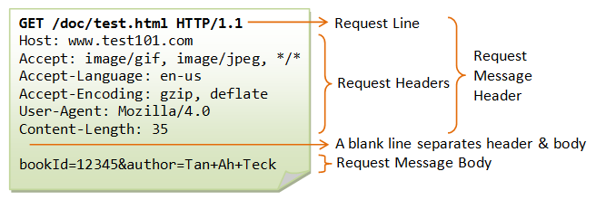

# Headers, Query params and Express

## Article/Blogs Link:

- [**HTTP Headers**](https://developer.mozilla.org/en-US/docs/Web/HTTP/Reference/Headers) - give a read
- [**Headers vs Body**](https://codeal.medium.com/headers-vs-body-1d3e754020b2)
- [**HTTP response status codes**](https://developer.mozilla.org/en-US/docs/Web/HTTP/Status)
- [**How to Fetch Data from an API Using the Fetch API in JavaScript**](https://javascript.info/fetch)
- [**How to fetch an api using axios?**](https://www.npmjs.com/package/axios)
- [**Axios vs. Fetch API: Selecting the Right Tool for HTTP Requests**](https://medium.com/@johnnyJK/axios-vs-fetch-api-selecting-the-right-tool-for-http-requests-ecb14e39e285)

# Headers

A req header..



## Types of HTTP Headers and Their Use Cases

**General Headers (Applicable to both requests & responses)**

- `Connection`: Controls whether the connection stays open after the request.

  - 🛠 Example: `Connection: keep-alive`

- `Cache-Control`: Defines caching rules.

  - 🛠 Example: `Cache-Control: no-cache, no-store, must-revalidate`

### Request Headers (Sent by the client to the server)

- **`Host`**: Specifies the domain name of the server.

  - 🛠 Example: `Host: www.example.com`

- **`User-Agent`**: Identifies the client (browser, device).

  - 🛠 Example: `User-Agent: Mozilla/5.0`

- **`Accept`**: Defines what types of responses the client can handle.

  - 🛠 Example: `Accept: application/json`, `*/*` (any type)

- **`Authorization`**: Carries credentials (JWT, Basic Auth, OAuth tokens).

  - 🛠 Example: `Authorization: Bearer <token>`

- **`Referer`**: Specifies the previous page the request came from.

  - 🛠 Example: `Referer: https://google.com`

- **`Content-Type`**: Tells the server what format the request body is in.

  - 🛠 Example: `Content-Type: application/json`

- **`Origin`**: Identifies the source domain making the request.
  - 🛠 Example: `Origin: https://example.com`

---

### Response Headers (Sent by the server to the client)

- **`Content-Type`**: Specifies the format of the response body.

  - 🛠 Example: `Content-Type: text/html; charset=UTF-8`

- **`Content-Length`**: Specifies the response size in bytes.

  - 🛠 Example: `Content-Length: 1024`

- **`Access-Control-Allow-Origin`**: Defines which domains can access the resource (CORS).

  - 🛠 Example: `Access-Control-Allow-Origin: *`

- **`Set-Cookie`**: Sends cookies to the client.

  - 🛠 Example: `Set-Cookie: sessionId=abc123; HttpOnly`

- **`WWW-Authenticate`**: Requests authentication from the client.

  - 🛠 Example: `WWW-Authenticate: Basic realm="Secure Area"`

- **`Location`**: Used in redirections to specify the new URL.
  - 🛠 Example: `Location: https://new-website.com`

### Reading Headers in Express.js

```js
app.get("/", (req, res) => {
  console.log(req.headers); // Logs all headers
  console.log(req.headers["user-agent"]); // Logs User-Agent
  res.send("Check server logs for headers!");
});
```

### Setting Response Headers in Express.js

```js
app.get("/", (req, res) => {
  res.set("X-Custom-Header", "MyValue"); // Custom header
  res.set("Content-Type", "application/json");
  res.send(JSON.stringify({ message: "Hello World" }));
});
```

### Ex:

**Using Headers for Authentication**

```js
app.get("/secure", (req, res) => {
  const token = req.headers["authorization"];
  if (!token) return res.status(401).send("Unauthorized");

  // Verify the token (JWT Example)
  res.send("Access Granted");
});
```

# FetchAPI

Node.js includes the Fetch API as a built-in feature starting with version 18.0.0,

**First, the `promise`, returned by `fetch`, resolves with an object of the built-in `Response` class as soon as the server responds with headers.**

At this stage we can check HTTP status, to see whether it is successful or not, check headers, but don’t have the body yet.

The promise rejects if the fetch was unable to make HTTP-request, e.g. network problems, or there’s no such site. Abnormal HTTP-statuses, such as **404 or 500 do not cause an error** these are resolved promise

```js
let promise = fetch(url, [options]);
```

Without `options`, this is a simple GET request, downloading the contents of the url.

We can see HTTP-status in response properties:

`status` – HTTP status code, e.g. 200.

`ok` – boolean, true if the HTTP status code is 200-299.

```js
let response = await fetch(url);

if (response.ok) {
  // if HTTP-status is 200-299
  // get the response body (the method explained below)
  let json = await response.json();
} else {
  alert("HTTP-Error: " + response.status);
}
```

**Second, to get the response body, we need to use an additional method call.**

`Response` provides multiple `promise-based` methods (these methods also returns a promise) to access the body in various formats:

`response.text()` – read the response and return as text,
`response.json()` – parse the response as JSON,

additionally, `response.body` is a ReadableStream object, it allows you to read the body chunk-by-chunk, we’ll see an example later.

> fetch() -resolves-> response -> response.json() -resolves-> JSON

```js
(async () => {
  let response = await fetch(url);
  console.log(response);
  let data = await response.json();
  console.log(data);
})();
```

```js
fetch(url)
  .then(function (response) {
    if (response.ok) {
      return response.json();
    } else {
      return new Error("Network issue");
    }
  })
  .then((val) => {
    console.log(val);
  })
  .catch((err) => {
    console.log(err);
  });
```

### POST Request (Sending Data)

Used to send data to a server.

```js
fetch("https://jsonplaceholder.typicode.com/posts", {
  method: "POST",
  headers: {
    "Content-Type": "application/json",
  },
  body: JSON.stringify({
    title: "New Post",
    body: "This is the post content",
    userId: 1,
  }),
})
  .then((response) => response.json())
  .then((data) => console.log(data))
  .catch((error) => console.error("Error:", error));
```

✅ Use case: Submitting forms, creating new resources.

### PUT Request (Updating Data)

```js
fetch("https://jsonplaceholder.typicode.com/posts/1", {
  method: "PUT",
  headers: {
    "Content-Type": "application/json",
  },
  body: JSON.stringify({
    title: "Updated Post",
    body: "Updated content",
    userId: 1,
  }),
})
  .then((response) => response.json())
  .then((data) => console.log(data))
  .catch((error) => console.error("Error:", error));
```

### DELETE Request (Removing Data)

```js
fetch("https://jsonplaceholder.typicode.com/posts/1", {
  method: "DELETE",
})
  .then((response) => console.log("Deleted:", response.status))
  .catch((error) => console.error("Error:", error));
```

> A Good read on CORs

### [Fetch: Cross-Origin Requests](https://javascript.info/fetch-crossorigin)


## Axios (Alternative to Fetch)
Axios is a promise-based HTTP client for the browser and Node.js, making API requests simpler compared to the Fetch API.
## 1. Installing Axios

If you're using **Node.js**, install Axios with:

```sh
npm install axios
```

For **CDN (Frontend use)**, add this in your HTML:

```html
<script src="https://cdn.jsdelivr.net/npm/axios/dist/axios.min.js"></script>
```

---

## 2. Making Requests with Axios

### **GET Request (Fetching Data)**

```javascript
axios.get('https://jsonplaceholder.typicode.com/posts/1')
  .then(response => console.log(response.data))
  .catch(error => console.error('Error:', error));
```
**Breaking it Down:**

`axios.get(URL)` → Sends a GET request to fetch data from the specified URL, and returns a promise

`.then(response => console.log(response.data))` → If the request is successful, it processes the response object

`response.data` contains the actual data returned from the server.

`.catch(error => console.error('Error:', error))` → If the request fails, it catches the error and logs it.

✅ **Benefits over Fetch**: Automatically parses JSON (no `response.json()` needed).

---

### **POST Request (Sending Data)**

```javascript
axios.post('https://jsonplaceholder.typicode.com/posts', {
  title: 'New Post',
  body: 'This is the post content',
  userId: 1
})
  .then(response => console.log(response.data))
  .catch(error => console.error('Error:', error));
```

✅ **Benefit**: You don’t need to manually stringify `body` like in Fetch.

---

### **PUT Request (Updating Data)**

```javascript
axios.put('https://jsonplaceholder.typicode.com/posts/1', {
  title: 'Updated Post',
  body: 'Updated content',
  userId: 1
})
  .then(response => console.log(response.data))
  .catch(error => console.error('Error:', error));
```

---

### **DELETE Request (Removing Data)**

```javascript
axios.delete('https://jsonplaceholder.typicode.com/posts/1')
  .then(response => console.log('Deleted:', response.status))
  .catch(error => console.error('Error:', error));
```

---

## 3. Setting Headers in Axios

You can send custom headers like authentication tokens:

```javascript
axios.get('https://api.example.com/data', {
  headers: { Authorization: 'Bearer my-token' }
})
  .then(response => console.log(response.data))
  .catch(error => console.error('Error:', error));
```

---

## 4. Global Axios Defaults

Instead of passing headers every time, set them globally:

```javascript
axios.defaults.headers.common['Authorization'] = 'Bearer my-token';
axios.defaults.baseURL = 'https://api.example.com';
```

---

## 5. Using Axios with Async/Await

Instead of `.then()`, use `async/await` for cleaner code:

```javascript
async function fetchData() {
  try {
    const response = await axios.get('https://jsonplaceholder.typicode.com/posts/1');
    console.log(response.data);
  } catch (error) {
    console.error('Error:', error);
  }
}

fetchData();
```

---

### **Why Use Axios Over Fetch?**

| Feature | Fetch API | Axios |
| --- | --- | --- |
| Automatic JSON Parsing | ❌ No (need `response.json()`) | ✅ Yes |
| Request/Response Interceptors | ❌ No | ✅ Yes |
| Automatic Timeouts | ❌ No | ✅ Yes |
| Easy Error Handling | ❌ No | ✅ Yes |
| Supports Older Browsers | ❌ No | ✅ Yes |


