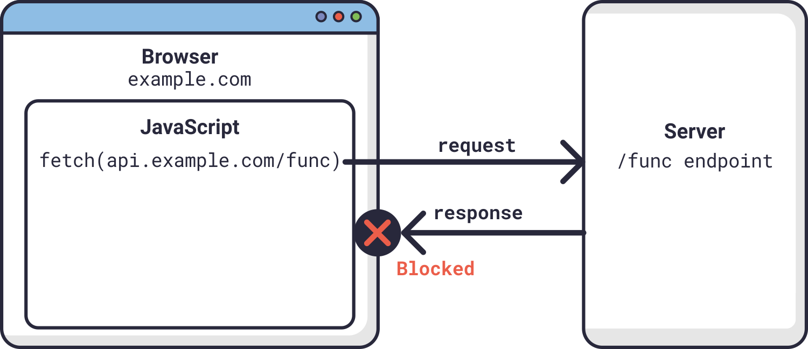
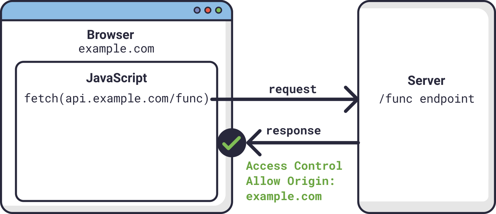
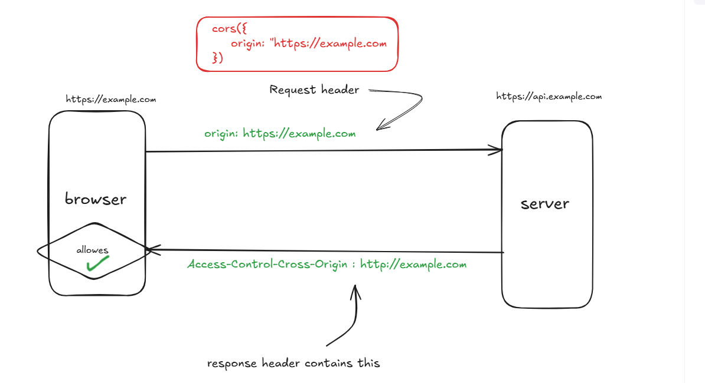
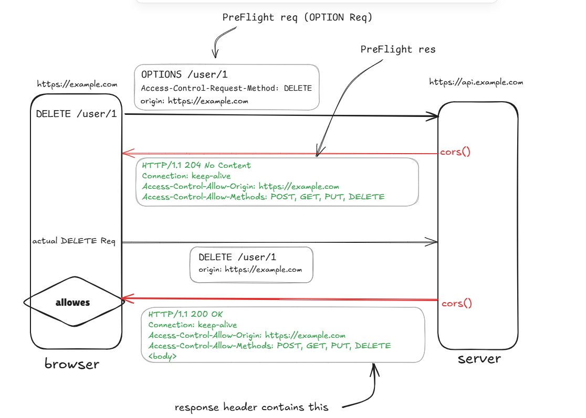

# **Middlewares and Cors**

## Article/Blogs Link:

- [**Express Explained with Examples - Installation, Routing, Middleware, and More**](https://www.freecodecamp.org/news/express-explained-with-examples-installation-routing-middleware-and-more/) - **Recommended - Must Read**
- [**What Does `app.use(express.json())` Do in Express?**](https://masteringjs.io/tutorials/express/express-json)

- [**UNDERSTAND CORS truely**](https://www.youtube.com/watch?v=E6jgEtj-UjI)
- [**CORS Indepth**](https://www.youtube.com/watch?v=tcLW5d0KAYE)
- [**CORS mdn**](https://developer.mozilla.org/en-US/docs/Web/HTTP/Guides/CORS)
- [**CORS in Node.js with Express**](https://saragam.medium.com/cors-in-node-js-with-express-99b355e93def)
- [**How to allow CORS in node.js?**](https://stackoverflow.com/questions/70060783/how-to-allow-cors-in-node-js)
- [**Preflight request**](https://developer.mozilla.org/en-US/docs/Glossary/Preflight_request)

## Commonly used Middlewares

### `express.json()` and `express.urlencoded()` uses `body-parser` under the hood

```js
const express = require("express");
const bodyParser = require("body-parser");

const app = express();
app.use(bodyParser.json());

app.post("/sum", (req, res) => {
  console.log(req.body);

  if (req.body) {
    let { a, b } = req.body;
    return res.json({ answer: a + b });
  } else return res.end({ error: "Provide a json body.." });
});

app.listen(3000, () => console.log("Server running.."));
```

## CORS - Cross Origin Resourse sharing

Cross-Origin Resource Sharing (CORS) is a security feature implemented in **web browsers** (not postman nor js) that restricts web applications from making requests to a different domain than the one that served the web page. By default, browsers enforce **same-origin policy**, meaning JavaScript **can only make HTTP requests to the same origin (protocol, domain, and port)** as the one serving the page.

For example, `example.com` can retrieve data from its server at `example.com` because they share the same domain. Any of its subdomains would also be accessible (i.e. `example.com/page1` or `example.com/page1/page2`).

However, resources from domains like `api.example.com` or `google.in` would not be accessible to `example.com` due to this security policy.



CORS is a mechanism that allows **servers to specify** which origins are permitted to access their resources using additional HTTP headers.

> origin means a specific location (url)

## How CORS Works? [scroll to the end for detailed explanation]

When a **browser** makes a **cross-origin request**, it includes an `Origin` header in the request.

    the Origin header is an actual HTTP header that the browser automatically includes in cross-origin requests. It indicates the source (protocol, domain, and port) of the request.

    For example, if a frontend web app hosted at https://example.com makes an API request to https://api.example.com, the browser sends a request like this:
    ----------------------
    GET /data HTTP/1.1
    Host: api.example.com
    Origin: https://example.com
    ----------------------

If the **server** allows the request, it responds with appropriate CORS headers, such as:

- `Access-Control-Allow-Origin`: Specifies which origin(s) can access the resource.

- `Access-Control-Allow-Methods`: Lists allowed HTTP methods (e.g., GET, POST).

- `Access-Control-Allow-Headers`: Lists permitted request headers.

- `Access-Control-Allow-Credentials`: Indicates whether credentials (cookies, authorization headers) are allowed.

For example, if we set `Access-Control-Allow-Origin` to `example.com`, it means that this website can now have access to `api.example.com`.



Server response:

    -----------------------
    HTTP/1.1 200 OK
    Access-Control-Allow-Origin: https://example.com
    -----------------------

For simple requests (like `GET` or `POST` without special headers), the browser sends the request directly to the server
For non-simple requests (like `PUT`, `DELETE`, or requests with custom headers), the browser performs a **preflight request** using the `OPTIONS` method before the actual request.

## Enabling CORS in Node.js with Express

enable CORS using the cors middleware.

### 1. Install CORS Middleware

Run the following command:

```sh
npm install cors
```

### 2. Basic CORS Configuration

Add the middleware to your Express app:

```js
const express = require("express");
const cors = require("cors");

const app = express();
app.use(cors()); // Enables CORS for all routes

app.get("/", (req, res) => {
  res.send("CORS is enabled!");
});

app.listen(3000, () => console.log("Server running on port 3000"));
```

This allows all origins (`*`) to access the server.

---

## Custom CORS Configuration

If you want more control, you can customize the CORS settings:

```js
app.use(
  cors({
    origin: "http://example.com", // Allow only this origin
    methods: ["GET", "POST", "PUT"], // Allowed HTTP methods
    allowedHeaders: ["Content-Type", "Authorization"], // Allowed headers
    credentials: true, // Allow cookies and authentication headers
  })
);
```

---

## Manually Setting CORS Headers

Instead of using the `cors` package, you can set headers manually:

```js
app.use((req, res, next) => {
  res.setHeader("Access-Control-Allow-Origin", "*"); // Allow all origins
  res.setHeader("Access-Control-Allow-Methods", "GET, POST, PUT, DELETE");
  res.setHeader("Access-Control-Allow-Headers", "Content-Type, Authorization");
  next();
});
```

---

## Handling Preflight Requests

The `cors()` middleware automatically handles preflight (OPTIONS) requests for you.

example of a preflight request-

a client might be asking a server if it would allow a `DELETE` request, before sending a `DELETE` request, by using a preflight request:

```
OPTIONS /resource/foo
Access-Control-Request-Method: DELETE
Access-Control-Request-Headers: x-requested-with
Origin: https://foo.bar.org
```

The CORS middleware processes this preflight request by checking the origin, methods, and headers.

If the server allows it, then it (cors()) will respond to the preflight request with an `Access-Control-Allow-Methods` response header.

```
HTTP/1.1 204 No Content
Connection: keep-alive
Access-Control-Allow-Origin: https://foo.bar.org
Access-Control-Allow-Methods: POST, GET, OPTIONS, DELETE
Access-Control-Allow-Headers: X-Requested-With
Access-Control-Max-Age: 86400
```

now the browser sends the actual `DELETE` request.
The `cors()` middleware adds CORS headers to the response again.

---

### open the `CORS` folder for example

NOTE:

- start the server [`index.js`]
- go to public folder [`cd public`]
- execute `npx serve` command or we can just open the html file with live server

- `npx serve` will serve the whole folder over http

- open console on the browser to see the CORS error (freaky famous error huh) [we have solved it using cors()]

## <center>How Browser handles CORS?



#### **🔹 Simple Requests (GET, POST without special headers)**

1.  **Browser sends request** to the server.
2.  **Server responds** with the requested data and includes `Access-Control-Allow-Origin`.
3.  **Browser checks** if the `Access-Control-Allow-Origin` header allows the request.
4.  - ✅ If **allowed**, the response is available to JavaScript.
    - ❌ If **not allowed**, the browser **blocks** the response and throws a CORS error in the console.

#### **🔸 Preflight Requests (For non-simple requests like PUT, DELETE, or custom headers)**

1.  **Browser first sends an OPTIONS request** (a "preflight request") to check if the server allows the main request.
2.  **Server responds** with CORS headers (`Access-Control-Allow-Origin`, `Access-Control-Allow-Methods`, etc.).
3.  **Browser checks the response:**

    - ✅ If allowed → Sends the actual request.
    - ❌ If not allowed → Blocks the request and shows a CORS error.

### Preflight :


