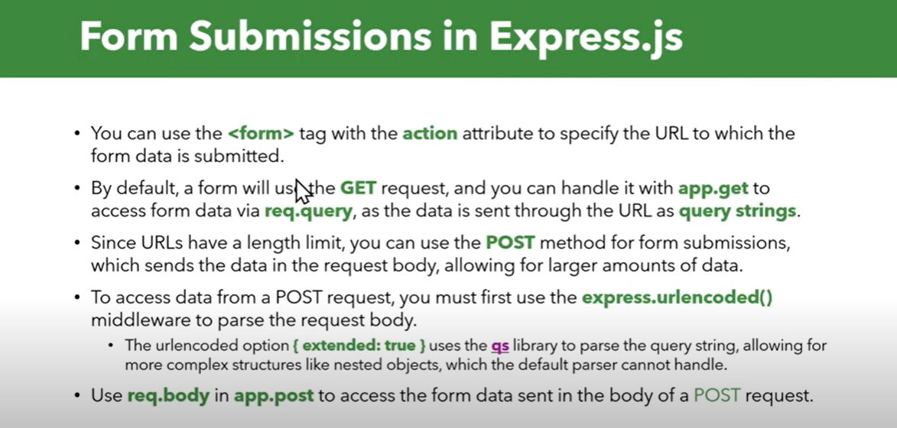

# **Form handling and static upload**

- [**Form Submission**](https://www.youtube.com/watch?v=CNJnrKkTjKo)

# Form submission


### HTML
```html
<form action="/submit" method="POST">
    <!-- in server req {input.name : input.value}  -->
  <label for="name">Name:</label>
  <input type="text" id="name" name="name" required>
  <label for="email">Email:</label>
  <input type="email" id="email" name="email" required>
  
  <button type="submit">Submit</button>
</form>
```
- When a user loads the HTML page in their browser, the browser treats all relative paths (like /submit) as relative to the current website's origin (protocol + domain + port).

- If the page is loaded from `http://localhost:3000`, then a form with `action="/submit"` will send a request to `http://localhost:3000/submit`.

- If the same HTML file is loaded from `https://example.com, then action="/submit"` will send a request to `https://example.com/submit`.

In  Express app, we'll need to handle the form submission route.

```js
const express = require("express");
const app = express();
const port = 3000;

// Middleware to parse form data
app.use(express.urlencoded({ extended: true })); // For form data

// Handle form submission
app.post("/submit", (req, res) => {
  const { name, email } = req.body; // Extract data from form
  res.send(`Received form submission: Name - ${name}, Email - ${email}`);
});

app.listen(port, () => {
  console.log(`Server running on http://localhost:${port}`);
});
```

### **NOTE**:

the server (Express) and the HTML file usually run separately in real-world applications. However, in this case, Express serves the HTML file itself, so they can run on the same port.

```js
const express = require("express");
const path = require("path");
const app = express();
const port = 3000;

// Middleware to parse form data
app.use(express.urlencoded({ extended: true }));

// Serve static files (including index.html)
app.use(express.static("public"));

// Handle form submission
app.post("/submit", (req, res) => {
  const { name, email } = req.body;
  res.send(`Received: Name - ${name}, Email - ${email}`);
});

// Start server
app.listen(port, () => {
  console.log(`Server running at http://localhost:${port}`);
});
```

### `express.static()`

 express.static("public") is a built-in middleware in Express that serves static files (like HTML, CSS, JS, images) directly from a folder, without writing separate routes for each file.

 **Working**

- Express serves files from a specified directory 
- Users can access these files via a URL
- No need to manually define routes for each file

```pgsql
/my-project
 ├── /public
 │   ├── index.html
 │   ├── styles.css
 │   ├── script.js
 │   ├── image.png
 ├── server.js
 ├── package.json
```

`server.js`

```js
const express = require("express");
const app = express();
const port = 3000;

// Serve static files from the "public" folder
app.use(express.static("public"));

app.listen(port, () => {
  console.log(`Server running at http://localhost:${port}`);
});
```

### 🌍 How to Access Static Files?

If you start the server (`node server.js`), you can now access:

`http://localhost:3000/` → Serves public/index.html

`http://localhost:3000/styles.css` → Serves public/styles.css

`http://localhost:3000/script.js` → Serves public/script.js

`http://localhost:3000/image.png` → Serves public/image.png

✔ No need to write separate routes for each file! 🚀

## Better Ways to Handle Form Data
using fetch or axios, why? 	Normal Submit (`<form>`) reloads the page

```js
<form id="myForm">
  <input type="text" name="name" placeholder="Your Name" required>
  <input type="email" name="email" placeholder="Your Email" required>
  <button type="submit">Submit</button>
</form>

<script>
  document.getElementById("myForm").addEventListener("submit", async function (event) {
    event.preventDefault(); // Prevent traditional form submission

    const formData = new FormData(this); // Collect form data

    //send the data to the server
    const response = await fetch("http://localhost:3000/submit", {
      method: "POST",
      body: formData, // Send data
    });

    const result = await response.text();
    alert(result); // Show server response
  });
</script>
```
`FormData` is a built-in JavaScript object that allows you to easily collect form input values and send them in an HTTP request (as something called multidata format), especially for `multipart/form-data` submissions (like file uploads).

`FormData()` is already in a format that `multipart/form-dat`a expects, so the browser automatically sets the correct Content-Type header

If you manually stringify it (JSON.stringify(formData)), it won’t work because FormData isn't a plain JavaScript object.

### 1️⃣ Convert FormData to an Object (Easiest Way)
ForData doesnt return a ordinary object

```js
const formData = new FormData(form);

// Convert FormData to a plain object
const formObject = Object.fromEntries(formData);

console.log(formObject);
```

<br>

---

# Authen