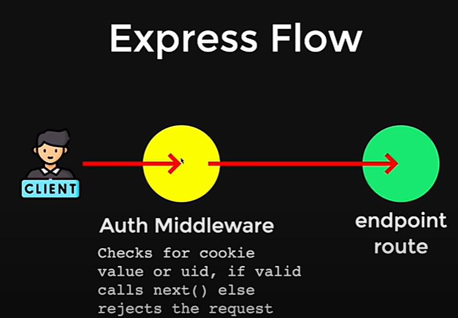
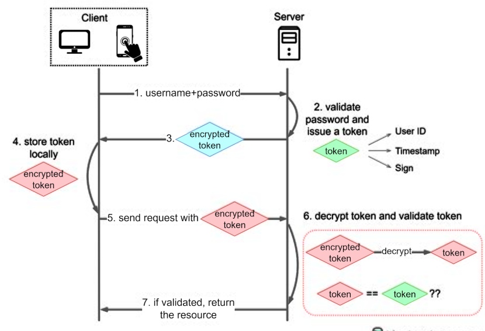
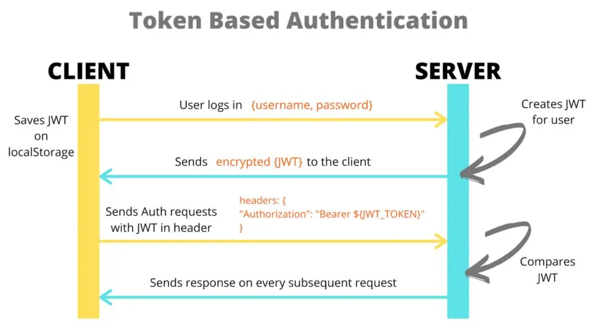
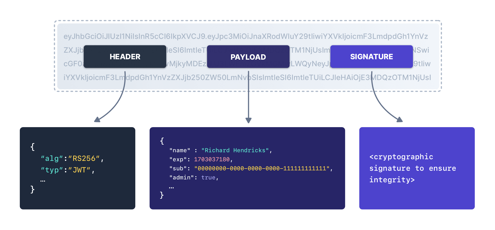
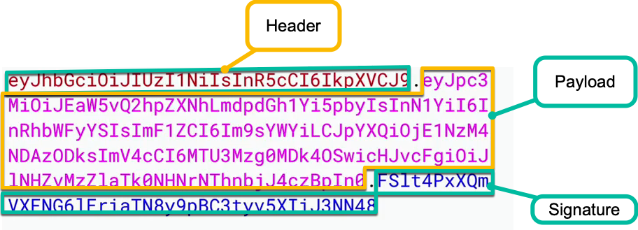

# **Week 6.1 - Authentication and JWT**

- [**Authentication and Authorization in Node.js**](https://codewithpawan.medium.com/authentication-and-authorization-in-node-js-a-comprehensive-guide-2755b57dce27) - Give a Read
- [**How Authentication works**](https://medium.com/@itsmeakhil/understanding-about-web-authentication-methods-ccae46734108) - Give a Read
- [**Authentication working Visualization**](https://www.youtube.com/watch?v=QzntvHz23tw) - watch 
- [**How To Implement JWT Authentication On Node**](https://adevait.com/nodejs/how-to-implement-jwt-authentication-on-node)
- [**JWT Authentication in Node.js**](https://medium.com/@extio/understanding-json-web-tokens-jwt-a-secure-approach-to-web-authentication-f551e8d66deb) - read
- [**Token-Based Authentication In Node.js Using JWT**](https://www.scholarhat.com/tutorial/nodejs/token-based-authentication-using-json-web-token)
- [**All Security Testing What are the pros and cons of using tokens and JWTs for authentication and authorization?**](https://www.linkedin.com/advice/3/what-pros-cons-using-tokens-jwts-authentication)
- [**.env file**](https://medium.com/the-node-js-collection/making-your-node-js-work-everywhere-with-environment-variables-2da8cdf6e786)

   - need `dotenv` package to access env variables in code  

## Authentication

Authentication is the process of verifying a user's identity before granting access to a system, application, or API. It ensures that only authorized users can access protected resources.

### Types of Authentication:

- **Session-Based Authentication (Cookie-Based) - statefull**

  - the server creates a session and **stores it in memory or a database**.

  - The client gets a session ID (cookie) that is sent with each request.

  - Requires server-side storage, making it less scalable.

- **Token-Based Authentication (JWT, OAuth, etc.) - stateless**

  - The server issues a token upon successful login.

  - The client stores the token (usually in local storage or HTTP-only cookies).

  - The token is sent with each request, typically in the HTTP headers.

  - No need for server-side storage of sessions, making it more scalable.

token-based authentication (JWT, OAuth) is **header-based** because the token is sent in the `Authorization` header (`Bearer <token>`).

On the other hand, cookie-based authentication (session-based) is not header-based because the authentication info is stored in a cookie, which the browser sends automatically with requests. `Cookie` header




### **How Authentication Works (Step-by-Step)**

1. **Login Request (Client → Server)**
   - Client sends **username & password** in a `POST /login` request.
   - Server **validates credentials** (checks database).

2. **Token/Session Creation (Server → Client)**
   - If valid, the server generates:
     - **JWT (Token-based)** → Sent in **response body**.
     - **Session ID (Session-based)** → Stored in a **cookie** (`Set-Cookie` header).

3. **Storing Token/Session (Client-Side)**
   - **JWT:** Stored in `localStorage`, `sessionStorage`, or **HTTP-only cookies**.
   - **Session ID:** Automatically stored in browser cookies.

4. **Sending Authenticated Requests (Client → Server)**
   - **JWT:** Sent in `Authorization: Bearer <token>` header.
   - **Session:** Browser automatically sends `Cookie: session_id=<value>`.

5. **Server Validates Token/Session**
   - **JWT:** Server verifies token **without storing it** (using secret key).
   - **Session:** Server **looks up session** in database/memory.

6. **Server Responds with Protected Data**
   - If authentication is valid, server sends the requested **protected resource**.
   - If invalid, server returns **401 Unauthorized**.



## JWT (JSON Web Token)
JWT (JSON Web Token) is a compact, self-contained (the token it self will contain the actual data) token used for authentication. It allows the server to verify a user's identity without storing session data.




### 🛠️ How JWT Works?

1. **Client Logs In** → Sends username & password to the server.

2. **Server Generates JWT** → If credentials are valid, the server creates a JWT.

3. **JWT Sent to Client** → The client receives the token and stores it (e.g., `localStorage`, `sessionStorage`, or `HTTP-only cookies`).

4. **Client Sends JWT in Requests** → The client includes the token in the **Authorization header** (`Bearer <token>`).

5. **Server Verifies JWT** → Server checks the token’s validity using a secret key.(by retriving the data from crypted token)

6. **Access Granted/Denied** → If valid, the server allows access; otherwise, it denies access.

### Why?

JWT (JSON Web Token) contains the user’s data inside the token itself, making it self-contained and eliminating the need for server-side session storage. The payload contains user info (e.g., id, username, role).



the token---




## JWT Vrification flow

When the server receives a JWT from the client, it **doesn’t just trust the payload blindly**. It does this first:

### ✅ It verifies the signature using a secret key (that only the server knows).

Here’s how it works under the hood:
---
### 📦 The JWT has 3 parts:

```
<Header>.<Payload>.<Signature> 
```
When the server originally created the token, it did this:
```js
jwt.sign(payload, SECRET_KEY);
```

So the token's signature is like:

```
HMAC_SHA256(base64UrlEncode(header) + "." + base64UrlEncode(payload), SECRET_KEY)
```

🔍 Now when the token comes back:
Server uses `jwt.verify(token, SECRET_KEY):`

It recalculates the signature.

- If the recalculated signature matches the one in the token → ✅ Token is authentic

- If it doesn’t match → ❌ Token is fake/tampered → rejected

⚠️ Why this is secure:

Client CANNOT forge a valid token because they don’t know your `SECRET_KEY`.

Even if they edit the payload ({ id: 999, role: 'admin' }), the signature will be invalid when verified.

👀 So in short:

**The server knows the user is authentic because the token’s signature matches what it expects, and only the server can generate or validate that.**

But see some jwt debugger (onlie tools) easily decode (not decrypt), the token.. coz- 

- The first two parts (HEADER & PAYLOAD) are **Base64-encoded**, not encrypted.

- That’s why tools like jwt.io can easily decode them.

- but they cannot verify the **signature** without the secret key

### **JWT isn't encrypted, just encoded.**, Thats why sensitive info should be encrpted before travelling in jwt playload       

### Code:

can skip `bcrypt`, but only if you aren’t handling passwords. Otherwise, always hash them!

- ❌ Plain passwords = easy to steal
- ✅ bcrypt = strong password protection, as we are storing users password 
- ✅ JWT + bcrypt = Secure authentication system

```js
require('dotenv').config();
const express = require('express');
const jwt = require('jsonwebtoken');
const bcrypt = require('bcryptjs');
const bodyParser = require('body-parser');
const cors = require('cors');

const app = express();
const PORT = process.env.PORT || 5000;
const SECRET_KEY = process.env.JWT_SECRET || "your_secret_key";

// Middleware
app.use(cors());
app.use(bodyParser.json());

// Dummy user data (Replace with a database in real projects)
const users = [{ id: 1, username: 'test', password: bcrypt.hashSync('password', 10) }];

// Generate JWT Token
const generateToken = (user) => {
    return jwt.sign({ id: user.id, username: user.username }, SECRET_KEY, { expiresIn: '1h' });
};

// 🔹 **Register Route**
app.post('/register', (req, res) => {
    const { username, password } = req.body;
    if (users.find(user => user.username === username)) {
        return res.status(400).json({ message: 'User already exists' });
    }
    
    const hashedPassword = bcrypt.hashSync(password, 10);
    const newUser = { id: users.length + 1, username, password: hashedPassword };
    users.push(newUser);

    res.json({ message: 'User registered successfully' });
});

// 🔹 **Login Route**
app.post('/login', (req, res) => {
    const { username, password } = req.body;
    const user = users.find(u => u.username === username);
    
    if (!user || !bcrypt.compareSync(password, user.password)) {
        return res.status(401).json({ message: 'Invalid credentials' });
    }
    
    const token = generateToken(user);
    res.json({ token });
});

// Middleware to Verify JWT
const authenticateJWT = (req, res, next) => {
    const token = req.header('Authorization')?.split(' ')[1];       // Authorization : Bearer <token>

    if (!token) return res.status(403).json({ message: "Access denied" });

    jwt.verify(token, SECRET_KEY, (err, user) => {
        if (err) return res.status(401).json({ message: "Invalid token" });

        req.user = user; // Attach user data to request
        next();
    });
};

// 🔹 **Protected Route**
app.get('/protected', authenticateJWT, (req, res) => {
    res.json({ message: `Welcome, ${req.user.username}!`, user: req.user });
});

// Start Server
app.listen(PORT, () => {
    console.log(`Server running on http://localhost:${PORT}`);
});
```

## 📌 Important Methods & Explanation


- `jwt.sign(payload, SECRET_KEY, options)`	Generates a new JWT token, playload sholud be a valid json obj

- `jwt.verify(token, SECRET_KEY)`	Verifies and decodes a JWT token, returns the playload data object

- `bcrypt.hashSync(password, saltRounds)`	Hashes the password securely

- `bcrypt.compareSync(password, hash)`	Compares a raw password with its hash

- `req.header('Authorization')`	Retrieves the token from request headers

### Summary

- User registers → Password is hashed before storing.
- User logs in → If credentials are correct, a JWT is generated.
- Client stores JWT → In localStorage, sessionStorage, or HTTP-only cookies.
- Client requests a protected route → Sends JWT in the Authorization header.
- Server verifies JWT → If valid, access is granted.

## Note:
- you must **store** and **send** JWT token manually in the client(unless using cookies).

- Local Storage (localStorage) → Easy, but vulnerable to XSS.

```js
localStorage.setItem("token", jwtToken);
```
    
```js
fetch("/api/protected-route", {
  method: "GET",
  headers: {
    "Authorization": `Bearer ${localStorage.getItem("token")}`
  }
})
.then(response => response.json())
.then(data => console.log(data));
```

