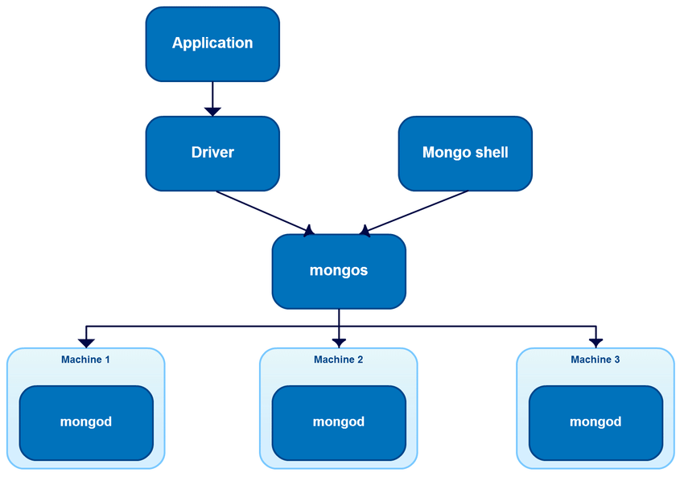
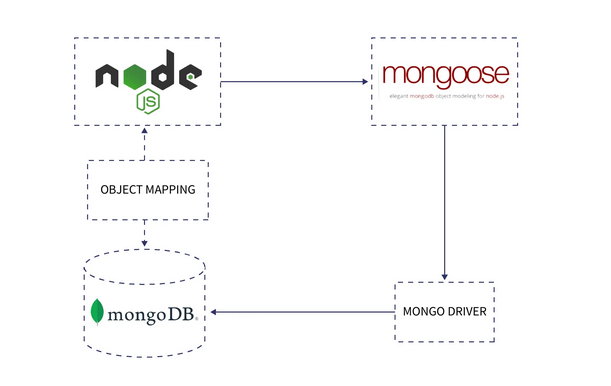
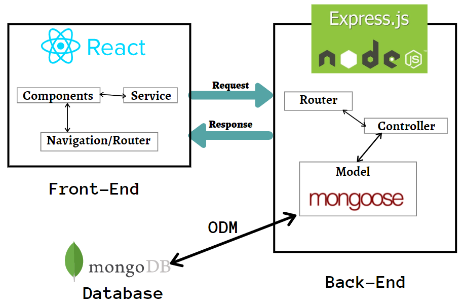
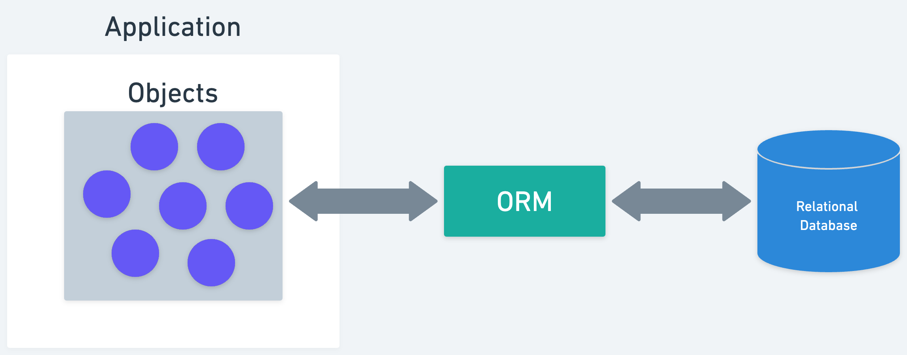
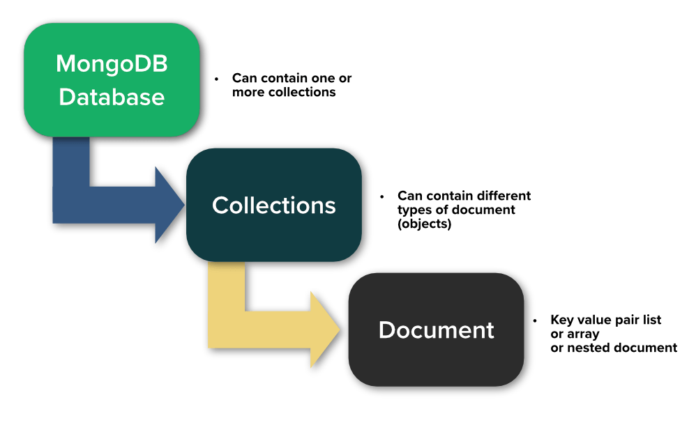
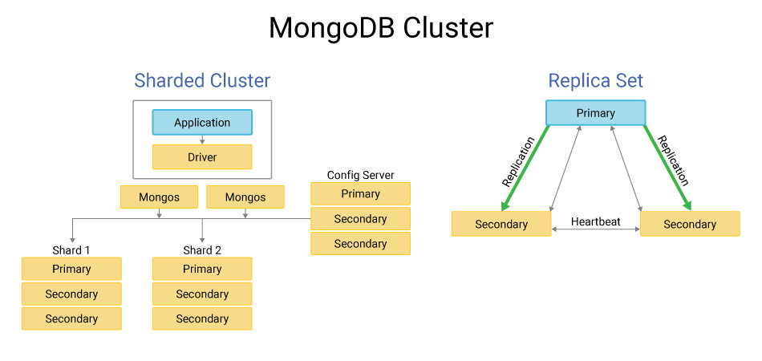
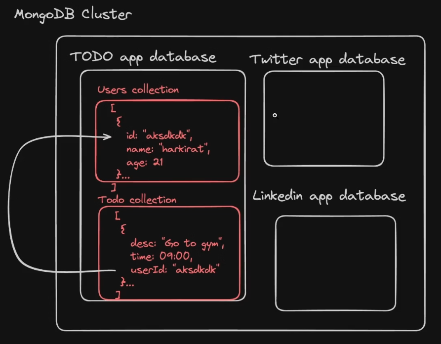
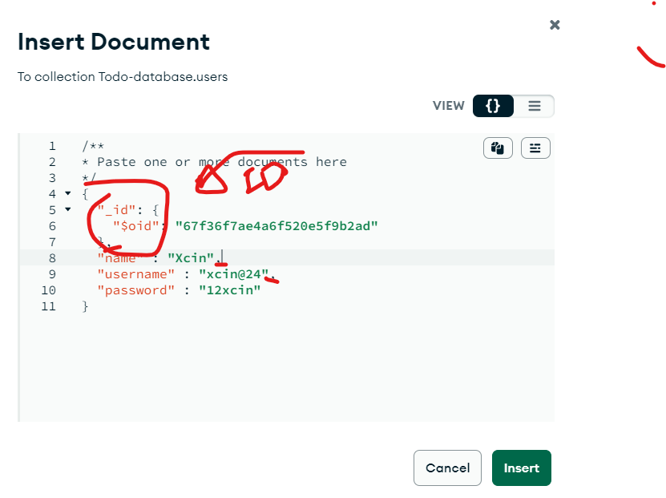

# **Week 07 - 7.1 | MongoDB**

## Article/Blogs Link:

- [**What Is A Database? Relational VS Nonrelational Databases**](https://www.freecodecamp.org/news/relational-vs-nonrelational-databases-difference-between-sql-db-and-nosql-db/)
- [**SQL vs NoSQL: When to Use Which**](https://www.freecodecamp.org/news/sql-vs-nosql-tutorial/)
- [**What is MongoDB? Features and how it works**](https://www.spiceworks.com/tech/cloud/articles/what-is-mongodb/) - Must Read
- [**Why Use MongoDB: What It Is and What Are the Benefits**](https://www.simplilearn.com/tutorials/mongodb-tutorial/what-is-mongodb)
- [**MongoDB Atlas Tour**](https://www.udemy.com/course/web-dev-master/learn/lecture/45782731#overview)
- [**How to Get Your MongoDB URL to Connect to Your Node.js Application**](https://www.freecodecamp.org/news/get-mongodb-url-to-connect-to-a-nodejs-application/)
- [**ORM/ODM?**](https://www.mongodb.com/developer/products/mongodb/mongodb-orms-odms-libraries/)
- [**What is Mongoose?**](https://www.freecodecamp.org/news/introduction-to-mongoose-for-mongodb-d2a7aa593c57/)
- [**How to Write Cleaner Code Using Mongoose Schemas**](https://www.freecodecamp.org/news/how-to-write-cleaner-code-using-mongoose-schemas/)

## 🧠 What is SQL and NoSQL?

### ✅ SQL (Structured Query Language)

SQL is the **language** of choice for Relational Database Management Systems,
What Is A Relational Database? A Relational database stores data in a structured and tabular way. That is, it stores information in **tables**

Examples of SQL databases:
MySQL,
PostgreSQL,
SQLite,
Microsoft SQL Server

```sql
CREATE TABLE users (
  id INT PRIMARY KEY,
  name VARCHAR(50),
  email VARCHAR(100)
);
```

### ✅ NoSQL (Not Only SQL)

NoSQL databases are non-relational. They store data in various formats like:

- Document-based (like MongoDB)
- Key-value pairs
- Wide-column stores
- Graph databases

Examples of NoSQL databases:

- MongoDB (Document)
- Redis (Key-Value)
- Cassandra (Wide-Column)
- Neo4j (Graph)

MongoDB Doc:

```js
{
  "name": "Alice",
  "email": "alice@example.com",
  "age": 25
}
```

### 🔍 Why MongoDB?

MongoDB is one of the most popular NoSQL databases. Here's why it's widely used:

- Document-Oriented: Stores data in **BSON (Binary JSON)** format, easy to work with JSON-like data in JavaScript.
- Flexible Schema: You can store different structures in the same collection.
- Scalable: Easily handles big data and distributed systems.
  High Performance: Optimized for read/write-heavy workloads.

> We can install the whole mongo db locally or use MongoDB Atlas Cloud service

## MongoDB Workflow Architecture (e.g., MERN Stack)

```scss
🖼️ Frontend (React / HTML)
        ↓ (HTTP Request via Fetch/Axios)
🌐 Express.js Backend (Node.js)
        ↓
📦 ODM (Mongoose) or MongoDB Driver
        ↓
📡 MongoDB Server Components
   - mongos (router for sharded clusters)
   - mongod (main DB engine/server)
```



### 🔹 1. Frontend (React/HTML/JS)

Users interact with the UI.
Sends HTTP requests (GET, POST, PUT, DELETE) via `fetch` or `axios` to your backend API.

### 🔹 2. Backend (Express.js + Node.js)

Routes handle the incoming requests like:

```js
app.get("/users", getUsers);
```

Controllers execute logic (get users, create user, etc.)

### 🔹 3. ODM (Object Document mapping)

Using `Mongoose` (ODM):
Converts your JavaScript objects into MongoDB documents.

Adds schema, validation, models, hooks.

**Internally uses the MongoDB driver to talk to the DB.**



MERN FLOW:



### 🔹 4. MongoDB Server Side Components

🧠 `mongod` (Core MongoDB Server):
`mongod` is the "Mongo Daemon" it's basically the host process for the database. When you start `mongod` you're basically saying "start the MongoDB process and run it in the background

- It Stores and manages your actual data.
- Runs on port 27017 by default.

🐚 `mongosh` or `mongo`:
mongo is the command-line shell that connects to a specific instance of mongod

Shell tool to manually run queries from CLI.

>  - ORM used by SQL databases (like MySQL, PostgreSQL)

---

# <center> MongoDB

- MongoDB is a NoSQL database.
- It stores data in **BSON** (binary JSON) format.
- Instead of tables and rows (like SQL), you have **collections** and **documents**.

Example of a MongoDB **document**:

```json
{
  "name": "Alice",
  "age": 25,
  "email": "alice@example.com"
}
```

This document would be inside a collection like `users`,
**collections** hold multiple **documents** (which are JSON-like objects).



## What is Cluster?

a cluster refers to a group of MongoDB servers (instances) that work together to store and manage data. The term can refer to different types of setups depending on context:

### 1. Replica Set (High Availability Cluster)

- A cluster of MongoDB servers that keep copies (replicas) of the same data.
- Ensures high availability and failover.

- Contains:

  - Primary node (accepts writes)

  - Secondary nodes (replicate data from primary, used for reads)

🔁 Used for: data redundancy, automatic failover.

### 2. Sharded Cluster (Horizontal Scaling; adding more servers)

- Used for scaling out large datasets across many machines.
- Breaks up data into chunks and spreads them across shards.

- Contains:
  - Shards: each holds a portion of data (can be replica sets too)
  - Query Router (`mongos`): sends queries to correct shard
  - Config Servers: store metadata about the shards

📦 Used for: distributing massive data loads, improving performance.



> A single MongoDB cluster can host multiple databases
> 

### MongoDB Document

in MongoDB, each document is required to have a unique \_id field that serves as its primary key. if you do not provide an `_id` value when inserting a document, MongoDB generates an `ObjectId` for this field..



when working within MongoDB's shell or certain drivers, documents might **display** the \_id field as:

```json
{
  "_id": ObjectId("507f1f77bcf86cd799439011"),
  "name": "Xcin",
  "username": "xcin@24",
  "password": "12xcin"
}
```

- `ObjectId` values are not strings, these are type of `ObjectId()`

- references between documents, MongoDB does not enforce relationships like traditional relational databases. However, you can implement references manually by storing the` _id` of one document within another. For example, if you have a `users` collection (containing `user` doc) and a `posts` collection, each post document can include a `user_id` field that stores the `_id` of the corresponding `user`:

```json
{
  "_id": ObjectId("post_id"),
  "title": "Post Title",
  "content": "Post content.",
  "user_id": ObjectId("user_id")  // Reference to the user
}
```

# <center> Mongoose

Mongoose is an Object Data Modeling (ODM) library for MongoDB and Node.js. It manages relationships between data, provides schema validation, and is used to translate between objects in code and the representation of those objects in MongoDB.

## Terminologies

### 📁 Collections and Documents

- A collection holds multiple `documents` (records).
- A document single unit of data in MongoDB, stored in JSON-like format. (Equivalent of: Rows or Records in SQL)

### 🔑 Fields

- Description: Key-value pairs inside documents. (equivalent Columns in SQL)

```json
{
  "firstName": "John",
  "lastName": "Doe",
  "email": "john@example.com"
}
```

`firstName`, `lastName`, and `email` are fields.

### 🧬 Schema (Mongoose)

- MongoDB is schema-less, meaning you can store any shape of data.
- Mongoose, however, adds a schema layer in your app code to enforce structure.
- Definition: Describes the shape of the **documents** inside a collection.
- Important: Schema applies to **documents**, not the collection itself.

🟢 Mongoose Schema = Structure of one document, enforced by the app (not MongoDB itself).

### 🧩 SchemaTypes

- Purpose: Define the data type of each field in the schema.
- Examples: `String`, `Number`, `Boolean`, `Date`, etc.
- You can also add options like:
  - `required: true`
  - `default: "N/A"`
  - `unique: true`

### 🏗 Models

- Definition: A Model is a **constructor** created from a Mongoose schema.
- Purpose: **Used to create and read documents from the collection.**
- Think of it like: A Model = Blueprint to create/handle documents.

```js
const puppySchema = new mongoose.Schema({
  //sstructure of the schema
  name: {
    type: String,
    required: true,
  },
  age: Number,
});

const Puppy = mongoose.model("Puppy", puppySchema); // used to interract with schema
```

## Code:

```js
// index.js
const express = require("express");
const mongoose = require("mongoose");
const app = express();
app.use(express.json());

// ✅ Connect to MongoDB
mongoose
  .connect("your_mongodb_uri_here", {
    useNewUrlParser: true,
    useUnifiedTopology: true,
  })
  .then(() => console.log("✅ MongoDB Connected"))
  .catch((err) => console.error("❌ MongoDB Error:", err));

// ✅ Define Schema
const todoSchema = new mongoose.Schema({
  title: {
    type: String,
    required: true,
  },
  completed: {
    type: Boolean,
    default: false,
  },
});

// ✅ Create Model
const Todo = mongoose.model("Todo", todoSchema);

// ✅ Routes

// CREATE (POST) - Add a new todo
app.post("/todos", async (req, res) => {
  try {
    const todo = new Todo(req.body); // Mongoose instance
    const saved = await todo.save(); // Save to DB
    res.status(201).json(saved);
  } catch (err) {
    res.status(400).json({ error: err.message });
  }
});

// READ (GET) - Fetch all todos
app.get("/todos", async (req, res) => {
  const todos = await Todo.find(); // Fetch all
  res.json(todos);
});

// READ (GET by ID)
app.get("/todos/:id", async (req, res) => {
  try {
    const todo = await Todo.findById(req.params.id); // Fetch by ID
    if (!todo) return res.status(404).send("Todo not found");
    res.json(todo);
  } catch (err) {
    res.status(400).json({ error: "Invalid ID" });
  }
});

// UPDATE (PUT) - Update by ID
app.put("/todos/:id", async (req, res) => {
  try {
    const updated = await Todo.findByIdAndUpdate(req.params.id, req.body, {
      new: true,
      runValidators: true,
    });
    res.json(updated);
  } catch (err) {
    res.status(400).json({ error: err.message });
  }
});

// DELETE - Remove a todo
app.delete("/todos/:id", async (req, res) => {
  try {
    const deleted = await Todo.findByIdAndDelete(req.params.id);
    if (!deleted) return res.status(404).send("Todo not found");
    res.json({ message: "Deleted successfully" });
  } catch (err) {
    res.status(400).json({ error: "Invalid ID" });
  }
});

// Start Server
app.listen(3000, () => console.log("🚀 Server running on port 3000"));
```

## 📘 Common Mongoose Methods & Options

### 🛠 Mongoose Methods

| Method                                  | Description                                         |
| --------------------------------------- | --------------------------------------------------- |
| `new Model(data)`                       | Creates a new document instance.                    |
| `.save()`                               | Saves the new document to the DB.                   |
| `.find()`                               | Gets all documents from a collection.               |
| `.findById(id)`                         | Gets a document by its `_id`.                       |
| `.findByIdAndUpdate(id, data, options)` | Updates a document and returns the updated version. |
| `.findByIdAndDelete(id)`                | Deletes a document by its ID.                       |
| `.findByIdAndDelete(id)`                | Deletes a document by its ID.                       |
| `.mongoose.model('ModelName', schema);` | ModelName(plural of collection in mongoDB) is collection name in db     |

---

### ⚙️ Common Options

| Option                     | Description                                                          |
| -------------------------- | -------------------------------------------------------------------- |
| `useNewUrlParser: true`    | Uses the new MongoDB connection string parser.                       |
| `useUnifiedTopology: true` | Uses the new unified topology engine (better stability/performance). |
| `runValidators: true`      | Ensures schema rules are respected during updates.                   |
| `new: true`                | Returns the updated document instead of the old one.                 |

---

✅ **All query and database operations return Promises.**

⚠️ `new Model(data)` is synchronous — it only creates the object in memory.  
➡️ Use `.save()` to store it in MongoDB.

# 📘 Mongoose CRUD Operations (with Todo model)

## ✅ Common CRUD Operations

| Operation       | Method                                      | Example                                                                 |
|----------------|---------------------------------------------|-------------------------------------------------------------------------|
| **Create**      | `new Model()` + `.save()` OR `.create()`   | `const todo = await Todo.create({ title: 'Learn Mongoose' });`         |
| **Read All**    | `.find()`                                   | `const todos = await Todo.find();`                                     |
| **Read One**    | `.findById(id)`                             | `const todo = await Todo.findById(req.params.id);`                     |
| **Update by ID**| `.findByIdAndUpdate(id, data, options)`     | `await Todo.findByIdAndUpdate(id, { completed: true }, { new: true });`|
| **Delete by ID**| `.findByIdAndDelete(id)`                    | `await Todo.findByIdAndDelete(id);`                                    |

---

## 🧪 Full Example

```js
// Create using new + save
const newTodo = new Todo({ title: 'Walk the dog' });
await newTodo.save();

// OR using create, will return the created doc
await Todo.create({ title: 'Read a book' });

// Read All
const todos = await Todo.find();

// Read One
const oneTodo = await Todo.findById('your_id_here');

// Update
const updated = await Todo.findByIdAndUpdate(
  'your_id_here',
  { completed: true },
  { new: true, runValidators: true }
);

// Delete
await Todo.findByIdAndDelete('your_id_here');
```

**🧠 Extra CRUD-related Methods
Method	Use**

`.findOne(query)`	Find a single doc matching a condition
`.deleteOne() / .deleteMany()`	Remove docs based on condition
`.updateOne() / .updateMany`()	Update one or multiple docs