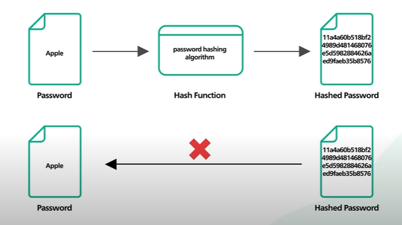
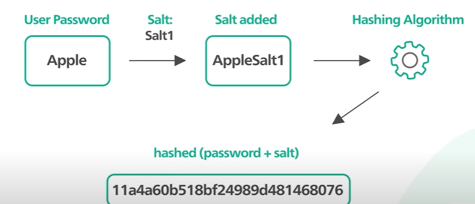

# **Passwords, Zod**

## Article/Blogs Link:
- [**Getting Started With MongoDB & Mongoose**](https://www.mongodb.com/developer/languages/javascript/getting-started-with-mongodb-and-mongoose/) - Must Read
- [**JSON and BSON**](https://www.mongodb.com/resources/basics/json-and-bson)
- [**What is hashing? How does hashing work?**](https://www.techtarget.com/searchdatamanagement/definition/hashing#:~:text=Hashing%20is%20a%20one%2Dway,hash%20values%20for%20each%20input.)
- [**How to Hash Passwords with bcrypt in Node.js**](https://www.freecodecamp.org/news/how-to-hash-passwords-with-bcrypt-in-nodejs/#:~:text=Conclusion-,What%20is%20Hashing%3F,value%20and%20facilitates%20the%20retrieval.)
- [**Hashing and Salting passwords in Nodejs using bcrpyt**](https://devgrammer.medium.com/hashing-and-salting-passwords-in-nodejs-using-bcrpyt-369ed308f722)
- [**How to make input validation simple and clean in your Express.js app**](https://medium.com/free-code-camp/how-to-make-input-validation-simple-and-clean-in-your-express-js-app-ea9b5ff5a8a7)
- [**How to Prevent Web API Attacks with Data Validation – Web API Security Guide**](https://www.freecodecamp.org/news/web-api-security-guide/)
- [**What is Zod?**](https://www.educative.io/answers/what-is-zod)
- [**Uderstanding Zod**](https://dev.to/abhilaksharora/understanding-zod-a-comprehensive-guide-to-schema-validation-in-javascripttypescript-171k) - must read
- [**Input Validation using Zod**](https://zod.dev/?id=introduction)

<br>
<br>
<br>

# How to store password in the database?

Passwords should never be stored in plain text. It should be stroed **Hashed** in the DB.

Password hash functions are designed to be **one-way** functions. This means it should not be computationally possible to reverse the process and get the original input password from the hashed value.



`bcrypt` is a hashing library that:

- Hashes passwords securely using the Blowfish cipher Algo.
- Adds salt to make each hash unique.

## 🧠 How bcrypt Works (Brief Overview)
- Salt generation – A random string added to the password before hashing.

- Hashing – `bcrypt` hashes the (password + salt) multiple 
times.

- Comparison – `bcrypt` provides a method to compare the raw password with the hashed one.



### `bcrypt` hashed password like this:
```perl
$2y$10$wHnAq9Mg1KOSQZl8RMy38ew05CnM2QshfQhM9PM6UBoFq3WX6tNza
```

`$2y$`	- Algorithm identifier (bcrypt, version/variant used)

`10` -	Cost factor (log2 of rounds) – 2^10 = 1024 rounds of hashing

Rest - Salt + Hash (base64-encoded)

## 🤔 If hashing is one-way, how does bcrypt compare passwords?

> User signUp; pass: "iloveher" ---hashed---> "isdhb/jb+j" --stored--> DB

>User signIn; pass: "iloveher" --hashed and compare with the stored on---> "isdhb/jb+j" == "isdhb/jb+j" (from DB)

Same hash function can generate same hash for same string. `bcrypt` extracts the salt and round from the stored hash..

### Under the hood:

Let’s say this is your stored hash in DB:

```perl
$2b$10$B2bFyY0J9vTPDMBpj5JSQuxGStkLo..Q3PZT63Ez8LCt/Py.7Tk6u
```
Now the user logs in and types `"mySecret123"`.

When you call:
```js
bcrypt.compare("mySecret123", storedHash)
```

bcrypt will:

- Extract the salt and cost from storedHash.

- Hash "mySecret123" using that same salt and cost.

- check if the resulting hash equals storedHash.


## Code:

```js
// bcrypt_demo.js

const bcrypt = require('bcrypt');

async function runBcryptDemo() {
  const password = 'mySecret123';
  const inputPassword = 'mySecret123';
  const saltRounds = 10;

  // Method 1: Hash with saltRounds directly
  const hashed1 = await bcrypt.hash(password, saltRounds);
  console.log('Hashed with hash():', hashed1);

  // Method 2: Manual salt generation
  const salt = await bcrypt.genSalt(saltRounds);
  const hashed2 = await bcrypt.hash(password, salt);
  console.log('Hashed with genSalt():', hashed2);

  // Method 3: Compare password with hashed
  const isMatch = await bcrypt.compare(inputPassword, hashed1);
  console.log('Password match:', isMatch);

  // Simulated registration
  const userInput = 'userPassword123';
  const storedHash = await bcrypt.hash(userInput, saltRounds);
  console.log('\n🔐 Stored hash in DB (on register):', storedHash);

  // Simulated login
  const loginAttempt = 'userPassword123';
  const loginResult = await bcrypt.compare(loginAttempt, storedHash);
  console.log('✅ Login successful:', loginResult);
}

runBcryptDemo();
```

## Example signup/signin

### 🔧 `models/User.js`

```js
const mongoose = require('mongoose');
const bcrypt = require('bcrypt');

const userSchema = new mongoose.Schema({
  username: { type: String, required: true, unique: true },
  password: { type: String, required: true },
});

// Method to compare password, will availabale to every `user` fetch by its model, it doesnt adds the method in db tho
userSchema.methods.comparePassword = function (candidatePassword) {
  return bcrypt.compare(candidatePassword, this.password);      //this - is the user on which its called
};

module.exports = mongoose.model('User', userSchema);
```

### 🚀 `app.js`

```js
const express = require('express');
const mongoose = require('mongoose');
const bcrypt = require('bcrypt');
const User = require('./models/User');

const app = express();
app.use(express.json());

// Connect to MongoDB
mongoose.connect('mongodb://localhost:27017/bcrypt_simple');

// Register
app.post('/register', async (req, res) => {
  try {
    const { username, password } = req.body;
    const hashedPassword = await bcrypt.hash(password, 10);
    await User.create({ username, password: hashedPassword });
    res.status(201).send('User registered');
  } catch (err) {
    res.status(400).send('Error registering user');
  }
});

// Login
app.post('/login', async (req, res) => {
  try {
    const { username, password } = req.body;
    const user = await User.findOne({ username });    // it contains the comparePassword method
    if (!user || !(await user.comparePassword(password))) {
      return res.status(401).send('Invalid credentials');
    }
    res.send('Login successful');
  } catch (err) {
    res.status(500).send('Server error');
  }
});

app.listen(3000, () => console.log('🔥 Server running on port 3000'));
```

# Zod 

Zod is a TypeScript-first schema declaration and validation library designed to provide a type-safe way to validate JavaScript objects. It helps developers define the shape of expected data and automatically generate TypeScript types from these schemas, ensuring both compile-time and runtime validation


**Zod schema** defines what an object should look like — its shape, types, and rules — before you process or store it.
```ts
import { z } from "zod";

// creating a schema for strings
const mySchema = z.string();

// parsing
mySchema.parse("tuna"); // => "tuna"
mySchema.parse(12); // => throws ZodError

// "safe" parsing (doesn't throw error if validation fails)
mySchema.safeParse("tuna"); // => { success: true; data: "tuna" }
mySchema.safeParse(12); // => { success: false; error: ZodError }
```

### Creating an object schema (How a boject should looks like)

```js
const z = require("zod");

// we can check if any object satisfies this schema
const userSchema = z.object({
  username: z.string().min(3),
  password: z.string().min(6),
});

// Validate some data
const data = {
  username: "john",
  password: "123456"
};

const result = userSchema.safeParse(data);

if (!result.success) {
  console.log("❌ Validation failed", result.error.errors);
} else {
  console.log("✅ Data is valid", result.data);
}
```

### 🧰 With Express Example
```js
app.post('/register', async (req, res) => {
  const userSchema = z.object({
    username: z.string().min(3),
    password: z.string().min(6),
  });

  const result = userSchema.safeParse(req.body);

  if (!result.success) {
    return res.status(400).json({ error: result.error.errors });
  }

  const { username, password } = result.data;
  // continue with hashing + saving...
});
```

### 🛠️ Common Validation Patterns

| Goal                        | Zod Schema                          | Example                                |
|-----------------------------|-------------------------------------|----------------------------------------|
| Required string             | `z.string()`                        | `z.object({ name: z.string() })`       |
| Minimum string length       | `z.string().min(3)`                 | `z.string().min(3)`                    |
| Maximum string length       | `z.string().max(10)`                | `z.string().max(10)`                   |
| Valid email format          | `z.string().email()`                | `z.string().email()`                   |
| Required number             | `z.number()`                        | `z.object({ age: z.number() })`        |
| Integer and positive number | `z.number().int().positive()`       | `z.number().int().positive()`          |
| Optional field              | `z.string().optional()`             | `z.object({ bio: z.string().optional() })` |
| Default value               | `z.string().default("N/A")`         | `z.string().default("hello")`          |
| Boolean value               | `z.boolean()`                       | `z.object({ isActive: z.boolean() })`  |
| Arrays                      | `z.array(z.string())`               | `z.array(z.string().min(2))`           |

### 🔍 Custom Error Messages, every function can have its own custom message
```js
z.string().min(3, { message: "Username must be at least 3 characters" })
//or
// z.string().min(3, "Username must be at least 3 characters")
```

### 👉 If a field is not marked as .optional() or has a .default(),
then Zod expects the user to provide it — otherwise, validation will fail.

```js
const userSchema = z.object({
  username: z.string().min(3),
  email: z.string().email(),
  password: z.string().min(6),
  age: z.number().int().positive().optional(),
  isAdmin: z.boolean().default(false),
});

const input = {
  username: "john",
  email: "john@example.com",
  password: "pass123",
};

const result = userSchema.safeParse(input);

if (!result.success) {
  console.log("❌ Validation errors:", result.error.errors);
} else {
  console.log("✅ Valid data:", result.data);
}
```

### Note: zod accepts any mailing format includes @, To restrict to Gmail only, you can use `.refine()` on top of `.email()`:

```js
const { z } = require("zod");

const gmailOnly = z.string().email().refine((val) => val.endsWith("@gmail.com"), {
  message: "Email must be a Gmail address",
});
```