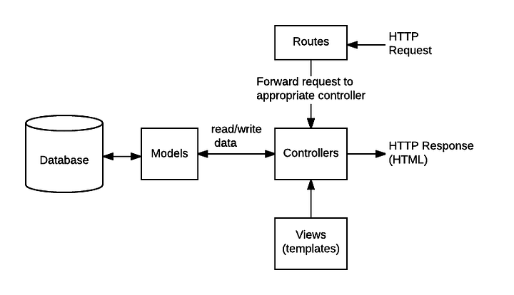
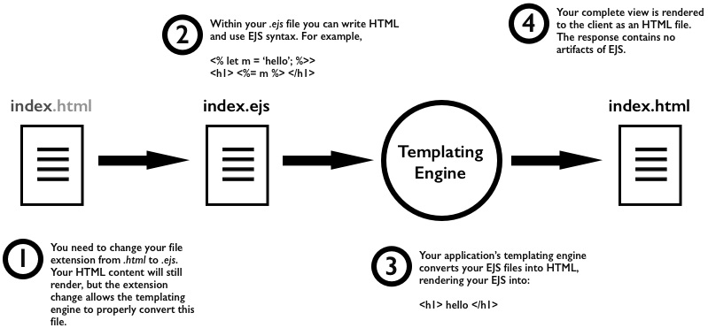

# **Backend of Course Selling App | Part-1**


## Articles/Blogs Link

-   [**MVC Pattern**](https://medium.com/@ipenywis/what-is-the-mvc-creating-a-node-js-express-mvc-application-da10625a4eda)
-   [**Folder Structure for NodeJS & ExpressJS project**](https://dev.to/mr_ali3n/folder-structure-for-nodejs-expressjs-project-435l)
-   [**A better project structure with Express and Node.Js**](https://medium.com/codechef-vit/a-better-project-structure-with-express-and-node-js-c23abc2d736f)
-   [**Routes and Controllers**](https://dev.to/ericchapman/nodejs-express-part-5-routes-and-controllers-55d3)
-   [**Building a Node API using Controllers and Routes**](https://medium.com/munchy-bytes/building-an-api-with-node-using-controllers-and-routes-ac58978d663f)
-   [**Differences between express.Router and app.get?**](https://stackoverflow.com/questions/28305120/differences-between-express-router-and-app-get)
-   [**What is .env file in Node.js?**](https://joannaterm.hashnode.dev/what-is-env-file-in-nodejs)
-   [**EJS**](https://blog.logrocket.com/how-to-use-ejs-template-node-js-application/)


# MVC Pattern 

MVC stands for Model, View, Controller is an architectural pattern that separates an application into three main logical components: 



### 🔧 1. Model (M)
- Represents the data and business logic of your application.
- Typically interacts with the database.
- In Express apps using MongoDB, this is handled using Mongoose models.

```js
// models/User.js
const mongoose = require("mongoose");

const userSchema = new mongoose.Schema({
  name: String,
  email: String,
  password: String,
});

module.exports = mongoose.model("User", userSchema);
```

### 👁️ 2. View (V)
- Represents what the user sees – the UI.
- In Express, you can use template engines like `EJS`, Pug, or Handlebars to render dynamic HTML.
- If you're building an API backend, you might not have Views. Instead, the frontend (like React or Angular) acts as the "View".
>dont need it for now, will user json res for now
```ejs
<!-- views/home.ejs -->
<h1>Welcome, <%= user.name %></h1>
```

### 🎮 3. Controller (C)
- Handles user requests, interacts with the Model, and returns a response (View or JSON).
- It contains the logic of what happens when a user hits an endpoint.

```js
const User = require("../models/User");

// GET all users
exports.getAllUsers = async (req, res) => {
  try {
    const users = await User.find();
    res.json(users); // "View" is just JSON response
  } catch (err) {
    res.status(500).json({ error: "Server error" });
  }
};

// POST create a user
exports.createUser = async (req, res) => {
  try {
    const { name, email, password } = req.body;
    const newUser = await User.create({ name, email, password });
    res.status(201).json(newUser);
  } catch (err) {
    res.status(400).json({ error: "Bad request" });
  }
};
```

Also, make sure to create a `routes` folder for holding all the routes that our app going to have, since a controller must be linked with route to listen for a specific HTTP request that comes across this route

```js
const express = require("express");
const router = express.Router();
const userController = require("../controllers/userController");

router.get("/", userController.getAllUsers);
router.post("/", userController.createUser);

module.exports = router;
```

🚀 App Entry (`app.js`)

```js
const express = require("express");
const mongoose = require("mongoose");
const userRoutes = require("./routes/userRoutes");

const app = express();
app.use(express.json()); // for parsing JSON request bodies

// Connect MongoDB
mongoose.connect("mongodb://localhost:27017/mydb");

// Use routes
app.use("/api/users", userRoutes);

app.listen(3000, () => {
  console.log("Server running on port 3000");
});
```

## 🛣️ What Are Routes in Express?

Routes in Express connect **URLs** (like `/api/users`) to specific **controller** functions (like `getAllUsers()` or `createUser()`).

They define **what should happen when someone hits a certain URL** with a certain HTTP method (GET, POST, PUT, DELETE, etc.).

### ⚙️ Step-by-step flow

1. `app.js` - Registers the router

```js
const express = require("express");
const app = express();
const userRoutes = require("./routes/userRoutes");

app.use("/api", userRoutes); // Adds prefix to all routes inside userRoutes
```

2. `routes/userRoutes.js` - Defines the routes

```js
// const express = require('express')
// const router = express.Router();
// we can call the method from the expresss obj, OR extarcting the method from the eexpress obj

const express = require("express");
const router = express.Router();    //init router
const userController = require("../controllers/userController");

router.get("/users", userController.getAllUsers);  // GET /api/users
router.post("/users", userController.createUser);  // POST /api/users

module.exports = router;
```
3. `controllers/userController.js` - Handles the logic

```js
exports.getAllUsers = (req, res) => {
  res.json([{ id: 1, name: "Alice" }, { id: 2, name: "Bob" }]);
};

exports.createUser = (req, res) => {
  const newUser = req.body;
  res.status(201).json(newUser);
};
```
<br>
<br>

----

# EJS (Embedded JavaScript Templates)

## 🧠 What is EJS?
EJS lets you write HTML with JavaScript embedded inside using `<%= %>`, `<% %>`, and more. It’s great for:

- Rendering dynamic content (e.g., user data, lists)

- Using if/else, loops in your HTML

- Creating reusable partials like headers and footers


###  🔧 What is a View Engine?
A view engine is basically a **template engine** in the context of Express.js.

- "View" = the HTML template you're sending/rendering to the client

- "Engine" = the tool that compiles that template + data into real HTML




- The view engine takes your `.ejs` (or `.pug`, `.hbs`, etc.) file

- Combines it with data you pass using `res.render()`

- Outputs **final HTML** to send to the browser

Example:
```js
app.set('view engine', 'ejs'); // sets EJS as the view engine
```

This tells Express:

__"Hey, whenever I call `res.render('file')`, use EJS to generate the HTML `from views/file.ejs`."__


### 🔧 Install EJS:

```
npm install ejs
```

### 🛠 Basic Express Setup with EJS:
```js
const express = require('express');
const app = express();

// Set view engine to EJS
app.set('view engine', 'ejs');

// Serve views from the 'views' folder by default
app.get('/', (req, res) => {
  res.render('index', { name: 'John' }); //'name' will be served as 'John' in index.ejs 
});

app.listen(3000, () => {
  console.log('Server running at http://localhost:3000');
});
```

### 📄 Step 2: Create Your First EJS File `views/index.ejs`

```html 
<!DOCTYPE html>
<html>
<head>
  <title>My EJS Page</title>
</head>
<body>
  <h1>Hello, <%= name %>!</h1>
</body>
</html>
```
- `<%= name %>` → This outputs the value of the `name` variable.

- It becomes: Hello, John! in the browser.

## 🔄 Common Syntax in EJS
| Syntax            | Purpose                        |
|-------------------|--------------------------------|
| `<%= value %>`    | Output escaped value           |
| `<%- value %>`    | Output unescaped HTML          |
| `<% code %>`      | Run JavaScript without output  |
| `<% if () { %>`   | Conditional blocks             |
| `<% for () { %>`  | Loops                          |

---

### ✅ Conditional Example

```ejs
<% if (isLoggedIn) { %>
  <p>Welcome back!</p>
<% } else { %>
  <p>Please log in.</p>
<% } %>
```

---

### ✅ Loop Example

```ejs
<ul>
  <% items.forEach(item => { %>
    <li><%= item %></li>
  <% }) %>
</ul>
```

---

## 📦 Step 3: Pass Data to EJS

```js
app.get('/users', (req, res) => {
  res.render('users', {
    isLoggedIn: true,
    items: ['Apple', 'Banana', 'Cherry']
  });
});
```

In `views/users.ejs`, you can then use that data as shown in the examples above.

## 🔄 Change Views Folder in Express

By default, Express looks for `.ejs` files in a folder named `views` (at the root of your project).
But you can customize it like this:

```js
const express = require('express');
const path = require('path');
const app = express();

// Use EJS as view engine
app.set('view engine', 'ejs');

// Set custom views folder
app.set('views', path.join(__dirname, 'my-templates')); // replace with your folder

app.get('/', (req, res) => {
  res.render('home', { name: 'John' }); // looks for my-templates/home.ejs
});

app.listen(3000, () => {
  console.log('Server running on http://localhost:3000');
});
```