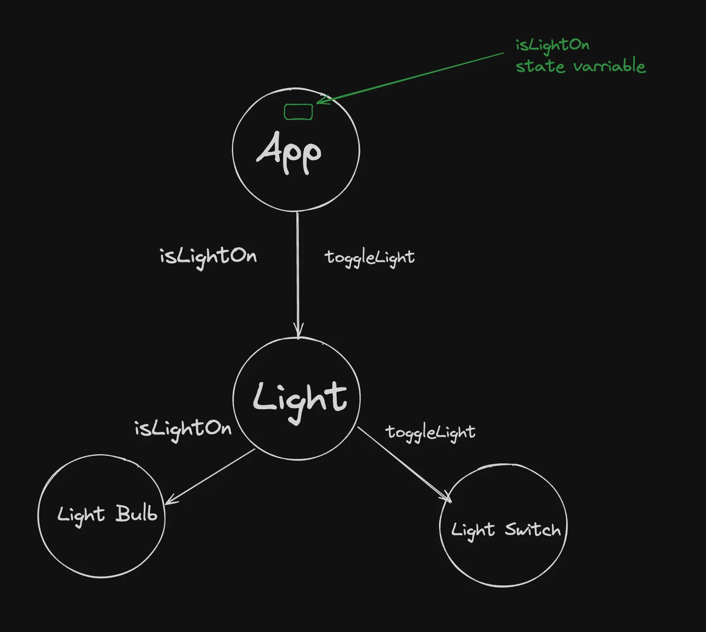
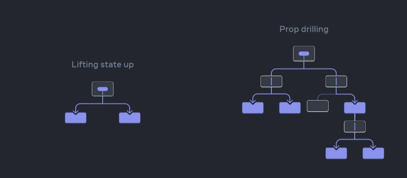
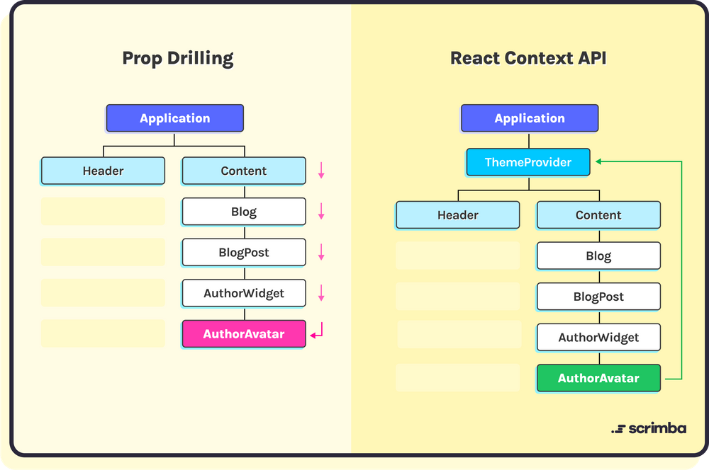
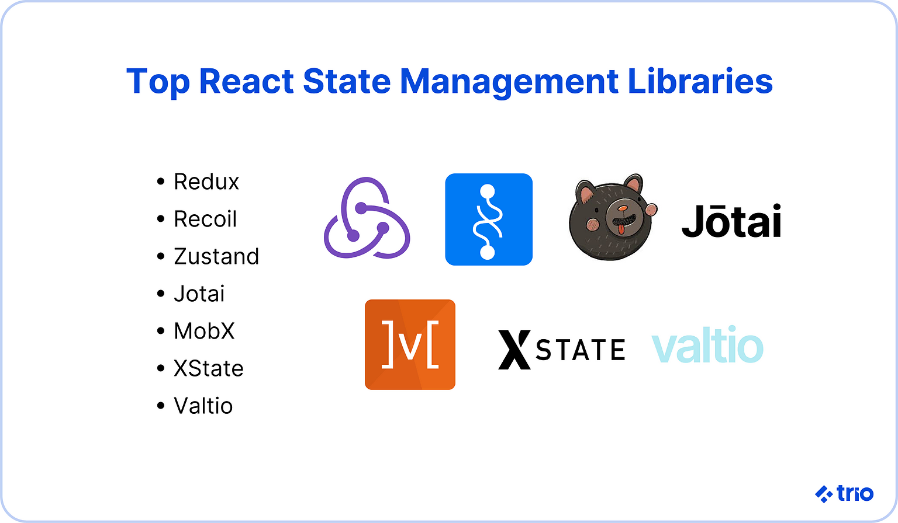

# **Context API, Rolling Up The State**


### [Notes/Slides Link](https://petal-estimate-4e9.notion.site/React-Part-1-1177dfd1073580069172fc54e33929c0)


## Articles/Blogs Link:
-   [**What Is "Lifting State Up" in React?**](https://www.freecodecamp.org/news/what-is-lifting-state-up-in-react/)
-   [**Sharing State Between Components**](https://react.dev/learn/sharing-state-between-components)
-   [**React State is rolling back to previous value**](https://stackoverflow.com/questions/65088390/react-state-is-rolling-back-to-previous-value)
-   [**React re-renders guide: why components re-render**](https://adevnadia.medium.com/react-re-renders-guide-why-react-components-re-render-a4efab132c10)
-   [**What is prop drilling in React?**](https://dev.to/codeofrelevancy/what-is-prop-drilling-in-react-3kol)
-   [**Prop Drilling in React Explained with Example**](https://www.freecodecamp.org/news/prop-drilling-in-react-explained-with-examples/)
-   [**How to Avoid Prop Drilling in React**](https://v1.scrimba.com/articles/react-context-api/) -must read
-   [**React Context API: A deep dive with examples**](https://blog.logrocket.com/react-context-api-deep-dive-examples/)
-   [**React Context API Explained with Examples**](https://www.freecodecamp.org/news/react-context-api-explained-with-examples/)
-   [**How to Use the React Context API in Your Projects**](https://www.freecodecamp.org/news/context-api-in-react/)
---
-   [**7 Top React State Management Libraries**](https://trio.dev/7-top-react-state-management-libraries/)
-   [**Exploring Recoil: Simplifying State Management in React Projects**](https://medium.com/@vikasipar/exploring-recoil-simplifying-state-management-in-react-projects-b19adbe3445b)
-   [**Recoil is the Samurai Sword of React State Management**](https://dev.to/codeofrelevancy/recoil-is-the-samurai-sword-of-react-state-management-5h3c)
-   [**Recoil**](https://recoiljs.org/docs/basic-tutorial/intro/)
-   [**React State Management — using Zustand**](https://medium.com/globant/react-state-management-b0c81e0cbbf3)
-   [**How to use Zustand**](https://refine.dev/blog/zustand-react-state/#introduction)
-   [**How to Use Redux Toolkit to Manage State in Your React Application**](https://www.freecodecamp.org/news/use-redux-toolkit-to-manage-state-in-react-apps/)
-   [**Mastering State Management in React with Redux and Redux Toolkit**](https://medium.com/@aysunitai/mastering-state-management-in-react-with-redux-and-redux-toolkit-d8e6f09d5393)
-   [**How to Use Redux and Redux Toolkit**](https://www.freecodecamp.org/news/redux-and-redux-toolkit-for-beginners/)
-   [**Difference Between Redux and Redux Toolkit**](https://medium.com/@Has_San/difference-between-redux-and-redux-toolkit-7e1e5431546d#:~:text=Redux%20is%20a%20state%20management,in%20an%20application%20over%20time.)
-   [**Recoil vs. Zustand vs. Redux**](https://medium.com/@rashmipatil24/recoil-vs-zustand-vs-redux-ddd4f4f20a92)
-   [**Comparing React State Management Libraries: Redux, Zustand, Recoil, and MobX**](https://javascript.plainenglish.io/comparing-react-state-management-libraries-redux-zustand-recoil-and-mobx-945402dc0cb)
-   [**How to Build Your Own React Hooks: A Step-by-Step Guide**](https://www.freecodecamp.org/news/how-to-create-react-hooks/)
-   [**How to create your own custom React Hooks**](https://blog.logrocket.com/create-your-own-custom-react-hooks/)
-   [**React Custom Hooks With Real-Life Examples**](https://betterprogramming.pub/react-custom-hooks-with-real-life-examples-c259139c3d71)
-   [**A Guide to React Custom Hooks**](https://dev.to/rasaf_ibrahim/a-guide-to-react-custom-hooks-2b4h)
-   [**15 Useful React Custom Hooks That You Can Use In Any Project**](https://dev.to/arafat4693/15-useful-react-custom-hooks-that-you-can-use-in-any-project-2ll8)
-   [**Passing Data from Child to Parent Components in React**](https://medium.com/@ozhanli/passing-data-from-child-to-parent-components-in-react-e347ea60b1bb)
-   [**Passing Data from a Child Component to Parent**](https://www.shecodes.io/athena/1930-passing-data-from-a-child-component-to-parent)
-   [**How to Pass Data and Events Between Components in React**](https://www.freecodecamp.org/news/pass-data-between-components-in-react/)
-   [**How to Work with useMemo in React – with Code Examples**](https://www.freecodecamp.org/news/how-to-work-with-usememo-in-react/)

---
## Lifting State Up 

Often, several components need to reflect the same changing data. Its recommend lifting the shared state up to their closest common ancestor.



### Example:

```js
function Parent() {
  const [count, setCount] = useState(0); // state is "rolled up" here

  return (
    <>
      <ChildA count={count} />
      <ChildB setCount={setCount} />
    </>
  );
}
```

## Problem: Unoptimal Re-renders:

The unoptimal re-renders happen when lifting state causes unrelated components to re-render unnecessarily — even if the state change doesn't affect them directly.

### Example:

```js
function Parent() {
  const [formState, setFormState] = useState({ name: "", age: "" });

  return (
    <>
      <NameInput name={formState.name} setFormState={setFormState} />
      <AgeInput age={formState.age} setFormState={setFormState} />
    </>
  );
}
```
Every time you type in `NameInput`, the parent re-renders, causing both inputs to re-render, even though only one changed.

## Props drilling 

Props drilling in React refers to the process of passing data (via props) through multiple layers of components, even if intermediate components don’t need the data themselves, just to get it to a deeply nested child.




### Ex

```js
function App() {
  const user = { name: "Alice" };
  return <Parent user={user} />;
}

function Parent({ user }) {
  return <Child user={user} />;
}

function Child({ user }) {
  return <GrandChild user={user} />;
}

function GrandChild({ user }) {
  return <h1>Hello, {user.name}</h1>;
}
```

`user` is only used in `GrandChild`, but we had to pass it through `Parent` and `Child`.

`Parent` and `Child` are just pipes — this is props drilling.


### ❌ Why Props Drilling Can Be a Problem
- Makes components harder to maintain.
- Causes tight coupling between components.
- Clutters components with props they don't actually use.
- Makes refactoring more difficult.

### Common Solutions to Avoid Props Drilling

- React Context API
- State Management Libraries (Redux, Zustand, Jotai, etc.)

## Context API 

If you don't want to use a full fledged state management library, you can also consider using the Context API in React.

The Context API is a built-in React feature that lets you create **global-like state or values** that can be accessed by any component in the component tree, without passing props manually at every level.


### Avoiding Props Drilling


```js
<App user={user}>
  <Parent user={user}>
    <Child user={user}>
      <GrandChild user={user} />
    </Child>
  </Parent>
</App>
```

With Context, we skip all this repetition and directly use the `user` where it’s needed.




### Three Steps to Use Context API

1. **Create a Context** — First, you create a Context using the `createContext()` function. This creates a special object that stores the state that you want to share

```js
import { createContext } from 'react';

const UserContext = createContext(); // Can set default value here
```

2. **Provide the Context** — You add the `<Context.Provider value={user} />` component to the top of the component tree that needs access to the shared state

```js
function App() {
  const user = { name: 'Alice', role: 'admin' };

  return (
    <UserContext.Provider value={user}>
      <Parent />
    </UserContext.Provider>
  );
}
```


3. **Use the Context** — Any child component (no matter how deep) wrapped within the `<Context>` component can access the shared data using the `useContext()` Hook or the `<Context.Consumer />` component

```js
import { useContext } from 'react';

function GrandChild() {
  const user = useContext(UserContext);
  return <h1>Hello, {user.name}</h1>;
}
```

we can pass multiple values through a single Context Provider — but you need to wrap them in an `object`.


```js
const UserContext = createContext();

function App() {
  const user = { name: 'Alice' };
  const isLoggedIn = true;

  return (
    <UserContext.Provider value={{ user, isLoggedIn }}>
      <Parent />
    </UserContext.Provider>
  );
}
```

Then in a child component:

```js
function GrandChild() {
  const { user, isLoggedIn } = useContext(UserContext);

  return (
    <div>
      {isLoggedIn ? <h1>Welcome, {user.name}</h1> : <p>Please log in</p>}
    </div>
  );
}
```

### default value to `createContext(defaultValue)`

The defaultValue is used only when a component using `useContext()` is not wrapped in a matching `<Provider>` higher up in the component tree.

**The default value you pass to `createContext(defaultValue)` is only used when there is no matching `<Provider>` above the component in the tree.**

**What Happens**

- If the component is inside a Provider, it gets the value from the Provider.
- If the component is not inside any Provider, it uses the default value.

```js
const MyContext = createContext("default");

function Component() {
  const value = useContext(MyContext);
  return <p>{value}</p>;
}
```

If Component is rendered without a `<MyContext.Provider>` above it, it will show:

```
default
```
```js
<MyContext.Provider value="provided">
  <Component />
</MyContext.Provider>
```
```
provided
```

----
<br>

# 🌗 React Dark/Light Mode Using Context API


## ✅ 1. ThemeContext.js

```jsx
import React, { createContext, useState } from 'react';

// Create context with default value
export const ThemeContext = createContext();

export function ThemeProvider({ children }) {
  const [theme, setTheme] = useState('light');

  const toggleTheme = () => {
    setTheme((prevTheme) => (prevTheme === 'light' ? 'dark' : 'light'));
  };

  return (
    <ThemeContext.Provider value={{ theme, toggleTheme }}>
      {children}
    </ThemeContext.Provider>
  );
}
```

---

## ✅ 2. App.js

```jsx
import React from 'react';
import { ThemeProvider } from './ThemeContext';
import Page from './Page';

function App() {
  return (
    <ThemeProvider>
      <Page />
    </ThemeProvider>
  );
}

export default App;
```

---

## ✅ 3. Page.js

```jsx
import React, { useContext } from 'react';
import { ThemeContext } from './ThemeContext';

function Page() {
  const { theme, toggleTheme } = useContext(ThemeContext);

  const style = {
    backgroundColor: theme === 'light' ? '#ffffff' : '#333333',
    color: theme === 'light' ? '#000000' : '#ffffff',
    minHeight: '100vh',
    padding: '2rem',
    textAlign: 'center',
    transition: '0.3s'
  };

  return (
    <div style={style}>
      <h1>{theme === 'light' ? 'Light Mode' : 'Dark Mode'}</h1>
      <button onClick={toggleTheme}>
        Switch to {theme === 'light' ? 'Dark' : 'Light'} Mode
      </button>
    </div>
  );
}

export default Page;
```

---

## 🟢 How It Works

- `ThemeContext` shares the theme state (`light` or `dark`) and a `toggleTheme` function.
- `ThemeProvider` wraps your app and provides access to the context values.
- `useContext(ThemeContext)` allows any component to access and use the current theme and toggle it.
- The `Page` component changes background and text color based on the theme.

---

## React State Management Libraries
