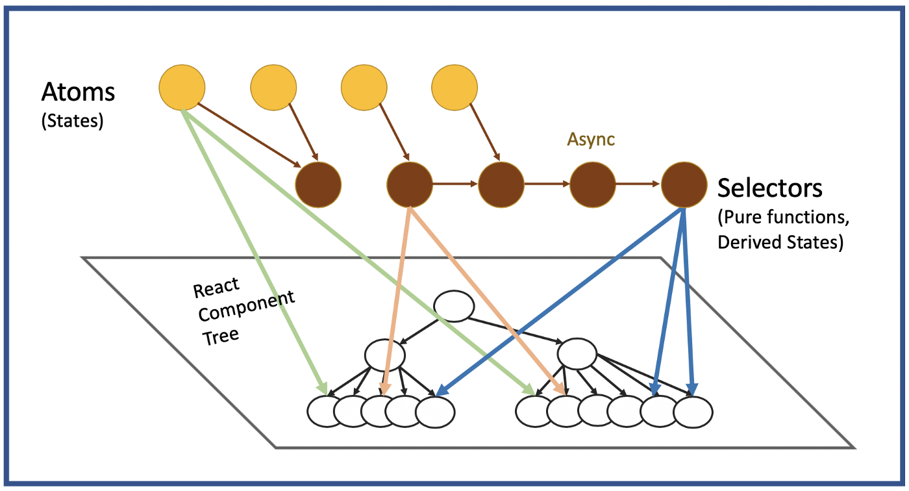

# **Recoil**

## [Notes/Slides Link](https://petal-estimate-4e9.notion.site/Recoil-1247dfd107358016bdb1ea1bb52e4a68)

## Articles/Blogs Link:

- [**7 Top React State Management Libraries**](https://trio.dev/7-top-react-state-management-libraries/)
- [**Exploring Recoil: Simplifying State Management in React Projects**](https://medium.com/@vikasipar/exploring-recoil-simplifying-state-management-in-react-projects-b19adbe3445b)

- [**Recoil core concepts**](https://medium.com/better-programming/recoiljs-the-future-of-react-state-management-ffb1345833b6) - +1
- [**Recoil is the Samurai Sword of React State Management**](https://dev.to/codeofrelevancy/recoil-is-the-samurai-sword-of-react-state-management-5h3c)

- [**Recoil**](https://recoiljs.org/docs/basic-tutorial/intro/) - OG Docs +1
- [**Atoms and Selectors**](https://recoiljs.org/docs/introduction/core-concepts/#:~:text=Recoil%20lets%20you%20create%20a,state%20either%20synchronously%20or%20asynchronously.)
----
- [**memo in React**](https://react.dev/reference/react/memo)
- [**React components - when do children re-render?**](https://whereisthemouse.com/react-components-when-do-children-re-render) +1
- [**What is React memo and how to use it?**](https://hygraph.com/blog/react-memo)
- [**Optimization with React Memo**](https://medium.com/picus-security-engineering/optimization-with-react-memo-7e0b0ffb7536)

----
- [**What is Memoization? How and When to Memoize in JavaScript and React**](https://www.freecodecamp.org/news/memoization-in-javascript-and-react/)
- [**What's the Difference Between the useMemo and useCallback Hooks?**](https://www.freecodecamp.org/news/difference-between-usememo-and-usecallback-hooks/)
- [**Better React Performance – When to Use the useCallback vs useMemo Hook**](https://www.freecodecamp.org/news/better-react-performance-usecallback-vs-usememo/)
- [**Caching in React – How to Use the useMemo and useCallback Hooks**](https://www.freecodecamp.org/news/caching-in-react/)
- [**useMemo**](https://react.dev/reference/react/useMemo)
- [**How to Work with useMemo in React – with Code Examples**](https://www.freecodecamp.org/news/how-to-work-with-usememo-in-react/)
- [**Maximizing React State Efficiency: A Deep Dive into Recoil Selectors vs. useMemo for Optimal Performance**](https://medium.com/@dashakashkumar636/maximizing-react-state-efficiency-a-deep-dive-into-recoil-selectors-vs-4f63ab3edc37)

## Recoil Videos

- [Recoil: State Management for Today's React](https://www.youtube.com/watch?v=_ISAA_Jt9kI&t=1739s)
- [Comparing the Top 5 React State Management Libraries](https://www.youtube.com/watch?v=Qbaw_ZQdfWo)

<br/>

# ⚠️ NOTE: Recoil is maintained, but may not yet be React 19 ready. use React 18 -

```
Cannot destructure property 'ReactCurrentDispatcher' of 'import_react.default.__SECRET_INTERNALS_DO_NOT_USE_OR_YOU_WILL_BE_FIRED' as it is undefined.
```

## 💥 What This Means:

Recoil is trying to access React's internal state dispatcher, but React isn't properly initialized or incompatible with Recoil.

---

## 🔍 Causes:

- ⚠️ Version mismatch: React 18+ with older Recoil (< 0.7).
- ❌ Improper import or app setup.
- ❌ Accessing React internals manually or via buggy tooling.
- 🧩 Bad module resolution by bundler.

---

## ✅ How to Fix It

### **Check Versions**

Use compatible versions:

```json
"react": "^18.2.0",
"react-dom": "^18.2.0",
"recoil": "^0.7.7"
```

Install/update:

```bash
npm install recoil@latest react@18 react-dom@18
```

---

<br>

## What is Recoil?

Recoil is a state management library for React, developed by Facebook, designed to handle complex application state in a scalable, efficient, and declarative way.

- Think of it as a lightweight and flexible alternative to Redux
- It works by using `atoms` (units of state) and `selectors` (derived/computed state) to manage and share state across components.

### How Recoil Works

### 1. Atoms: Units of State

- An atom is a piece of state that you can read from and write to.
- When an atom is updated, all components that use that atom will automatically re-render with the new value.

```js
import { atom } from "recoil";

const counterState = atom({
  key: "counterState", // unique ID
  default: 0, // default value
});
```

### 2. Selectors: Derived/Computed State [#Read](https://recoiljs.org/docs/introduction/core-concepts/#selectors)

A selector is a pure function that can:

- Read the value of `atoms` or other `selectors`
- Compute and return a new value (compute new state based on atoms or other selectors.)
- Be used by components just like atoms

```js
import { selector } from "recoil";
import { counterState } from "./atoms";

const doubleCounter = selector({
  key: "doubleCounter",
  get: ({ get }) => get(counterState) * 2,
});
```

- You can also make selectors asynchronous, which makes them powerful for data fetching.

### 3. RecoilRoot: Context Provider

- You need to wrap your React app in a `RecoilRoot` so that atoms and selectors can work globally.

```js
import { RecoilRoot } from "recoil";

function App() {
  return (
    <RecoilRoot>
      <YourAppComponents />
    </RecoilRoot>
  );
}
```

### Usage

```js
import { useRecoilState, useRecoilValue } from "recoil";
import { counterState, doubleCounter } from "./store";

function Counter() {
  const [count, setCount] = useRecoilState(counterState);
  const double = useRecoilValue(doubleCounter);

  return (
    <div>
      <p>Count: {count}</p>
      <p>Double: {double}</p>
      <button onClick={() => setCount(count + 1)}>Increment</button>
    </div>
  );
}
```

## Internals (Advanced Peek)

Recoil uses a concept similar to a dependency graph:

- Atoms and selectors are nodes.
- When a selector depends on an atom, a connection is created.
- When you update an atom, Recoil knows which components/selectors depend on it and updates/re-render only those — making it reactive and efficient.



- `Atoms` in Recoil = Like `useState()` variables, but shared across components.

- `Selectors` = Like `useMemo()` — they derive values from atoms, but do not modify atoms directly.
  You can derive or transform atom values inside selectors.
  If you want to write to atoms via a selector, you need to use a writeable selector with a `set` function.

```js
// Atom: shared state (like useState)
const counterState = atom({
  key: "counter",
  default: 5,
});

// Selector: reads the atom, returns a computed value
const doubleCounter = selector({
  key: "doubleCounter",
  get: ({ get }) => {
    const count = get(counterState);
    return count * 2;
  },
});
```

in the component

```js
const double = useRecoilValue(doubleCounter); // read computed value
const [count, setCount] = useRecoilState(counterState); // read/write atom
```

## 1. `atom()`

**Purpose:** Defines a piece of state (like `useState`) that can be shared across components.

**Returns:** An atom object used with hooks like `useRecoilState`, `useRecoilValue`, etc.

```js
const counterState = atom({
  key: "counterState",
  default: 0,
});
```

---

## 2. `selector()`

**Purpose:** Defines derived state from atoms or other selectors (like `useMemo`).

**Returns:** A selector object used with hooks like `useRecoilValue`.

```js
const doubleCounter = selector({
  key: "doubleCounter",
  get: ({ get }) => get(counterState) * 2,
});
```

---

## 3. `useRecoilState()`

**Purpose:** Like `useState` but for Recoil atoms/selectors.

**Returns:** `[value, setterFunction]`

```js
const [count, setCount] = useRecoilState(counterState);
```

---

## 4. `useRecoilValue()`

**Purpose:** Read-only access to an atom or selector.

- Returns the value of the given Recoil state.

- **This hook will subscribe the component to re-render if there are changing in the Recoil state.**

**Returns:** `value`

```js
const double = useRecoilValue(doubleCounter);
```

---

## 5. `useSetRecoilState()`

**Purpose:** Returns a setter function for updating the value of writeable Recoil state.

**This is the recommended hook to use when a component intends to write to state without reading it. If a component used the useRecoilState() hook to get the setter, it would also subscribe to updates and re-render when the atom or selector updated. Using useSetRecoilState() allows a component to set the value without subscribing the component to re-render when the value changes.**

**Returns:** `setterFunction`

```js
const setCount = useSetRecoilState(counterState);
```

---

## 6. `useResetRecoilState()`

**Purpose:** Resets an atom or selector to its default value.

**Returns:** `resetFunction`

```js
const resetCount = useResetRecoilState(counterState);
```

---

## 7. `useRecoilCallback()`

**Purpose:** Create a callback that has access to the snapshot of Recoil state.

**Returns:** A custom callback function.

```js
const customCallback = useRecoilCallback(({ snapshot, set }) => async () => {
  const currentValue = await snapshot.getPromise(counterState);
  set(counterState, currentValue + 1);
});
```

---

## `useMemo()`

`useMemo` is a React Hook that **memoizes a computed value**, so it’s only recalculated when its dependencies change.

- `useMemo` helps avoid unnecessary recalculations of expensive logic during re-renders.

```js
const memoizedValue = useMemo(() => {
  // expensive calculation
  return computeSomething(input);
}, [input]);
```

- returns the result of the funtion

### Without `useMemo`:

Every re-render of the component recalculates the function, even if the input hasn't changed.

### With useMemo:

React remembers the last result and skips recalculating unless the dependency (input) has changed.

```js
const MyComponent = ({ number }) => {
  const squared = useMemo(() => {
    console.log("Calculating square...");
    return number * number;
  }, [number]);

  return <p>Square: {squared}</p>;
};
```

<br>

---

---

---

---

can achieve similar behavior using `useEffect` and `useState`, but it’s not the same, and here’s why in a nutshell:

```js
const [result, setResult] = useState();

useEffect(() => {
  const computed = expensiveCalculation(input);
  setResult(computed);
}, [input]);
```

| Feature                         | `useEffect + useState`                 | `useMemo`                            |
| ------------------------------- | -------------------------------------- | ------------------------------------ | --------------- |
| Triggers re-render?             | ✅ Yes (because of `setState`)         | ❌ No (pure value, no state change)  |
| Is value available immediately? | ❌ No — updated **after** first render | ✅ Yes — available **during** render | ✅ Very concise |

---

---

---

---

---

## Recoil Parallel:

A Recoil `selector` works similarly to `useMemo` — it derives data from atoms, and caches the result until dependencies (atoms/selectors) change.


----


## What is `React.memo`?

- `React.memo` is a **Higher Order Component (HOC)**.
- It **memoizes** a functional component — meaning:
  > It will only re-render if **props change**.
- It helps **prevent unnecessary re-renders** for performance optimization.

---

## 🔧 Syntax

```jsx
import React from 'react';

const MyComponent = ({ name }) => {
  return <div>Hello, {name}!</div>;
};

export default React.memo(MyComponent);
```

---

## ⚙️ How It Works

- React normally re-renders child components when a parent re-renders.
- `React.memo` tells React to **skip re-rendering** if the props are the **same as last time**.
- Uses **shallow comparison** on props.

---

## ✅ When to Use `React.memo`

- The component is **pure** (same output for same props).
- Props are **primitive values** (string, number, boolean).
- Component re-renders often and affects performance.
- You're not passing new object/function instances as props every time.

---

## ❌ When Not to Use It

- Component is very small and cheap to render.
- Props change frequently.
- You're passing inline objects/functions (which cause re-renders anyway).

---

## 🧠 Custom Comparison

You can pass a custom comparison function to control when re-render should happen:

```jsx
const MyComponent = ({ user }) => {
  return <div>{user.name}</div>;
};

function areEqual(prevProps, nextProps) {
  return prevProps.user.name === nextProps.user.name;
}

export default React.memo(MyComponent, areEqual);
```

---

## 🧩 React.memo with `{children}`

### Case 1: Static JSX Children

```jsx
<Parent>
  <Child />
</Parent>
```

- `Child` does **not** re-render if props and JSX tree are unchanged.
- React can reuse the subtree.

### Case 2: Dynamic or Inline JSX

```jsx
<Parent>
  <Child prop={{ name: "new object every time" }} />
</Parent>
```

- `Child` **will** re-render due to new reference.
- Use `memo` and stable props to avoid this.

---

## 🧪 Debug Tip

Add a log inside the child component:

```jsx
const Child = React.memo(() => {
  console.log("Child rendered");
  return <div>I am the child</div>;
});
```

Use this to test when and why re-renders happen.

---


---- 
## Side topic: Thee shaking

### [Read](https://stackoverflow.com/a/55936233)