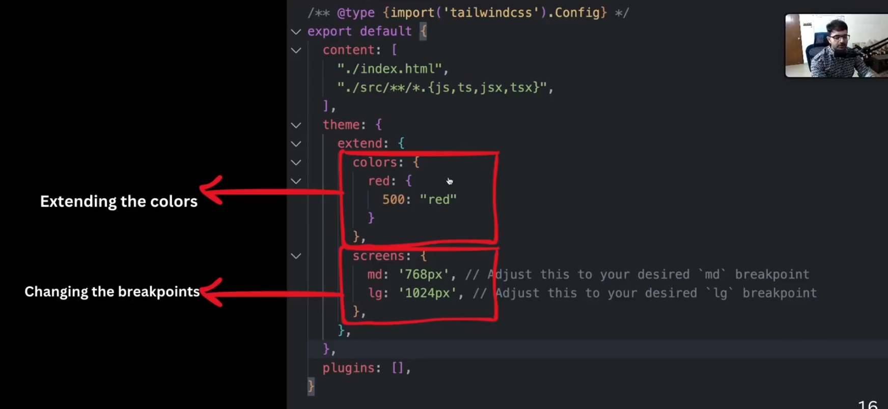

## [Custom Colours in Tailwind CSS v4](https://medium.com/@dvasquez.422/custom-colours-in-tailwind-css-v4-acc3322cd2da)
## [v4: How can i define Custom Screen size ?](https://github.com/tailwindlabs/tailwindcss/discussions/16675)

```
@theme {
  --breakpoint-sup-sm: 641px;
  --breakpoint-sup-md: 769px;
  --breakpoint-sup-lg: 1025px;
  …
}
```




## [Adding custom styles](https://tailwindcss.com/docs/adding-custom-styles#adding-component-classes)

## [Custom Fonts](https://tailwindcss.com/docs/font-family#customizing-your-theme)


```css
@import url("https://fonts.googleapis.com/css2?family=Roboto&display=swap");
@import "tailwindcss";
@theme {
  --font-roboto: "Roboto", sans-serif; 
}
```


## Note 

```js
onDone={() => console.log("Done!")}
```

creates an arrow function, and passing it as a prop (here, named onDone).

```js
function MyComponent({ onDone }) {
  return (
    <button onClick={() => {
      console.log("Button clicked");
      onDone(); // This calls the function passed in onDone prop
    }}>
      Click Me
    </button>
  );
}

function App() {
  return (
    <MyComponent onDone={() => console.log("Done!")} />
  );
}
```


# Note:

In React, the `ref` prop can accept **two types of values**:

---

## ✅ 1. Callback Function

Yes, React supports passing a **callback function** to the `ref` prop:

```jsx
<input ref={(el) => { console.log(el); }} />
```

### 🔍 Behavior:
- When the element **mounts**, `el` is the actual DOM element.
- When the element **unmounts**, `el` is `null`.

| Lifecycle Event     | `el` value passed to callback |
|---------------------|-------------------------------|
| Mount               | DOM element (`<input>`)       |
| Unmount             | `null`                        |

---

## ✅ 2. `useRef()` Object

```jsx
const inputRef = useRef(null);
<input ref={inputRef} />
```

React automatically assigns the DOM element:

```js
inputRef.current = <DOM element>
```

---

## 🧠 Why Use a Callback Ref?

Use a **callback ref** when:
- You need to store **multiple DOM elements** (e.g., for OTP inputs)
- You want custom **mount/unmount logic**
- You prefer **not to use `useRef()`** in some situations

### ✅ Example:

```jsx
function App() {
  const refs = useRef([]);

  return (
    <div>
      {[...Array(4)].map((_, i) => (
        <input
          key={i}
          ref={(el) => (refs.current[i] = el)}
        />
      ))}
    </div>
  );
}
```

---

## ⚠️ Comparison Table

| Feature                   | `useRef()` Object       | Callback Function         |
|--------------------------|-------------------------|---------------------------|
| Simple to use            | ✅                      | ❌ (more verbose)         |
| Multiple refs            | ❌                      | ✅                        |
| Mount/unmount control    | ❌                      | ✅                        |
| Reusable in components   | ✅                      | ✅                        |

---

## ✅ Summary

Yes — `ref={}` can take a **callback function**, and it’s a **powerful tool** when you need more flexibility (like focusing multiple inputs or reacting to mount/unmount events).
