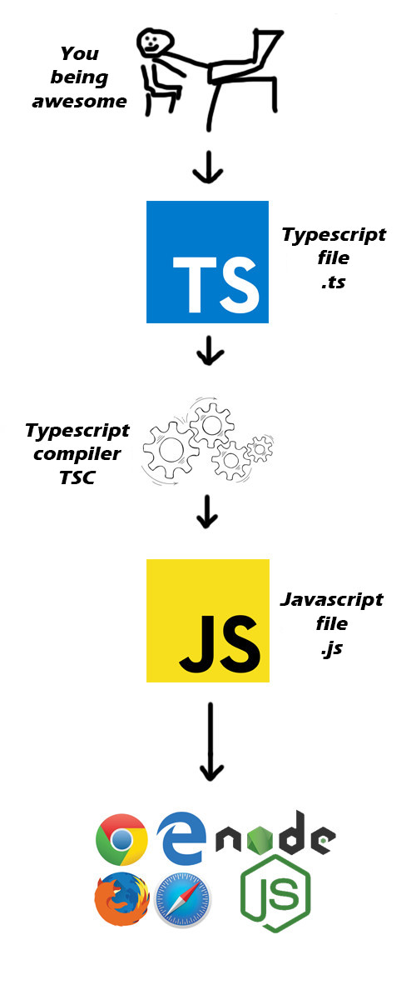

# **TypeScript Day 1**


## Articles/Blogs Link:
- [**Learn TypeScript – The Ultimate Beginners Guide**](https://www.freecodecamp.org/news/learn-typescript-beginners-guide/)
- [**Typescript cheatsheet**](https://rmolinamir.github.io/typescript-cheatsheet/#table-of-contents) +1 OG
- [**Mastering Object-Oriented Programming with TypeScript**](https://dev.to/rajrathod/mastering-object-oriented-programming-with-typescript-encapsulation-abstraction-inheritance-and-polymorphism-explained-c6p)

- [**Compiling TypeScript**](https://code.visualstudio.com/docs/typescript/typescript-compiling#:~:text=A%20tsconfig.json%20file%20defines,help%20you%20along%20the%20way.)
- [**How can I get the Typescript compiler to output the compiled js to a different directory?**](https://stackoverflow.com/questions/24454371/how-can-i-get-the-typescript-compiler-to-output-the-compiled-js-to-a-different-d)
- [**What's the difference between TypeScript and JavaScript?**](https://www.reddit.com/r/learnprogramming/comments/zi9ora/whats_the_difference_between_typescript_and/)
- [**Learn TypeScript – A Comprehensive Guide for Beginners**](https://www.freecodecamp.org/news/typescript-for-beginners-guide/)
- [**What is TypeScript?**](https://hygraph.com/blog/what-is-typescript)
- [**How TypeScript Can Improve Your Web Development Projects**](https://www.freecodecamp.org/news/how-typescript-can-improve-web-development-projects/)
- [**How the TypeScript Compiler Works and Its Components**](https://cloudaffle.com/series/typescript-compiler/typescript-compilation-overview/#:~:text=The%20TypeScript%20compiler%20works%20by,along%20with%20optional%20source%20maps.)
- [**How the TypeScript Compiler Compiles**](https://www.youtube.com/watch?v=X8k_4tZ16qU)
- [**Functions in TypeScript**](https://blog.wajeshubham.in/functions-in-typescript)
- [**Interfaces vs Types in TypeScript**](https://stackoverflow.com/questions/37233735/interfaces-vs-types-in-typescript)
- [**How Types Work in TypeScript – Explained with JavaScript + TypeScript Code**](https://www.freecodecamp.org/news/basic-typescript-types/)
- [**What is TypeScript?**](https://hygraph.com/blog/what-is-typescript)
- [**What is a tsconfig.json**](https://www.typescriptlang.org/docs/handbook/tsconfig-json.html#:~:text=The%20presence%20of%20a%20tsconfig,required%20to%20compile%20the%20project.)
- [**Exploring Node.js Modules: CommonJS vs. ES6 Modules**](https://medium.com/globant/exploring-node-js-modules-commonjs-vs-es6-modules-2766e838bea9)
- [**`tsconfig.json` file explained in detail**](https://accreditly.io/articles/tsconfigjson-file-explained-in-detail) +1
- [**Automatically compile TypeScript files on file save**](https://stackoverflow.com/questions/51128841/automatically-compile-typescript-files-on-file-save)


## Video
[The TSConfig Cheat Sheet](https://www.youtube.com/watch?v=xQgBJIye5EU) +1


## Common Error (w/o ts.config)
### [Cannot redeclare block-scoped variable in TypeScript](https://medium.com/@surajkpcool/cannot-redeclare-block-scoped-variable-in-typescript-b92454f2f81f)
### [Cannot redeclare block-scoped variable in TypeScript](https://stackoverflow.com/a/50913569)

----
----
----


TypeScript is a superset of JavaScript. That means every valid JavaScript code is also valid TypeScript code — but TypeScript adds **static typing** and other useful features.

## How TypeScript Works
- You write .ts files using TypeScript.
- TypeScript uses a compiler (`tsc`) to transpile (not really compile like C++) [other compilers : `esbuild`, `swc`] TypeScript into JavaScript.
- The output is plain JavaScript, usually .js files, which browsers or Node.js can execute.



## How to Get Started

###  Global Installation (`-g`)

```
npm install -g typescript
```

- Installs TypeScript once on your system.
- You can use the `tsc` command anywhere, in any project.

### Local Installation (per-project)

```
npm install --save-dev typescript
```

- Installs TypeScript only for that specific project, inside `node_modules/.`

---

### Initialize a TypeScript project:

```
tsc --init

<--in case of locally installed ts compile-->
npx tsc --init
```
-  creates a `tsconfig.json` file — which you can tweak to control how TypeScript compiles (like which JS version to target)

- The presence of a `tsconfig.json` file in a directory indicates that the directory is the root of a TypeScript project. 

[config tsconfig.json](https://www.typescriptlang.org/docs/handbook/tsconfig-json.html#:~:text=The%20presence%20of%20a%20tsconfig,required%20to%20compile%20the%20project.)

---

### Compile `.ts` files:
- `tsc` (without npx)

    - This works only if TypeScript is installed globally:

    ```
    npm install -g typescript
    tsc index.ts
    ```
    - The command tsc is available system-wide.

    - You can run `tsc` from any folder.

    - Compiles index.ts → index.js.

If `tsc` gives you a “command not found” error, it means TypeScript isn't installed globally.


-  `npx tsc`

    - This works when TypeScript is installed locally in your project:

    ```
    npm install --save-dev typescript
    npx tsc index.ts
    ```
    ```
    <--Auto save-->
    npx tsc index.ts --watch 
    ```
    - You don’t need to install it globally.

    - npx temporarily runs the `tsc` binary from `node_modules/.bin/tsc.`

    - It ensures you're using the locally installed version, which is great for consistency across projects.

--- 
# 🧠 Why Use `npx tsc` Instead of `tsc` When TypeScript is Locally Installed?

If you install TypeScript locally using:

```bash
npm install --save-dev typescript
```

It adds the TypeScript **compiler (`tsc`)** to:

```
./node_modules/.bin/tsc
```

But this binary is **not globally available** on your system.

---

## ❌ `tsc` Alone Won't Work

When you run:

```bash
tsc
```

It will only work if:
- TypeScript is installed **globally** (`npm install -g typescript`)
- OR you've added `node_modules/.bin` to your **system PATH**

Otherwise, you'll see an error like:

```
tsc: command not found
```

---

## ✅ `npx tsc` to the Rescue

```bash
npx tsc
```

- Finds the `tsc` binary in `./node_modules/.bin`
- Uses the **locally installed version**
- Works without any global installs
- Ensures consistent compiler version per project

> **Best practice** for team and project work.

---

## 🧾 Summary Table

| Command   | Requires Global Install | Uses Local Version | Notes                            |
|-----------|--------------------------|---------------------|----------------------------------|
| `tsc`     | ✅ Yes                   | ❌ No                | Works only if TypeScript is global |
| `npx tsc` | ❌ No                    | ✅ Yes               | Recommended and project-safe     |

---

# NOTE:

`tsc` comes from the typescript package (locally or globally), not any npm registry

But terminal doesn't know about this path by default — that’s where npx comes in. 


## `npx` is a shortcut to run local CLI tools

```
npx tsc
```
“Hey, look in `node_modules/.bin `for `tsc` and run it.”


## How `npx` Works

- Looks in `./node_modules/.bin (local install)`
- If not found, it downloads from the npm registry
- Runs the CLI tool
- (Optional) Discards it after use

---

# 📘 `tsconfig.json` Explained — Full Guide to Each Field

`tsconfig.json` is the configuration file for the TypeScript compiler. It tells the `tsc` command **how to compile** your TypeScript code.

---

## 🔧 Basic Example

```json
{
  "compilerOptions": {
    "target": "es6",
    "module": "commonjs",
    "outDir": "dist",
    "rootDir": "src",
    "strict": true
  },
  "include": ["src"],
  "exclude": ["node_modules"]
}
```

---

## ⚙️ `compilerOptions` Fields (with Common Values)

### ✅ `target`
Sets the JavaScript version to compile to.

| Option     | Output JS Version |
|------------|-------------------|
| `es5`      | For old browsers  |
| `es6`/`es2015` | Modern JS (let, const, etc.) |
| `es2016` to `es2022` | Adds newer JS features |
| `esnext`   | Latest features (not finalized yet) |

---

### ✅ `module`
Defines the module system for JS output.

| Option        | Description                  |
|---------------|------------------------------|
| `commonjs`    | Node.js-style (require/module.exports) |
| `esnext` / `es6` | ES Modules (`import/export`) |
| `amd`         | For older browsers (RequireJS) |
| `none`        | No module system              |

---

### ✅ `outDir` & `rootDir`
- `outDir`: Where to place compiled `.js` files
- `rootDir`: Where to read `.ts` source files from, Start compiling from this folder, and preserve its structure when outputting to `outDir`.

---

### ✅ `strict`
Turns on all strict type-checking options (recommended).

Equivalent to enabling:
- `noImplicitAny`
- `strictNullChecks`
- `strictFunctionTypes`
- `strictBindCallApply`, etc.

---

### ✅ `esModuleInterop`
Enables `import defaultExport from 'commonjs-lib'` syntax.

---

### ✅ `allowJs`
Allows compiling `.js` files alongside `.ts`.

---

### ✅ `checkJs`
Performs type-checking on `.js` files too.

---

### ✅ `sourceMap`
Generates `.map` files for debugging TypeScript in browser devtools.

---

### ✅ `declaration`
Generates `.d.ts` type declaration files.

---

### ✅ `noEmit`
Prevents JS file output — useful for just type-checking.

---

### ✅ `lib`
Specifies which built-in libraries to include in the compilation.

Example:
```json
"lib": ["dom", "es2020"]
```

---

## 📂 `include`, `exclude`, `files`

### ✅ `include`
What files/folders to compile.
```json
"include": ["src"]
```

### ✅ `exclude`
What to ignore (like `node_modules`, build folders, etc.)
```json
"exclude": ["dist", "node_modules"]
```

### ✅ `files`
Manually list exact files to compile (rarely used).

---

## 📌 Extra Compiler Options (Popular)

| Option              | Description                                    |
|---------------------|------------------------------------------------|
| `resolveJsonModule` | Allows importing `.json` files as modules      |
| `forceConsistentCasingInFileNames` | Error on mismatched file name casing |
| `skipLibCheck`      | Skip type checking in `.d.ts` files (faster builds) |
| `incremental`       | Saves info to speed up future builds           |

---

## ✅ Sample Minimal Project

```json
{
  "compilerOptions": {
    "target": "es2020",
    "module": "commonjs",
    "rootDir": "src",
    "outDir": "dist",
    "strict": true,
    "esModuleInterop": true
  },
  "include": ["src"]
}
```

---

Let me know if you'd like help generating a `tsconfig.json` for your project!


# 🆚 `tsc` vs `tsx` in TypeScript

## 🟣 `tsx` (by `esbuild-kit`)

| Feature                 | Description |
|-------------------------|-------------|
| **Purpose**             | Run `.ts`/`.tsx` files directly without a build step |
| **Tooling**             | Uses **esbuild** internally (very fast) |
| **Emits JS files?**     | ❌ No — it runs code in-memory |
| **Similar to**          | `ts-node`, but much faster |
| **Example Usage**       | `npx tsx src/index.ts` |
| **Best For**            | Dev scripts, local servers, quick prototypes |

---

## 🔵 `tsc` (TypeScript Compiler)

| Feature                 | Description |
|-------------------------|-------------|
| **Purpose**             | Compiles `.ts`/`.tsx` to `.js` files |
| **Tooling**             | Official TypeScript compiler |
| **Emits JS files?**     | ✅ Yes — writes files to disk |
| **Example Usage**       | `tsc` or `tsc index.ts` |
| **Best For**            | Full builds, production code, libraries |

---

## 🔄 Summary Table

| Tool  | Compiles? | Runs Code? | Emits `.js`? | Speed   | Typical Use     |
|-------|-----------|------------|--------------|---------|------------------|
| `tsc` | ✅        | ❌         | ✅           | Medium  | Build step       |
| `tsx` | ✅        | ✅         | ❌           | ⚡ Fast | Dev-time runtime |

---

**Tip:** Use `tsx` during development for fast feedback, and `tsc` for final builds.


# Notes: 

## [Slides](https://projects.100xdevs.com/tracks/6SbPPXGkG8QKFOTW9BmL/ts-1)
## [Enough](https://rmolinamir.github.io/typescript-cheatsheet/#table-of-contents)


# TypeScript Project Structure: `src/` and `dist/` Explained

### ❓ Question  
**"Should we always structure our project with `./src` as the root and `/dist` for storing the JS files that will be distributed during deployment? And should we only push our `src` folder to GitHub because the JS files can be generated?"**

---

### ✅ Answer

Yes — that’s the **recommended and professional way** to structure a TypeScript project.

---

## 📁 Recommended Project Structure

```
your-project/
├── src/           ← TypeScript source files (your actual code)
│   ├── index.ts
│   └── utils/
│       └── helper.ts
├── dist/          ← Compiled JavaScript files (auto-generated)
├── tsconfig.json
├── package.json
└── .gitignore
```

---

## ⚙️ tsconfig.json Setup

```json
{
  "compilerOptions": {
    "rootDir": "src",
    "outDir": "dist",
    "target": "ES2020",
    "module": "CommonJS",
    "strict": true
  }
}
```

- `rootDir`: Tells TypeScript where your source `.ts` files are.
- `outDir`: Tells TypeScript where to put the compiled `.js` files.
- This ensures folder structure is preserved from `src/` to `dist/`.

---

## 🛑 Do Not Push `dist/` to GitHub

- It contains **auto-generated JavaScript**, which can be recompiled using `tsc`.
- Keep your repo clean and efficient by ignoring it.

### Add this to `.gitignore`:

```gitignore
# - `dist/` - Ignores any directory named "dist" in any location
# - `/dist/` - Ignores a "dist" directory specifically in the root of the project


dist/
```

---

## ✅ Push Only `src/` to GitHub

- Your actual work (TypeScript code) lives in `src/`.
- JavaScript can be regenerated anytime, so it's unnecessary to version-control it.

---

## 🚀 Deployment

- When deploying, you run `npx tsc` to generate the `dist/` folder.
- You deploy the contents of `dist/` (compiled `.js` files), not the TypeScript code.

---

## 🧾 Summary Table

| Folder  | Purpose                       | Push to GitHub | Deploy to Production |
|---------|-------------------------------|----------------|----------------------|
| `src/`  | TypeScript source code        | ✅ Yes         | ❌ No (optional)     |
| `dist/` | Compiled JavaScript output    | ❌ No          | ✅ Yes               |

---

This setup is standard in open-source TypeScript libraries and production-grade backend apps. It keeps development and deployment cleanly separated.

----

# TypeScript Interfaces — In-Depth Guide

## 🎯 What is an Interface in TypeScript?

An `interface` is a way to define the shape of an object. It describes the names and types of properties that an object can have.

## 🧱 Basic Interface

```ts
interface User {
  name: string;
  age: number;
}

const user: User = {
  name: "Alice",
  age: 30
};
```

## 🛠 Key Features of Interfaces

### 1. ✅ Optional Properties

```ts
interface User {
  name: string;
  age?: number;
}
```

### 2. ✨ Readonly Properties

```ts
interface User {
  readonly id: number;
  name: string;
}
```

### 3. 🧩 Index Signatures

```ts
interface PhoneBook {
  [name: string]: string;
}
```

### 4. 🔁 Interface Extension (Inheritance)

```ts
interface Person {
  name: string;
}

interface Employee extends Person {
  jobTitle: string;
}
```

### 5. 🧠 Function Types in Interfaces

```ts
interface Greeter {
  (name: string): string;
}

const greet: Greeter = (name) => \`Hello, \${name}\`;
```

### 6. 🧩 Interface for Classes

```ts
interface Shape {
  area(): number;
}

class Circle implements Shape {
  constructor(public radius: number) {}

  area(): number {
    return Math.PI * this.radius * this.radius;
  }
}
```

## ⚖️ Interface vs Type

| Feature                     | `interface`                     | `type`                           |
|-----------------------------|----------------------------------|----------------------------------|
| Extending                   | ✅ via `extends`                 | ✅ via `&` (intersection)         |
| Declaration merging         | ✅ Supported                    | ❌ Not supported                  |
| Suitable for                | Object shapes, class contracts   | Complex types, unions, tuples    |

## 📦 Real-World Example

```ts
interface ApiResponse<T> {
  success: boolean;
  data: T;
  error?: string;
}

const response: ApiResponse<string[]> = {
  success: true,
  data: ["item1", "item2"]
};
```

---


----

## NOTE:

```js
type ArgTypes = number | string;

function fn(a : ArgTypes, b: ArgTypes){
    return a+b;
}
```
- its an error 

## why?
 TypeScript can't safely perform the + operation on the union type, we need to nerrow down the union 

 
## 🎯 What is Narrowing?

**Narrowing** is how TypeScript determines the specific type of a variable from a more general or union type, based on logic you write in your code.

> For example, narrowing lets TypeScript know that a value of type `string | number` is specifically a `string` inside an `if (typeof val === "string")` block.

---

## 🧱 Basic Example

```ts
function printLength(value: string | number) {
  if (typeof value === "string") {
    // value is narrowed to string
    console.log(value.length);
  } else {
    // value is narrowed to number
    console.log(value.toFixed(2));
  }
}
```

---

## 🔍 Common Types of Narrowing

### 1. `typeof` Narrowing

```ts
function check(val: string | number) {
  if (typeof val === "string") {
    // val is string
  } else {
    // val is number
  }
}
```

### 2. `instanceof` Narrowing

```ts
class Car { drive() {} }
class Bike { pedal() {} }

function move(vehicle: Car | Bike) {
  if (vehicle instanceof Car) {
    vehicle.drive(); // Car
  } else {
    vehicle.pedal(); // Bike
  }
}
```

### 3. Truthiness Narrowing

```ts
function greet(name?: string) {
  if (name) {
    console.log("Hello, " + name.toUpperCase());
  }
}
```

### 4. Equality Narrowing

```ts
function compare(x: string | number, y: string | boolean) {
  if (x === y) {
    // TypeScript knows both x and y are string
    console.log(x.toUpperCase());
  }
}
```

### 5. Discriminated Union Narrowing

Use a common literal property to distinguish object types.

```ts
type Circle = { kind: "circle"; radius: number };
type Square = { kind: "square"; side: number };
type Shape = Circle | Square;

function getArea(shape: Shape) {
  if (shape.kind === "circle") {
    return Math.PI * shape.radius ** 2;
  } else {
    return shape.side * shape.side;
  }
}
```

---

## 🧠 Why Narrowing Matters

- ✅ Better IntelliSense and autocompletion
- ✅ More precise error checking
- ✅ Safer code and fewer bugs at runtime

----

## 🎯 What is `type` in TypeScript?

The `type` keyword in TypeScript is used to create **aliases** for **custom types**. It's like giving a nickname to a combination of types.

You can use `type` to define:

- Object shapes
- Union and intersection types
- Primitive aliases
- Tuples, arrays, and more

---

## 🧱 Basic Syntax

```ts
type User = {
  name: string;
  age: number;
};

const u: User = { name: "Alice", age: 30 };
```

---

## 🔄 Union Types

```ts
type Status = "loading" | "success" | "error";

let currentStatus: Status = "loading";
```

---

## ➕ Intersection Types

```ts
type Person = { name: string };
type Employee = Person & { jobTitle: string };

const emp: Employee = {
  name: "Bob",
  jobTitle: "Developer"
};
```

---

## 🔢 Tuples with `type`

```ts
type Point = [number, number];

const coordinate: Point = [10, 20];
```

---

## ⚠️ Differences Between `type` and `interface`

| Feature                     | `type`                           | `interface`                     |
|-----------------------------|----------------------------------|----------------------------------|
| Object shapes               | ✅                               | ✅                               |
| Union/Intersection          | ✅ Yes                          | ❌ (Not directly)               |
| Declaration merging         | ❌ No                           | ✅ Yes                          |
| Extending                   | ✅ via `&`                      | ✅ via `extends`                |
| Recommended for             | Complex types, unions, tuples    | Class contracts, object shapes  |

---

## 📦 Example: API Response Type

```ts
type ApiResponse<T> = {
  success: boolean;
  data: T;
  error?: string;
};

const response: ApiResponse<string[]> = {
  success: true,
  data: ["a", "b", "c"]
};
```

---

## 🧠 Tip: When to Use `type`

- Use `type` when you need **unions**, **tuples**, or more **complex types**.
- Use `interface` when defining **object structures**, especially with **classes**.

---