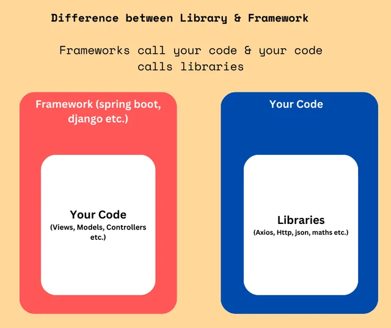
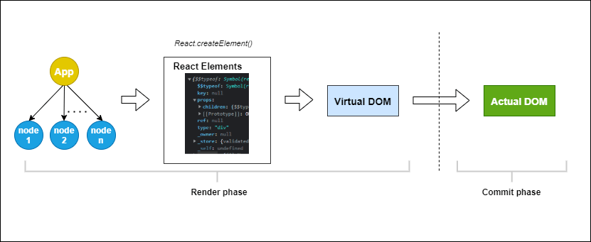

# **React Basics**

## Articles/Blogs Link:

- [**JavaScript Modules – How to Create, Import, and Export a Module in JS**](https://www.freecodecamp.org/news/javascript-modules/)
- [**What's the Difference Between Default and Named Exports in JavaScript?**](https://www.freecodecamp.org/news/difference-between-default-and-named-exports-in-javascript/)
- [**Top JavaScript Concepts to Know Before Learning React**](https://www.freecodecamp.org/news/top-javascript-concepts-to-know-before-learning-react/)

---

- [**React rendering concepts**](https://medium.com/@shivambhadani_/mastering-advanced-reactjs-concepts-essential-knowledge-for-every-frontend-developer-8123cf0b13ab) - Must read
- [**Video on Rendering**](https://www.youtube.com/watch?v=mECV6nGOqNo)
- [**Video in Depth**](https://www.youtube.com/watch?v=7YhdqIR2Yzo)
- [**How React Works**](https://medium.com/@ruchivora16/react-how-react-works-under-the-hood-9b621ee69fb5)
- [**React rerenders, why?**](https://www.joshwcomeau.com/react/why-react-re-renders/)
- [**Understand How Rendering Works in React**](https://www.telerik.com/blogs/understand-how-rendering-works-react)
- [**React Fiber - The core of reconciliation**](https://github.com/acdlite/react-fiber-architecture)

- [**How State Works in React – Explained with Code Examples**](https://www.freecodecamp.org/news/what-is-state-in-react-explained-with-examples/)

---

- [**Importing and Exporting Components**](https://react.dev/learn/importing-and-exporting-components)
- [**React Docs**](https://react.dev/learn)- Must read, learnt more than any tutorial
- [**Learn React – A Handbook for Beginners**](https://www.freecodecamp.org/news/react-for-beginners-handbook/#:~:text=React%20is%20a%20very%20popular,operation%20and%20should%20be%20minimized)
- [**CRA vs Vite**](https://www.tatvasoft.com/outsourcing/2024/07/vite-vs-create-react-app.html)
- [**Why You Should Use React.js For Web Development**](https://www.freecodecamp.org/news/why-use-react-for-web-development/)
- [**What Is React: Understanding the Features and How to Deploy for Modern Web Development**](https://www.hostinger.in/tutorials/what-is-react)
- [**What is React.js? Uses, Examples, & More**](https://blog.hubspot.com/website/react-js)
- [**Introduction to ReactJS: Learn Components, Usage, and Features**](https://www.brilworks.com/blog/introduction-to-reactjs/)
- [**React Fundamentals – JSX, Components, and Props Explained**](https://www.freecodecamp.org/news/react-fundamentals/)
- [**React Re-rendering: Exploring What, Why, and How**](https://medium.com/simform-engineering/react-re-rendering-exploring-what-why-and-how-d180d5305892)
- [**State Management in React – When and Where to use State**](https://www.freecodecamp.org/news/react-state-management/)
- [**How to Use the useState() Hook in React – Explained with Code Examples**](https://www.freecodecamp.org/news/usestate-hook-3-different-examples/)
- [**React Concepts**](https://youtu.be/4AXQgOcL1mo?si=3OfOlIEABm1BpIbg)

# <center>Lessgo</center>

React is a **JavaScript library** (not a framework) for building user interfaces, especially **single-page applications (SPAs)**. A Single Page Application (SPA) is a web app that loads a single HTML page and updates the content dynamically as the user interacts with it — without refreshing the entire page.

It was created by Facebook and is now open-source and widely used.



- A collection of functions/tools our code can use is Library.
- A complete structure for building apps is Framework.
- Frameworks are more strict and have more rules. Whereas libraries are more flexible. Like in Nextjs which is a framework, it's compulsory to make a folder with the foldername in the app directory to display it at /foldername route.

## ❓ Why React? What Problem Does It Solve?

Before React, building UIs in vanilla JS or jQuery was messy and hard to manage as your app grew.

as your UI grows:

- You keep updating DOM manually (`getElementById`, etc.)

- State (data) and UI can go out of sync

- Reusable components are hard

## ✅ How React Solves This

- **Component-based Architecture**: Break your UI into small, reusable, independent pieces called components.
- **State Management**: React handles the data (state) and re-renders UI when it changes.
- **Virtual DOM**: React doesn’t update the real DOM directly. It uses a virtual DOM (a lightweight copy of the DOM) to calculate the minimal changes and apply them efficiently.


<br>

## <center>Working?</center>

React introduces a **Virtual DOM**, which is a **lightweight copy** of the real DOM kept in memory.

### How it works:

1. When state or props change, React creates a **new Virtual DOM**.
2. It compares the new Virtual DOM with the **previous Virtual DOM** using a **diffing algorithm**.
3. React finds the **minimal set of changes**.
4. Then it **patches (updates)** only the necessary parts of the **real DOM**.

> Below is a visual description of the rendering process for initial render.
> 

> Below is a visual description of the rendering process when an application re-renders.
> 

## 🛠️ Two Phases of React's Rendering

### 1. **Render Phase** (Preparation)

- React runs your component functions (e.g., `<App />`) to generate **React elements**.
- Builds a new **Virtual DOM**.
- Compares it with the **previous Virtual DOM** to detect changes.

### 2. **Commit Phase** (Execution)

- React applies those changes to the **real DOM**.
- Triggers side effects (`useEffect`) and updates the UI.

## 🧱 Steps in Detail:

1. **App is rendered**: Components return React elements using JSX.
2. **React.createElement()** is used internally to create React elements.
3. Virtual DOM tree is built.
4. Differences are calculated with the old virtual DOM.
5. The real DOM is updated (patched) only where changes occurred.

## 🔍 Jargon Explained:

- `JSX`: A syntax extension that lets you write HTML-like code in JavaScript.

- `State`: Data that a component holds (like count), OR, state is a built-in object that stores data or information about a component's current situation. Each component manages its own state. react rerenders when states changes

- `Component`: A function that returns JSX — reusable piece of UI. When state changes, React automatically re-renders the component to update the UI with the new state.

- `useState`: A React Hook to add state to a functional component.

- `Virtual` DOM: An in-memory representation of the actual DOM, for fast diffing and efficient updates.

---

## project setup!

### 🏗 1. Installation Using CRA (Slow, Deprecated)

```
npx create-react-app my-app
cd my-app
npm start
```

- `npx` → Runs a package without installing it globally
- `create-react-app` → Official tool to scaffold a React app
- `my-app` → Your folder name
- `npm start` → Runs the dev server

> npm test, npm start, npm restart, and npm stop are all aliases for npm run xxx.

### ⚡ 2. Installation Using Vite

```
npm create vite@latest my-app
cd my-app
npm install
npm run dev
```

- `npm create vite@latest` → Uses the latest Vite setup tool, shortcut : `npx create-vite@latest`
- It will ask you to choose a framework → pick React
- `npm install` → Installs dependencies
- `npm run dev` → Starts the Vite dev server (super fast!)

## 📁 React App File Structure

When you create a React app using `npx create-react-app my-app`, here’s what the default structure looks like:

```perl
my-app/
├── node_modules/           # All dependencies installed via npm
├── public/
│   └── index.html          # Main HTML file, root div lives here
├── src/
│   ├── App.js              # Root component (your app's main UI)
│   ├── App.css             # Styling for App.js
│   ├── index.js            # Entry point – renders <App /> to the DOM
│   └── index.css           # Global styles
├── package.json            # Project info + dependencies
└── README.md               # Project instructions
```

## ⚛️ React Application Flow

Here's how a React app flows:

- Browser loads `public/index.html`

- That file has a `<div id="root"></div>` where React will inject your app

- `src/index.js` renders the root component (`<App />`) into that `div`

- `<App />` contains other components (Header, Button, etc.)

### `public/index.html`

```js
<!DOCTYPE html>
<html lang="en">
  <head>
    <meta charset="UTF-8" />
    <title>React App</title>
  </head>
  <body>
    <div id="root"></div> <!-- React renders into this -->
  </body>
</html>
```

### `src/index.js`

```js
import React from "react";
import ReactDOM from "react-dom/client";
import "./index.css";
import App from "./App";

const root = ReactDOM.createRoot(document.getElementById("root"));
root.render(<App />);
```

- `ReactDOM.createRoot()` initializes React rendering.

- `render(<App />)` mounts the root component.

### `src/App.js`

```jsx
import React, { useState } from "react";
import "./App.css";

function App() {
  const [count, setCount] = useState(0); // state hook

  return (
    <div className="App">
      <h1>🚀 React Counter App</h1>
      <p>Count: {count}</p>
      <button onClick={() => setCount(count + 1)}>Increase</button>
      <button onClick={() => setCount(count - 1)}>Decrease</button>
    </div>
  );
}

export default App;
```

- useState(0) initializes a count value.

- React re-renders the UI whenever count changes.

- JSX returns the UI (HTML + JS syntax).

### `src/App.css`

```css
.App {
  text-align: center;
  margin-top: 50px;
}

button {
  margin: 5px;
  padding: 10px 20px;
  font-size: 16px;
}
```

## 🔁 Imports React

React (and tools like Webpack/Vite) allow you to use the ES6 `import` syntax to pull in various types of files:

- 📁 JavaScript modules
- 🖼️ Images
- 🎨 CSS files
- 🧩 JSON
- etc.

---

## 💡 Examples in CRA Defaul Code

### 1. Importing an Image: in `App.js`

```js
import logo from "./logo.svg";
```

- You’re importing an **SVG file**, and assigning it to a variable `logo`.
- This variable becomes a **string URL** (like `/static/media/logo.2345abc.svg`).
- You can use it in JSX like this:

```jsx

```

✅ So yes — **image imports return a string**, which is the URL to the processed image.

---

### 2. Importing a CSS File:

```js
import "./App.css";
```

- This **does not assign anything to a variable**. Why?

👉 Because you’re not importing a value — you’re triggering a **side-effect**.

### 🧠 What does importing CSS actually do?

When you import `./App.css`, you're telling Webpack/Vite:

> "Hey! Inject this CSS file into the HTML `<style>` tag when bundling."

- There’s no object or value to assign — so no variable is used.

### 🔬 Behind the scenes:

- CSS is processed by a **CSS loader** (like `style-loader` or Vite’s internal handler)
- The styles are injected into the DOM when your JavaScript runs
- You import it for its **effect**, not for a **value** it exports

---

## 🔍 Summary Table

| File Type | Import Syntax                    | Result             | Use Case                        |
| --------- | -------------------------------- | ------------------ | ------------------------------- |
| `.js`     | `import x from './x.js'`         | JS module/value    | Functions, components, etc.     |
| `.css`    | `import './x.css'`               | Injects CSS        | Applies global/component styles |
| `.svg`    | `import logo from './logo.svg'`  | Returns URL string | Use in ``     |
| `.json`   | `import data from './data.json'` | Parsed object      | Use like `data.name`, etc.      |

---

### Note : In React, everything works based on what the bundler (like Webpack or Vite) allows — not just pure JavaScript rules.

A bundler takes all your code (JS, CSS, images, etc.), processes it, and bundles it into optimized files the browser can run. (`bundel.js`)

🧰 Examples:

- Webpack (used in Create React App)
- Vite (faster, modern alternative)
- Parcel, Rollup, etc.

### NOTE : React always `return`/`render` one element.. use react fragment to bind many elements.. `<> </>`

## JS in JSX

JSX lets you put markup into JavaScript, Curly braces let you “escape back” into JavaScript so that you can embed some variable from your code and display it to the user. For example, this will display `user.name`:

> if we want any js code inside html we have to use {}, any other part just use normal js

```js
function App() {
  // any js code or html
  return (
    // only one ele that is html <>, so use {} for back to js
    <h1>{user.name}</h1>
  );
}
```

## Styling React Using CSS

- **Using JS objects as inline styles**

```js
function App{
  return(
    <button style={{
      color: 'white',
      padding: '10px',
    }}>Click Me</button>
  )
}
```

In JSX, JavaScript expressions are written inside curly braces, and since JavaScript objects also use curly braces, the styling in the example above is written inside two sets of curly braces {{}}.

OR

```js
function App() {
  const btnStyle = {
    backgroundColor: "blue",
    color: "white",
    padding: "10px",
  };

  return <button style={btnStyle}>Click Me</button>;
}
```

- **Importing CSS as a side effect (external CSS)**

```css
/* styles.css */
.button {
  background-color: blue;
  color: white;
  padding: 10px;
}
```

```js
// App.jsx
import "./styles.css"; // This is the side effect import

function App() {
  return <button className="button">Click Me</button>;
}
```

## Conditional rendering

```jsx
let content;
if (isLoggedIn) {
  content = <AdminPanel />;
} else {
  content = <LoginForm />;
}
return <div>{content}</div>;
```

OR

```jsx
<div>{isLoggedIn ? <AdminPanel /> : <LoginForm />}</div>
```

OR

```js
<>{isLoggedIn && <AdminPanel />}</>
```

> && - returns first falsy value, or the last one.
> || returns first truthy value

## Rendering lists

```js
const products = [
  { title: "Cabbage", isFruit: false, id: 1 },
  { title: "Garlic", isFruit: false, id: 2 },
  { title: "Apple", isFruit: true, id: 3 },
];

export default function ShoppingList() {
  const listItems = products.map((product) => (
    <li
      key={product.id}
      style={{
        color: product.isFruit ? "magenta" : "darkgreen",
      }}
    >
      {product.title}
    </li>
  ));

  return <ul>{listItems}</ul>;
}
```

### What is key used for in React?

The `key` prop helps React identify which items in a list have:

- Changed
- Been added
- Been removed

This allows React to efficiently re-render only the parts of the UI that need updating, instead of re-rendering the whole list from scratch.

> key must be unique among siblings.

React will show a warning. if key not been used
