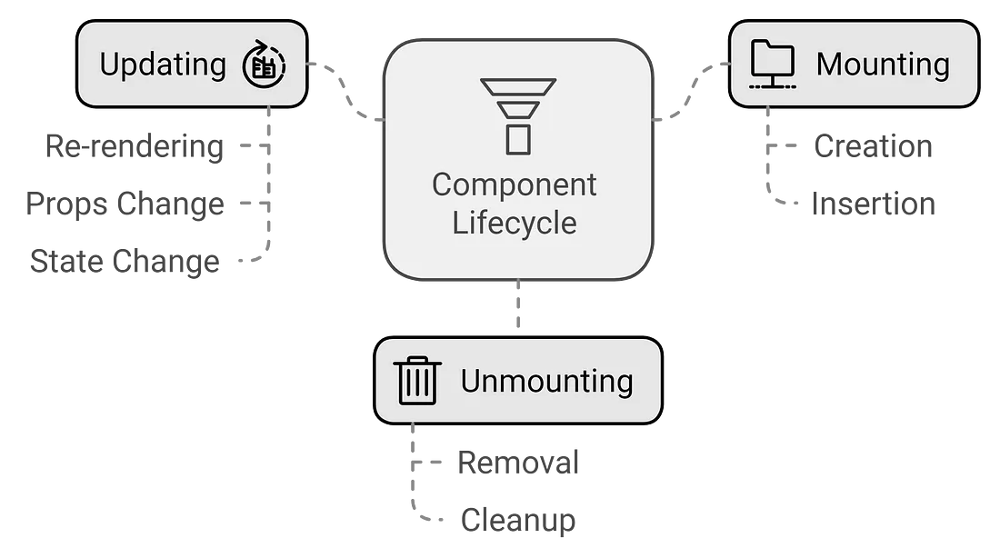

# **React useState**

## Articles/Blogs Link:

- [**What are Components and Types of Components in React JS**](https://medium.com/@reactmasters.in/what-are-components-and-types-of-components-in-react-js-4e2642b136a2)

- [**React Hooks Explained Simply**](https://daily.dev/blog/react-hooks-explained-simply#:~:text=Hooks%20are%20special%20functions%20in,needing%20to%20write%20class%20components.)
- [**State?**](https://react.dev/learn/state-a-components-memory) - Must read

- [**useState in React**](https://blog.logrocket.com/guide-usestate-react/#:~:text=start%20with%20use%20.-,What%20is%20the%20useState%20Hook%3F,the%20setter%20function%20is%20called.)
- [**How State Works in React – Explained with Code Examples**](https://www.freecodecamp.org/news/what-is-state-in-react-explained-with-examples/)
- [**React Props Explained with Examples**](https://refine.dev/blog/react-props/#passing-function-to-react-component)
- [**How to Use the useState() Hook in React – Explained with Code Examples**](https://www.freecodecamp.org/news/usestate-hook-3-different-examples/)
- [**React Conditional Rendering – Explained with Examples**](https://www.freecodecamp.org/news/react-conditional-rendering/)
- [**Making Sense of React Hooks**](https://medium.com/@dan_abramov/making-sense-of-react-hooks-fdbde8803889)

---

- [**How to use Conditional Rendering in React**](https://refine.dev/blog/react-conditional-rendering/#rendering-nothing-with-null)
- [**The React Lifecycle: Simply Explained!**](https://www.youtube.com/watch?v=kKVVan3EGoU)
- [**React Lifecycle methods - Basics**](https://medium.com/@rashmipatil24/react-lifecycle-methods-and-hooks-28522be7d7e4)
- [**Explain the meaning of Mounting and Demounting**](https://www.geeksforgeeks.org/explain-the-meaning-of-mounting-and-demounting/)
- [**React Component Lifecycle Methods – Explained with Examples**](https://www.freecodecamp.org/news/react-component-lifecycle-methods/)
- [**React lifecycle methods diagram**](https://projects.wojtekmaj.pl/react-lifecycle-methods-diagram///)
---
React’s useEffect() hook replaces those lifecycle methods:
- [**React useEffect Hook**](https://www.freecodecamp.org/news/react-useeffect-absolute-beginners/)
- [**Can someone explain useEffect dependency arrays like im 5?**](https://www.reddit.com/r/reactjs/comments/ualpri/can_someone_explain_useeffect_dependency_arrays/)
- [**Dependency array in useEffect hook**](https://medium.com/devil-is-in-the-details/dependency-array-in-useeffect-hook-d73e0ef2ab33)
- [**useEffect with and without dependency array in react**](https://dev.to/aasthapandey/useeffect-in-react-3flb)
- [**Understanding the Importance of the useEffect Dependency Array in React**](https://www.dhiwise.com/post/understanding-the-importance-of-the-useeffect-dependency-array-in-react)
- [**Understanding React’s useEffect cleanup function**](https://blog.logrocket.com/understanding-react-useeffect-cleanup-function/)
- [**useEffect cleanup function in React.js**](https://codedamn.com/news/frontend/useeffect-cleanup-function-in-react-js-complete-guide)
- [**React Hooks – How to Use the useState & useEffect Hooks in Your Project**](https://www.freecodecamp.org/news/how-to-use-the-usestate-and-useeffect-hooks-in-your-project/)


---

## 🧠 What is State in React?

In React, state is a built-in object that stores data or information about a component's current situation. It is mutable, meaning its values can change over time, and when it does, React re-renders the component to reflect those changes in the UI. State is essentially a component's memory, allowing it to maintain and update its own data independently.

State is managed within a component using the `useState` hook in functional components or the `this.state` object in class components. To update the state, you should use the `setState` function, which triggers a re-render of the component and its children.

## What is hook?

React Hooks are tools that allow you to use state and other React features without writing class components.

- Before hooks, we could only use features like state, lifecycle methods, etc., in **class components**.
  But hooks let you do all that in **functional components**, which are simpler and more common now.

## `useState(<anyInitialVal>)`

- `useState` is a React Hook that allows functional components to manage state. It provides a way to declare state variables and update them, triggering re-renders of the component when the state changes.

- `useState` is called inside a functional component and returns an array containing two elements: the current state value and a function to update that value. The initial state value is passed as an argument to `useState`.

- When the state update function is called, React schedules a re-render of the component, and during the next render cycle, the state variable will hold the updated value.

### 1. Functional Component

- ➡️ Just a plain JavaScript function that returns JSX (the UI).
- ✅ Recommended way in modern React (especially with hooks!)

```js
import React, { useState } from "react";

function Counter() {
  const [count, setCount] = useState(0);

  return (
    <div>
      <p>Count: {count}</p>
      <button onClick={() => setCount(count + 1)}>Increment</button>
    </div>
  );
}
```

### 2. Class Component

➡️ A more traditional way using class syntax.
Was used before hooks were introduced.

```js
// Greeting.js
import React, { Component } from "react";

class Greeting extends Component {
  render() {
    return <h1>Hello from a Class Component!</h1>;
  }
}

export default Greeting;
```

```js
// App.js
import React from "react";
import Greeting from "./Greeting"; // Adjust path if needed

function App() {
  return (
    <div>
      <Greeting />
    </div>
  );
}

export default App;
```

To use state in a class component, you’d write:

```js
class Counter extends React.Component {
  constructor() {
    super();
    this.state = { count: 0 };
  }

  render() {
    return (
      <div>
        <p>Count: {this.state.count}</p>
        <button onClick={() => this.setState({ count: this.state.count + 1 })}>
          Increment
        </button>
      </div>
    );
  }
}
```

> we can share state variable (also setter function) from App.js to its child components (Counter.jsx) using props, in this way we can use this state valiable in both files

```js
//🔧 App.js:
import React, { useState } from 'react';
import Counter from './Counter';

export default function App() {
  const [itemCount, setItemCount] = useState(10);

  return (
    <div>
      <Counter itemCount={itemCount} setItemCount={setItemCount} />
      <p>Current Count from App: {itemCount}</p>
    </div>
  );
}
```
```js
//🛠 Counter.js:
import React from 'react';

export default function Counter({ itemCount, setItemCount }) {
  const addItem = () => {
    setItemCount(itemCount + 1);
  };

  const removeItem = () => {
    setItemCount(itemCount - 1);
  };

  return (
    <>
      <h1>Items: {itemCount}</h1>
      <button onClick={addItem}>Add</button>
      <button onClick={removeItem}>Remove</button>
    </>
  );
}
```

## React Lifecycle Methods 

A lifecycle event is a specific moment in a component’s life — from when it’s created, to when it’s updated, and finally when it’s removed from the screen.



🧬 Think of it like this:
A component goes through 3 main phases:

- **Mounting** (being added to the DOM)
- **Updating** (changing state or props)
- **Unmounting** (being removed from the DOM)

### 🧱 In Class Components

- Mounting : `componentDidMount()` :	Runs once after component is added to the DOM

- Updating	: `componentDidUpdate()` :	Runs after state or props change

- Unmounting	 : `componentWillUnmount()` : Runs right before component is removed


```js
class Example extends React.Component {
  componentDidMount() {
    console.log('Component mounted!');
  }

  componentDidUpdate() {
    console.log('Component updated!');
  }

  componentWillUnmount() {
    console.log('Component will unmount!');
  }

  render() {
    return <div>Hello</div>;
  }
}
```
## <center>useEffect()</center>
### 🪝 In Functional Components (with Hooks)

React’s `useEffect()` hook replaces those lifecycle methods...

`useEffect()` is a hook that lets you run side effects in functional components.

🧠 What’s a side effect?

Any code that interacts with the outside world or affects things outside React:

- Fetching data from an API
- Setting up a timer
- Accessing local storage
- Event listeners (scroll, resize)
- Logging something to the console
- Manual DOM manipulation (rare in React)

```js
useEffect(() => {
  // Side effect here (runs after render)
}, [dependencies]);
```
### 🔍 How useEffect Works:
It runs after the component renders (mount or update), based on the dependency array.

- `useEffect(fn)`	Runs after every render (not recommended)

- `useEffect(fn, [])`	Runs once when component mounts ✅

- `useEffect(fn, [count])`	Runs when count changes ✅

🧪 Example 1: Run Once on Mount (like `componentDidMount`)
```js
useEffect(() => {
  console.log("Component mounted!");
}, []);
```
🧪 Example 2: Run When State Changes
```js
const [count, setCount] = useState(0);

useEffect(() => {
  console.log("Count changed:", count);
}, [count]);
```

🧹 Cleanup Function (like `componentWillUnmount`)

You return a function inside useEffect to clean up things like timers or event listeners:

```js
useEffect(() => {
  const timer = setInterval(() => {
    console.log("Tick");
  }, 1000);

  return () => {
    clearInterval(timer); // Cleanup
    console.log("Component unmounted");
  };
}, []);
```

## Clouser hehehe

```js
function App(){
    let [counter, setCounter] = useState(1);

    console.log("Rereder");
    
    useEffect(() => {
        const intervalId = setInterval(() => {
            setCounter(counter => counter + 1); // reason : Clouser, each time funtion call with new counter value
        }, 1000);
        return () => clearInterval(intervalId);
    }, []);

    return(
        <>
            <h1>Counter : {counter} </h1>
            <button onClick={()=> {setCounter(counter+1)}}>Add</button>
        </>
    )
}
```
### 📜 First: Why `setCounter(counter => counter + 1)`?

When you write:

```javascript
setCounter((counter) => {
  return counter + 1;
});

```

you're using the **functional form** of state update.  
In this form, **React automatically passes the latest state value** to the function, and you return the new state.

---

### 🧠 Why NOT just `setCounter(counter + 1)` inside `setInterval`?

Because of **closures**!

When you set up a `setInterval`, React "captures" (remembers) the `counter` **value at that time**.  
If you directly use `counter + 1`, it will **always use the old value**, not the updated one.

**Example if you use `setCounter(counter + 1)`**:

- Suppose `counter` was `0` when the component mounted.
- Inside the interval, it keeps using `0`, `0 + 1`, and you never get to 2, 3, 4, etc. 😭

---

### 📈 The Correct Way

Using:

```javascript
setCounter(counter => counter + 1);
```

makes sure that **every time**, React gives you the **latest, up-to-date value** of `counter`, no matter how old your `setInterval` closure is.

✅ So it will correctly increment: 0 → 1 → 2 → 3 → 4 → etc.

---

### 📦 Tiny Visual Example:

| Situation                      | What happens                            |
|--------------------------------|-----------------------------------------|
| `setCounter(counter + 1)`      | Uses _stale/old_ `counter` value (bad)   |
| `setCounter(counter => counter + 1)` | Uses _fresh/latest_ `counter` (good) |


---

### TL;DR:

> Use `setCounter(counter => counter + 1)` **whenever you update state based on the previous state**, especially **inside async code** like `setInterval`, `setTimeout`, or event handlers.

### NOTE : 
React Strict Mode: If your app is wrapped in `<React.StrictMode>`, React intentionally double-renders (n code: Mount 2 times, 2 intervals) components in development mode to help identify potential problems. This is a development-only behavior.

Thats why ` console.log("Rereder");` prints twice every 1s..

so, removing `strictMode` we can remove the clearInteval also, it will works as expexted

## <center> Props </center>
### 🔍 What are Props in React?

**Props** (short for "properties") are **special inputs** you can pass into React components.  
They allow you to **send data** from a **parent component** to a **child component**.

Props make components **dynamic and reusable** by giving them different inputs.

---

### 👉 How Props Work

- You can think of props as **arguments** you pass to a function.
- A parent component passes props **into** a child component.
- The child component **receives** them and can **use** or **display** the data.

---

### 💡 Example: Passing Props

**Parent Component:**

```jsx
function App() {
  return (
    <div>
      <Welcome name="Alice" />
      <Welcome name="Bob" />
    </div>
  );
}
```

**Child Component:**

```jsx
function Welcome(props) {
  return <h1>Hello, {props.name}!</h1>;
}
```

Here:
- `App` passes a `name` prop to `Welcome`.
- `Welcome` uses `props.name` to display different names.

---

### 🔍 How to Access Props

- Inside the component, props are available as a parameter.
- You can use **`props.propName`** to access each value.

**Example:**

```jsx
function UserProfile(props) {
  return <p>User: {props.username}</p>;
}
```

---

### 💚 Destructuring Props (Cleaner Way)

Instead of always writing `props.username`, you can **destructure** props:

```jsx
function UserProfile({ username }) {
  return <p>User: {username}</p>;
}
```

Both styles are correct — destructuring just makes the code cleaner.

---

### 🔄 Props are **Read-Only**

- Props cannot be modified by the child component.
- The child can **only read** the values given by the parent.

If you try to modify props directly, React will warn you.


