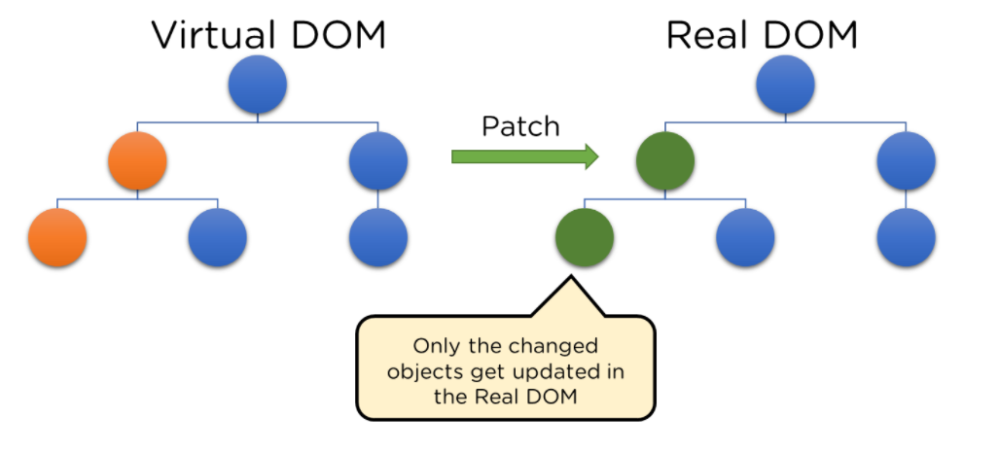
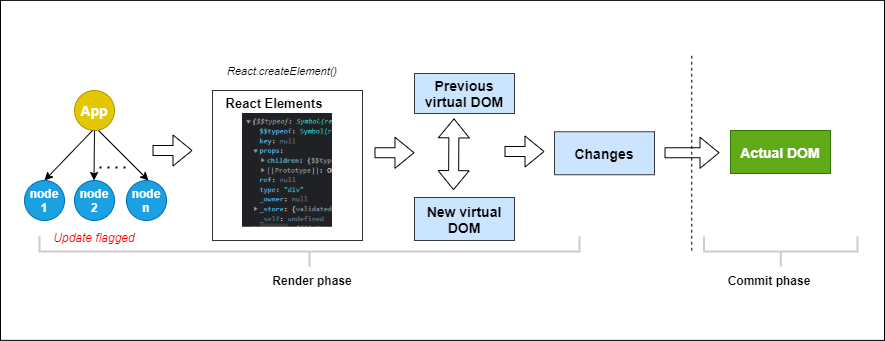

# **React Basics**


## Articles/Blogs Link:

-   [**JavaScript Modules – How to Create, Import, and Export a Module in JS**](https://www.freecodecamp.org/news/javascript-modules/)
-   [**What's the Difference Between Default and Named Exports in JavaScript?**](https://www.freecodecamp.org/news/difference-between-default-and-named-exports-in-javascript/)
-   [**Top JavaScript Concepts to Know Before Learning React**](https://www.freecodecamp.org/news/top-javascript-concepts-to-know-before-learning-react/)

---
-   [**How React Works**](https://medium.com/@ruchivora16/react-how-react-works-under-the-hood-9b621ee69fb5)

-   [**Understand How Rendering Works in React**](https://www.telerik.com/blogs/understand-how-rendering-works-react)

-   [**How State Works in React – Explained with Code Examples**](https://www.freecodecamp.org/news/what-is-state-in-react-explained-with-examples/)

---
-   [**Importing and Exporting Components**](https://react.dev/learn/importing-and-exporting-components)
-   [**Learn React – A Handbook for Beginners**](https://www.freecodecamp.org/news/react-for-beginners-handbook/#:~:text=React%20is%20a%20very%20popular,operation%20and%20should%20be%20minimized)
-   [**Why You Should Use React.js For Web Development**](https://www.freecodecamp.org/news/why-use-react-for-web-development/)
-   [**What Is React: Understanding the Features and How to Deploy for Modern Web Development**](https://www.hostinger.in/tutorials/what-is-react)
-   [**What is React.js? Uses, Examples, & More**](https://blog.hubspot.com/website/react-js)
-   [**Introduction to ReactJS: Learn Components, Usage, and Features**](https://www.brilworks.com/blog/introduction-to-reactjs/)
-   [**React Fundamentals – JSX, Components, and Props Explained**](https://www.freecodecamp.org/news/react-fundamentals/)
-   [**React Re-rendering: Exploring What, Why, and How**](https://medium.com/simform-engineering/react-re-rendering-exploring-what-why-and-how-d180d5305892)
-   [**State Management in React – When and Where to use State**](https://www.freecodecamp.org/news/react-state-management/)
-   [**How to Use the useState() Hook in React – Explained with Code Examples**](https://www.freecodecamp.org/news/usestate-hook-3-different-examples/)

# <center>Lessgo</center>

React is a **JavaScript library** (not a framework) for building user interfaces, especially **single-page applications (SPAs)**. A Single Page Application (SPA) is a web app that loads a single HTML page and updates the content dynamically as the user interacts with it — without refreshing the entire page. 

It was created by Facebook and is now open-source and widely used.


- A collection of functions/tools our code can use is Library.
- A complete structure for building apps is Framework.
- Frameworks are more strict and have more rules. Whereas libraries are more flexible. Like in Nextjs which is a framework, it's compulsory to make a folder with the foldername in the app directory to display it at /foldername route.

## ❓ Why React? What Problem Does It Solve?

Before React, building UIs in vanilla JS or jQuery was messy and hard to manage as your app grew.

as your UI grows:

- You keep updating DOM manually (`getElementById`, etc.)

- State (data) and UI can go out of sync

- Reusable components are hard

## ✅ How React Solves This
- **Component-based Architecture**: Break your UI into small, reusable, independent pieces called components.
- **State Management**: React handles the data (state) and re-renders UI when it changes.
- **Virtual DOM**: React doesn’t update the real DOM directly. It uses a virtual DOM (a lightweight copy of the DOM) to calculate the minimal changes and apply them efficiently.



<br>

## <center>Working?</center>

React introduces a **Virtual DOM**, which is a **lightweight copy** of the real DOM kept in memory.

### How it works:
1. When state or props change, React creates a **new Virtual DOM**.
2. It compares the new Virtual DOM with the **previous Virtual DOM** using a **diffing algorithm**.
3. React finds the **minimal set of changes**.
4. Then it **patches (updates)** only the necessary parts of the **real DOM**.

>Below is a visual description of the rendering process for initial render.


>Below is a visual description of the rendering process when an application re-renders.


## 🛠️ Two Phases of React's Rendering

### 1. **Render Phase** (Preparation)
- React runs your component functions (e.g., `<App />`) to generate **React elements**.
- Builds a new **Virtual DOM**.
- Compares it with the **previous Virtual DOM** to detect changes.

### 2. **Commit Phase** (Execution)
- React applies those changes to the **real DOM**.
- Triggers side effects (`useEffect`) and updates the UI.

## 🧱 Steps in Detail:

1. **App is rendered**: Components return React elements using JSX.
2. **React.createElement()** is used internally to create React elements.
3. Virtual DOM tree is built.
4. Differences are calculated with the old virtual DOM.
5. The real DOM is updated (patched) only where changes occurred.

## 🔍 Jargon Explained:
- `JSX`: A syntax extension that lets you write HTML-like code in JavaScript.

- `Component`: A function that returns JSX — reusable piece of UI.

- `State`: Data that a component holds (like count).

- `useState`: A React Hook to add state to a functional component.

- `Virtual` DOM: An in-memory representation of the actual DOM, for fast diffing and efficient updates.

---- 

## 📁 React App File Structure
When you create a React app using `npx create-react-app my-app`, here’s what the default structure looks like:

```perl
my-app/
├── node_modules/           # All dependencies installed via npm
├── public/
│   └── index.html          # Main HTML file, root div lives here
├── src/
│   ├── App.js              # Root component (your app's main UI)
│   ├── App.css             # Styling for App.js
│   ├── index.js            # Entry point – renders <App /> to the DOM
│   └── index.css           # Global styles
├── package.json            # Project info + dependencies
└── README.md               # Project instructions
```

## ⚛️ React Application Flow
Here's how a React app flows:

- Browser loads `public/index.html`

- That file has a `<div id="root"></div>` where React will inject your app

- `src/index.js` renders the root component (`<App />`) into that `div`

- `<App />` contains other components (Header, Button, etc.)


### `public/index.html`

```js
<!DOCTYPE html>
<html lang="en">
  <head>
    <meta charset="UTF-8" />
    <title>React App</title>
  </head>
  <body>
    <div id="root"></div> <!-- React renders into this -->
  </body>
</html>
```
### `src/index.js`
```js
import React from 'react';
import ReactDOM from 'react-dom/client';
import './index.css';
import App from './App';

const root = ReactDOM.createRoot(document.getElementById('root'));
root.render(<App />);
```

- `ReactDOM.createRoot()` initializes React rendering.

- `render(<App />)` mounts the root component.

### `src/App.js`

```jsx
import React, { useState } from 'react';
import './App.css';

function App() {
  const [count, setCount] = useState(0); // state hook

  return (
    <div className="App">
      <h1>🚀 React Counter App</h1>
      <p>Count: {count}</p>
      <button onClick={() => setCount(count + 1)}>Increase</button>
      <button onClick={() => setCount(count - 1)}>Decrease</button>
    </div>
  );
}

export default App;
```

- useState(0) initializes a count value.

- React re-renders the UI whenever count changes.

- JSX returns the UI (HTML + JS syntax).

### `src/App.css`

```css
.App {
  text-align: center;
  margin-top: 50px;
}

button {
  margin: 5px;
  padding: 10px 20px;
  font-size: 16px;
}
```

